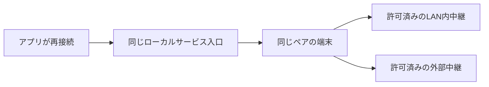

# sobalink

[English](README.en.md) · [使い方](docs/GENERIC.ja.md) · [確認範囲](docs/VERIFICATION.md)

**離れていても、すぐそばに。** 端末同士をつなぎ、必要な TCP/UDP サービスを通じてアプリを使います。`soba` を起動し、ローカル画面で相手を選んで、SSH/SFTP・Web・データベースなどのポートへ接続します。この端末のサービスも、相手と有効期間を決めて共有できます。文字・画像・ファイル・フォルダーの送信にも対応します。Go に埋め込んだ React 画面と CLI は同じ許可判定を使います。

**実験的なソフトウェアです。** 公開版は [sobalink Releases](https://github.com/webkaz-labs/sobalink/releases) で版・ソース・署名付き資材と検証結果を確認してください。ソースの機能説明だけでは、その版での受入を示しません。実端末での認証・アプリ互換性・スマートフォン QR・ネイティブ IME・OS サインインとスリープ復帰は別の確認が必要です。[ソースごとの検証結果](docs/VERIFICATION.md)

## まず使う

### 署名付き公開版を使う

最新の公開済みプレリリースは [0.3.0-alpha.5](https://github.com/webkaz-labs/sobalink/releases/tag/v0.3.0-alpha.5)、ソースは `0b14fcfb3e49a7ad6c99bed8e4c67a5e577878d6` です。[公開 workflow](https://github.com/webkaz-labs/sobalink/actions/runs/37423908236) の全15ゲートが合格し、署名・provenance・公開取得・4ネイティブ対象の実導入を確認しました。LAN送信先制限、選んだホストの中継運用、中継なしLAN、高度な任意WAN探索、接続方式の併用、調整可能な中継資源予算を含みます。[同一ソースCI](https://github.com/webkaz-labs/sobalink/actions/runs/37421937582) も全6ジョブが合格しました。実端末の認証、アプリ互換性、OSサインイン・休止復帰の受入は未完了です。[資材と対応環境](docs/DISTRIBUTION.md#install-a-signed-prerelease)

LAN外の接続にはTailscaleを使います。中継の起動と今後の配置改善はLAN内を対象にし、外部中継の配備は当面対象外です。任意の高度なWAN候補設定には、到達可能な互換中継と固定pinを既に用意している必要があります。

mise **2026.9.18** を用意した環境で実行します。`mise use -g` は通常使う版を設定します。

```sh
mise install "packslip:github.com/webkaz-labs/sobalink[prerelease=true]@0.3.0-alpha.5"
mise use -g "packslip:github.com/webkaz-labs/sobalink[prerelease=true]@0.3.0-alpha.5"
mise exec -- soba version
mise exec -- soba
```

### ソースからビルドする

このチェックアウトをビルドする場合は Go **1.27.1**、Node **24.19.0**、npm **11.9.0** を使います。画面の依存関係はロックファイルに固定しています。

```sh
npm --prefix web ci --no-audit --no-fund
npm --prefix web run build
go run ./cmd/prepare-engine
go build -tags ts_omit_portmapper,ts_omit_captiveportal,ts_omit_useproxy -trimpath -o bin/soba ./cmd/soba
./bin/soba
```

Windows のビルドは `go build -tags ts_omit_portmapper,ts_omit_captiveportal,ts_omit_useproxy -trimpath -o bin/soba.exe ./cmd/soba`、起動は `./bin/soba.exe` です。導入後の実行に Node は不要です。

### 起動後の操作

1. 表示された `http://127.0.0.1:ポート` を同じ端末のブラウザーで開き、端末に表示された一回用コードを入力します。コードは URL に含みません。再発行は別の端末ウィンドウで `soba ui`
2. ネットワークを選びます。既存の Tailnet を利用する場合は、sobalink の独立ノードを公式の Tailscale 認証ページで参加させます。Tailcat LAN は明示した信頼できる中継先とペアリングを使います。ローカル画面と CLI から設定できます。[LAN 手順](docs/LAN.ja.md)。この公開版には明示して選ぶ[中継なしLAN](docs/DIRECT_LAN.ja.md)と[接続方式の併用](docs/MIXED_CONNECTIONS.ja.md)もあり、利用前に現在の検証範囲を確認してください
3. 相手・ポート・有効期間を確認してサービスを共有または接続します。表示された実際の接続先をアプリで使い、認証と動作を確認します
4. 文字やファイルを送る場合は、現在の識別情報を確認して意図した送信者を信頼します。文字は明示して送り、画像・複数ファイル・フォルダーは一括内容を確認します
5. 受信側は原則として一括ごとに保存先を決めて承認します。自動保存は、特定のバックエンド・信頼済み相手・信頼の世代・保存先を指定した場合だけ有効です
6. 使い終わったら個別停止、受信共有を止める `soba stop-shares`、信頼取消、または本体を止める `soba stop` を使います

例では `soba` を PATH 上の実行ファイルとして表記します。ソースビルドでは `./bin/soba`、Windows では `./bin/soba.exe` に読み替えます。起動した端末は開いたままにします。初回のネットワークは未選択で、勝手に認証や共有を始めません。[日英の画面・CLI手順](docs/GENERIC.ja.md)

## できることと境界

| 操作 | 範囲 |
| --- | --- |
| サービス共有 | 明示した相手、既定は有限の1時間、明示して解除までにも変更可能。TCP 範囲は予約入口を除いて扱う |
| 接続 | 既定は停止まで。通常の Tailnet サービスにも接続でき、相手側の sobalink は不要 |
| 保存した操作 | 停止状態の定義、プロフィール、グループ、確認付き入出力、リース付きローカルタスク。保存だけでは開始しない |
| 容量 | 論理制限は既定・有限・無制限から選択。調整できる有限の資源予算は別に管理 |
| 文字・画像・ファイル・フォルダー | 明示して送信。複数項目を一括確認。文字のコピーも手動 |
| 受信 | 一括承認が既定。保存先を固定した相手別の自動保存は希望制 |
| 再試行 | 同じ起動中の未完了ファイルを先頭から再送。途中バイト・再起動後の再開はしない |
| ローカル操作 | 正確な `127.0.0.1` の一時ポート、一回用コード、セッション・Origin・CSRF の検査 |

受信ファイルを自動で開く・実行する・既存ファイルを上書きすることはありません。フォルダーの実行属性やリンクは引き継ぎません。ブラウザーからの空フォルダー選択にはブラウザー API の制限があるため、完全なフォルダー構成が必要なら CLI でも確認してください。

TCP の広い共有範囲は、許可期間中にその範囲で新しく起動したアプリにも適用されます。必要な範囲まで狭め、除外を設定してください。探索 `54543`、ピア API `54544`、ペアリング `54545` とバックエンド内部の入口はサービス共有から除外します。UDP とローカル接続の実待受には、既定64件の調整可能な有限予算があります。共有相手32件や一括256項目・1 GiBは論理制限の初期値で、固定の製品上限ではありません。論理制限を外しても、本人確認・パス安全性・通信形式・資源の検査は残ります。[容量の選択](docs/CAPACITY.ja.md) · [安全性](docs/SECURITY.ja.md)

Direct・Relay は暗号化された通信の経路、再接続は通信を作り直す状態です。経路が不明なら不明と表示し、遅延から推測しません。単一方式の設定では選択したネットワークを変更しません。併用モードでは、認証済みの同じ相手に明示許可した経路について、利用不能が確認できた場合に限り新しい接続で別経路を選べます。許可拒否や状態不明では切り替えず、既存 TCP の移行・再送は行いません。Tailcat に任意の公開中継先への自動フォールバックはありません。[ネットワークと設計](docs/ARCHITECTURE.md)

## 準備した経路で復旧する

同じ Tailcat のペアを保ったまま、LAN 内と外部の正確な中継候補を準備します。ネットワークを移る前に両端で候補を設定し、認証された経路情報を非公開で交換して、それぞれの端末で使う候補を許可します。複数中継の経路復旧を扱う CLI とローカル画面は alpha.4 に含まれます。[短い設定手順](docs/LAN.ja.md#別の経路を準備する)



図は許可済みの復旧関係を表し、あらゆるネットワークでの到達性を保証しません。native試験の証拠と残る実機確認はソースごとの記録を参照してください。local は中継アドレスの区分で、通常の中継方式は公開経路を使う可能性のある相手への直接通信を維持します。[LAN送信先制限](docs/LAN_DESTINATIONS.ja.md)は明示的に宛先を許可する機能で、プロセス全体の外部通信ゼロや物理NIC・VPNの隔離を保証しません。既存 TCP は切れる場合があり、アプリで再接続します。ファイル再試行は同じ起動中の未完了項目全体だけです。[証拠と限界](docs/VERIFICATION.md#経路復旧の条件)

## CLI の短い例

```sh
soba setup --network tailnet
soba login --browser
soba peers
soba --dry-run share --preset ssh --peers PEER_ID
soba share --preset ssh --peers PEER_ID
soba connect --preset ssh --peer PEER_ID
soba trust PEER_ID
soba message PEER_ID "Hello"
soba send PEER_ID ./image.png ./notes.txt ./sample-folder
soba status
soba stop
```

`PEER_ID` は現在の相手に置き換えます。共有と接続はそれぞれ必要な端末で実行します。SSH プリセットは TCP 22、接続側のローカル入口は2222です。Web は `--preset web` で TCP 8080／入口8080を候補にし、`--ports`・`--local-port` で変更できます。アプリ自身の起動・認証は別に必要です。省略した名前には未使用名を選び、既存設定を上書きしません。

ローカル画面または[案内付き CLI](docs/CLI_GUIDE.ja.md)でサービスを選択・編集・確認でき、明示した CLI オプションで自動処理も行えます。LAN のホスト／中継設定、招待のファイル入力、受信先、自動保存、サービスの保存・確認・コピー・再開始も JSON 編集なしで操作できます。[ブラウザー・リンク・QRによる認証](docs/SIGN_IN.ja.md)、[保存サービス・グループ・タスク](docs/SAVED_SERVICES.ja.md)、[起動・ログアウト](docs/LIFECYCLE.ja.md)も参照できます。`soba help examples`、`soba lan --help`、`soba service --help` を参照してください。`--dry-run` は適用前の入力確認で、到達性や空きポートの試験ではありません。言語は自動選択し、`soba --locale ja ...` / `en` で切り替えます。`status`・`peers`・グループ・サービス操作は日英の人向け表示を用意し、機械向け出力には `--json` を使います。詳細な型付き操作は構造化結果を返します。明示した認証表示では非公開の人向け案内を出します。`--json-errors` 指定時の失敗は標準エラーの `{code,error}` です。[詳しい CLI 手順](docs/GENERIC.ja.md#言語自動処理困ったとき)

任意の[認証付き TCP プロキシと診断](docs/PROXY_DIAGNOSTICS.ja.md)も用意しています。ブロードキャスト、永続的なオフライン送信箱、遠隔管理・遠隔ファイル一覧は現在の機能に含めません。

[明示的な起動時接続・非公開プロキシ設定](docs/STARTUP.ja.md) · [アプリ設定・RustDesk](docs/CLIENT_HELPERS.ja.md) · [ローカル画面の操作](docs/WEB_CONTROLS.ja.md) · [機能対応と受入](docs/FEATURE_PARITY.ja.md) · [文書一覧](docs/README.md)

## 開発と検証

[開発・使いやすさの基本方針](docs/DEVELOPMENT_PRINCIPLES.ja.md)を実装・文書・レビューの共通基準にします。[設計](docs/ARCHITECTURE.md)、[配布](docs/DISTRIBUTION.md)、[検証](docs/VERIFICATION.md)、[残る受入条件](docs/ROADMAP.ja.md)を参照してください。

Go の race / vet と画面の単体試験に加え、Linux x64/ARM64・macOS ARM64・Windows x64 のネイティブ CI、ロック済み画面資材の再生成、配布物の反復ビルド・署名・provenance・実導入確認を維持します。旧版の合格結果を新しいソースの証拠にはしません。
