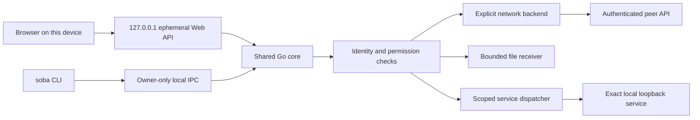
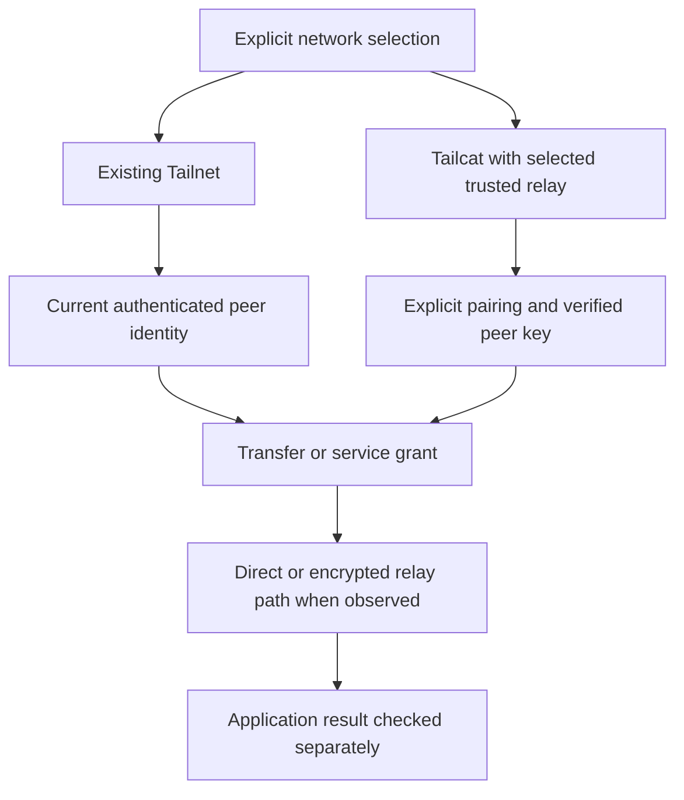
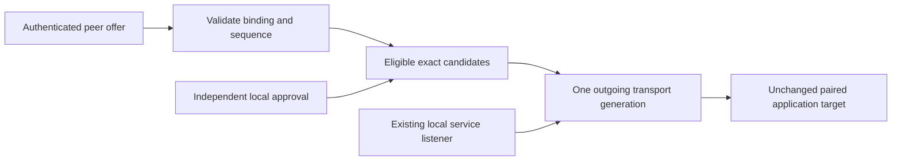
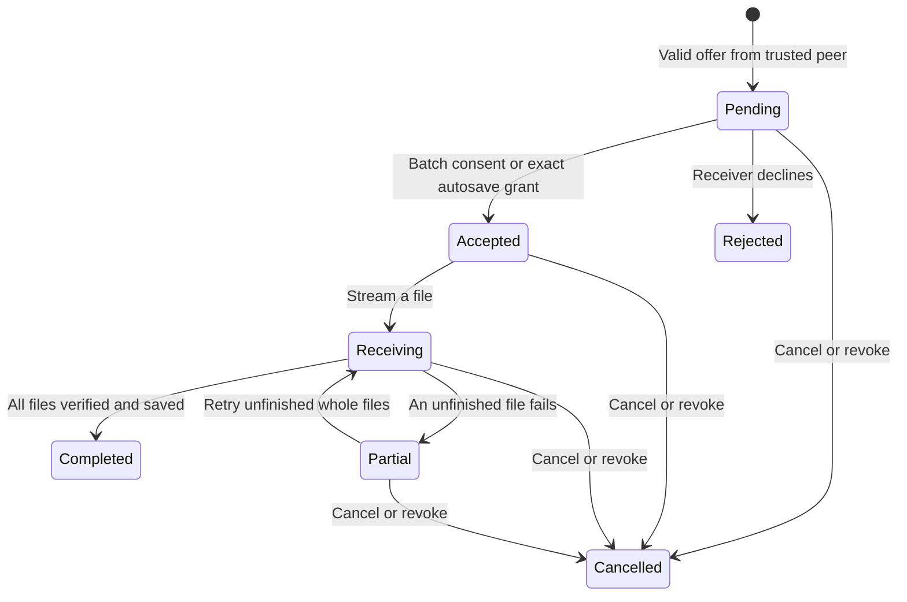

# sobalink architecture

[日本語ガイド](GENERIC.ja.md) · [English guide](GENERIC.en.md) · [Security](../SECURITY.md) · [Development principles](DEVELOPMENT_PRINCIPLES.en.md)

sobalink connects devices to their selected application services, with explicit text and file transfer as additional operations. It combines an embedded React UI and a Go agent. Human interaction and agent CLI requests share one application boundary. A peer can exchange authorized messages, batches and service metadata; it cannot operate the local administration API.

## Source map

| Source | Responsibility |
| --- | --- |
| `cmd/soba` | Locale selection, foreground/background lifecycle, reviewed per-user startup, local command interface |
| `web` | React source, pinned npm lockfile, generated assets embedded with Go |
| `internal/webui` | Exact loopback management listener, code/session/Origin/CSRF checks |
| `internal/control` | Owner-restricted Unix socket or Windows named pipe |
| `internal/core` | Shared commands, current state, stopped definitions/groups, trust, peers, transfers, service grants, proxy and diagnostics |
| `internal/capacity` | Versioned logical choices and finite resource-budget catalog |
| `internal/identity` | Embedded tsnet adapter and current Tailnet identity |
| `internal/lanlink`, `internal/core/lan*.go` | Pairing, recipient-authenticated offers, explicit-lifetime local route approvals, protected versioned state and bounded candidate coordination |
| `internal/routecat` | Attributed Tailcat adaptation: prepared server regions, single-candidate clients and authenticated peer rendezvous; under native verification |
| `internal/transfer` | Manifest validation, receive policy, bounded streaming, storage and whole-file retry |
| `internal/ranges` | Compact range/exclusion sets, immutable plans and TCP fallback admission |
| `internal/policy`, `internal/transport` | Current-identity authorization, forwarding and bounded TCP/UDP lifetimes |
| `internal/distribution` | Deterministic package layout, source/dependency metadata, frontend assets and notices |

The legacy `cmd/tsnet-bridge` implementation may remain in the tree. It does not define the new UI, CLI or profile compatibility contract. The repository and module are now `github.com/webkaz-labs/sobalink`; earlier release signatures retain their historical identities.

## Network boundaries

The application selects one backend explicitly. A new profile selects none. A saved selected backend may reconnect when the agent starts. Saved definitions alone do not restart services, and transfer progress never resumes. Separately reviewed outbound startup approvals have the bounded behavior described below. Runtime switching cannot silently exchange backend identities or continue an existing TCP session.

Existing Tailnet mode uses a separate embedded tsnet node. Enrollment uses the official interactive login flow. Current peer identity, Tailnet grants/ACLs and the application grant are checked independently. Service dialing uses the embedded stack instead of an OS-network fallback. OS routes and DNS remain outside this product's management surface.

Published alpha.5 includes authenticated prepared-route recovery and the reviewed resource/failure-classification extensions; alpha.2 remains the historical single-relay baseline: `internal/routecat` is a bounded, attributed adaptation of the pinned Tailcat source, not an unmodified upstream feature. It keeps the prepared server regions in one engine and selects a single approved outgoing candidate per peer generation. The original numeric bootstrap relay, certificate pin, device identity, PSK and directional role keys remain unchanged. [Adaptation and provenance](../internal/routecat/UPSTREAM.md) · [Route contract](ROUTE_RECOVERY_DESIGN.en.md)

A relay may be self-hosted or another endpoint explicitly trusted by the user. The normal single `soba` executable retains direct UDP support; permitted traffic includes direct peer paths (including public paths), encrypted payload and HTTPS/ICMP diagnostics to exact configured/approved relays. `local` is a relay classification, not strict LAN isolation or zero external traffic. Strict no-external-egress mode remains unimplemented and no helper binary is added. Required tags omit port mapping, captive-portal probes and system-proxy fallback; proxy/unsupported backend overrides are rejected. No default public relay map, DNS bootstrap or arbitrary fallback is selected. [Current evidence](VERIFICATION.en.md#route-recovery-gate)

Direct and Relay are path observations; Reconnecting is a lifecycle state. Unknown means the backend has not supplied reliable path evidence. A route can change inside a backend, but the product makes no established-TCP preservation promise. An unavailable backend does not trigger automatic exchange to another mode.

Startup restores the explicitly saved network and saved receive approvals by default, including enabled, unpaused per-peer file autosave with an available destination. Unavailable autosave destinations stop only receiving and disable the affected grant; restoring the destination or confirming inventory does not re-enable it. See [receiver recovery](CAPACITY.en.md#receiver-recovery). Ordinary saved definitions remain stopped and previous transfers never resume. Separate exact outbound startup selections and private saved-proxy approvals may opt into a future online launch, once after readiness; offline launch suppresses those attempts for the entire process. Changed definitions/groups/network/hostname or target revocation invalidate approval. A finite permission begins afresh on a new process launch, while transport recovery preserves the existing expiry. [Explicit startup and private profiles](STARTUP.en.md) Optional per-user sign-in startup previews and binds the exact OS plan and saved profile to a review token; local-only startup is an explicit alternative. Tailnet logout closes application traffic before contacting the identity backend, distinguishes acknowledged and unconfirmed logout, and then exits. See [startup and logout](LIFECYCLE.en.md) ([日本語](LIFECYCLE.ja.md)).

## Prepared routes and stable service entrances

The original relay remains the pairing/bootstrap anchor. Additional exact numeric endpoint/pin/scope tuples are prepared under offline management within saved-state and exchange-format budgets, then activated by restarting. Runtime presence and attempt budgets are separately adjustable; there is no fixed four-candidate permission ceiling. Adding/removing these candidates preserves pairs. Replacing the original anchor retains the older stop/revoke/reconfigure rules.

A private recipient-sealed version-2 offer carries the explicitly selected candidates within the existing 24 KiB plaintext/64 KiB envelope bounds, directional pair binding, a durable sequence and an explicit `finite` or `until-revoked` lifetime. Local approval independently binds exact candidate IDs and its reviewed lifetime. Version 2 has no arbitrary 30-day duration ceiling; finite dates must still be valid and representable. A finite approval cannot outlast a finite offer, and until-revoked approval requires an until-revoked offer. The CLI requires exactly one of `--ttl` or `--until-revoked` for offer/withdraw and nonempty approval; it has no lifetime default. The Web UI defaults new offers and eligible approvals to until-revoked, shows the scope and impact for review and leaves every candidate unchecked. Finite offers, including old version 1, permit only finite approval. A fresh offer, reconnect or reload never renews permission automatically. Exchange remains manual and private, with no automatic external messaging or command execution.

Managed new connections try local candidates first, with deterministic ordering, five-second route checks/connection attempts within a candidate-count × five-second dial budget and a 30-second hold-down. Concurrent dials serialize per peer. The coordinator preserves healthy active flows during optional preference probes. Fresh transport checks can retire a failed generation, including hung flows, so a new connection can recover; application-port refusal alone does not retire a transport that passes its follow-up health check. It revisits the preferred candidate after the hold-down when no flows are active. These are current implementation bounds, not a measured recovery SLA. Permission expiry, revocation and shutdown cancel the generation.

The local service listener is independent of the outgoing transport and is intended to retain its exact address/port for new application connections during same-process recovery. This is not the management UI's ephemeral port and does not extend service permission. Existing TCP can fail; no arbitrary byte replay, remote-job restart, partial-byte file resume or process-restart resume is added. Full two-process/socket proof, offline-LAN cold start with external services unavailable and four-target final-source results remain acceptance gates.

LAN state version 1 retains legacy singleton semantics. The earlier prepared-route file format is version 2; explicit lifetime protocol/state version 2 requires enclosing private LAN file version 3. Original keys and anchor survive migration. Earlier finite offers/approvals retain their exact deadlines and are never silently converted to until-revoked. Issued/received versions cannot regress, sequences remain monotonic across restart, and re-pairing changes the directional binding. Unsupported state versions fail closed in older binaries. Saved proof/high-water marks survive expiry and withdrawal. Failed local revocation or applied-withdrawal persistence stops affected work and latches Core recovery, including offline management. Whole-profile rollback is not solved by local counters. [State and migration details](ROUTE_RECOVERY_DESIGN.en.md)

## Management and peer surfaces

The management listener is always `127.0.0.1:0` at allocation and then the exact resulting host/port. It serves embedded assets and `/api` only. A separately delivered one-time terminal code creates a session; mutating requests require the matching Origin and session CSRF token. URL-based secrets, wildcard listening and remote administration are excluded.

Network failures carry a stable `self.errorCode`; the UI localizes recovery guidance while preserving technical details. The current UI contract is [web/API.md](../web/API.md), backed by TypeScript in `web/src/api.ts`. The UI cannot make its own trust decision authoritative: Go validates identity, expiry, range, receive policy and path safety on every relevant operation. Request IDs deduplicate repeated commands within bounded process-local history; they do not claim durable transaction recovery.

The peer API has separate routes for hello, explicit messages, transfer offers/status/content and minimal service discovery. Transport-derived identity is rechecked against current peer state. Peer routes do not accept local management commands, filesystem destinations or arbitrary URLs. Reserved endpoints are discovery `54543`, peer API `54544` and pairing `54545`; local management/control and backend-internal endpoints are also excluded from generic service sharing.

## Trust, batches and storage

Trust, pairing, autosave and service sharing are distinct scopes. LAN invitations last 1–600 seconds and are bound to one recipient key. Sealed bootstrap authorizes only the verified transport role; server and client role keys stay distinct. Atomic private-state persistence precedes pairing success. See the [LAN command and recovery guide](LAN.en.md). A display name never supplies identity. A receive policy binds a backend, exact peer and trust generation to an absolute local destination. Revocation closes work and invalidates the previous generation. Reviewed receive settings become effective after profile-file replacement; a published result with uncertain durability is reflected in saved and runtime settings while the uncertainty is returned.

A manifest includes relative paths, kinds, sizes and SHA-256 values. Directories explicitly represent empty folders. The receiver bounds metadata, path depth, reservations, outstanding batches and concurrent file streams, rejects unsafe paths/links and creates files without overwrite. Final acknowledgement follows size/hash verification and save completion. Completed-file acknowledgements are idempotent while their batch exists.

The initial logical defaults are 256 entries per batch and 1 GiB per file/batch, adjustable or explicitly unlimited within finite storage/metadata budgets. Local staging defaults to 600 seconds or an explicitly selected alternative. Browser uploads stage into private local storage before offering a batch to the peer. Native session and command JSON bodies have a five-second read deadline; native browser upload bodies have a rolling 30-second idle deadline refreshed only by received bytes. The existing total staging deadline starts after reservation, is not refreshed by progress, and remains in force during normal progress; explicitly unlimited staging removes only that total deadline, not the idle deadline. A configurable free-space reserve (initially 512 MiB) guards incoming and outgoing payload writes using actual filesystem availability, 32 KiB chunks and at most 1 MiB of process-local in-flight allowances. Failed space inspection rejects writes; saved files and atomic no-replace finalization remain intact. This free-space guard is separate from receiver quota recovery below and cannot prevent other processes/delayed allocation consuming space. See [capacity boundaries](CAPACITY.en.md#transfer-free-space-margin). Local upload progress, remote acceptance, file saving, partial completion and completed delivery remain separate states. No automatic file opening, execution or clipboard synchronization follows receipt.

Receiver quota recovery uses a private index of receiver-owned staging roots (v1 readable, v2 written). Retirement acquires a target-bound atomic-writer lease before creating its bounded durable guard, and holds that lease through the decorated index save, post-save identity checks, verification and guard release. Admission durably reclaims the owned writer snapshot before allocating the guard. Let `B = max(encodedBefore, encodedAfter)` be the larger encoded index size immediately before or after retirement, and `G = encodedguard` the encoded durable guard size. The protected interval reservation `2B + G` must fit `AccountingLimits.MaxBytes`; this does not reserve `2*MaxBytes + G`. Close releases the writer lease without removing an unreleased guard. Failure before guard creation leaves no new guard; an error after terminal guard removal does not imply that the guard remains. For interleavings with another writer, index + guard + shared snapshot is bounded by `B + G + max(B, S_other)`, where `S_other` is that writer's admitted snapshot bound. Owner/namespace and legacy allowances are additional. Other writers keep their own admission limits, including explicit unlimited choices, so there is no universal finite aggregate cap. Uncertain persistence or changed bindings keep receiving blocked across restart; the guard is not ownership proof or deletion authority. Startup inventories only identified owned staging within finite budgets, never arbitrary destination trees or saved output. Ambiguous roots, unavailable or replaced destinations, unsafe stages, and incomplete or over-budget inventory block receiving. Zero-payload internal staging is safely retired or remains accounted, without per-transfer metadata accumulation. Preparation intent and the existing three index writes preserve compatibility and preparation ordering but do not alone guarantee safe retirement. See [security boundaries](../SECURITY.md#trust-and-receiving) for the limit on cross-filesystem same-account races. The legacy missing-index review and explicit confirmation flow remains unchanged.

An existing profile with a missing legacy index remains receive-blocked until explicit local review. `soba receive recovery confirm` previews status; `soba receive recovery confirm --reviewed` records review of all previous default, per-peer and manual destinations, unfinished staging and saved output, then initializes the absent index and inventories only what can be proven owned. Before confirming, resolve unfinished old receives so no untracked partial data remains; keep saved files. Unknown or unavailable old locations must be reviewed before confirmation. --reviewed attests that this review and cleanup are complete; it does not delete files or discover arbitrary unrecorded legacy leftovers. This does not add partial-byte or restart resume.

Retry starts each unfinished file again from byte zero. There is no byte-offset resume, durable progress journal or restart resume. Saved data survives cancellation and process shutdown; active batch state does not. A new batch after restart may create unique-name duplicates, which the user must review.

The embedded relay forces a fresh admission check through a two-minute connection lease. Removed relay sessions may remain for that lease, and temporary bootstrap admission plus a lease can last about four minutes from initial bootstrap. Application revocation closes its own flows immediately. The native fixture passed its 130-second existing-TCP test across a real relay lease on all four targets at the recorded commit; this is a bounded scenario, not a general TCP continuity guarantee.

Peer Pause stops messages/files and cancels active sends; resuming requires reselecting those files. It does not revoke separate service grants. `soba start --offline` opens management without reconnecting a saved backend, so pairing state can be revoked or repaired after startup failure.

## Compact service plans

TCP sharing uses a compact inclusive range/exclusion plan with one userspace fallback dispatcher. Shared range port N maps to the same exact loopback port N; one shared port can explicitly map to a different local application port. A broad range is a real future grant: applications started later on effective ports are reachable while the permission remains active.

Plans require explicit current peer IDs, a current embedded-node address, a specific protocol, valid ports in 1–65535 and a reviewed lifetime. Shares default to a finite hour, support other positive whole-second durations, and allow explicit `until-revoked`. Outbound connections default to `until-stopped`. The logical share-peer default is 32, adjustable or explicitly unlimited; it is not a hard protocol maximum. System reservations and active internal endpoints are removed from effective scope. Overlap, collision, stale identity and exhausted capacity fail before an unsafe plan becomes usable.

UDP shares, local connections and optional proxy listeners require materialized resources and share an adjustable finite budget, initially 64 listeners. TCP shares do not consume one listener per covered port. Client connections may explicitly remap sorted effective remote ports to consecutive local ports, but shared ranges retain same-port targets. Each accepted flow checks current identity, grant and deadline before loopback dialing.

Discovered services carry bounded metadata only for eligible peers and active grants, including explicit until-revoked shares. Rotating refresh passes examine at most 128 peers and background probes use at most four workers. Automatic retries back off at 2, 4, 8, 16, 32 and then 60 seconds; manual refresh remains immediate. Retry state is bounded to 128 protected entries, with overflow probes admitted four at a time only when that cache is full. Discovery and local pages retain separate finite byte/entry budgets. A selected observation is revalidated before connecting. Ordinary Tailnet services can be connected manually without a peer sobalink API. All service state labels application health `unverified`.

Private-state publication outcomes and recovery bounds are described in [bounded private-state persistence](#bounded-private-state-persistence).

Expiry, stop and peer revocation close tracked flows. They do not cancel a remote application job, retrieve delivered content or extend a deadline. Saved definitions are inert until explicitly started or covered by a separately reviewed outbound-only startup approval; inbound shares cannot opt into startup.

## Capacity, saved workflows and local tools

The versioned capacity policy separates logical `default`/`limited`/`unlimited` choices from adjustable finite resource budgets. The policy file has its own bounded envelope so saved-profile growth cannot require an unbounded read to discover its limit. Profile, LAN pairing, messages, transfer metadata/spool, listeners, TCP/UDP flows, queues, discovery and pages use the corresponding budgets. Lower counts do not remove records or existing pairs; finite storage cannot be lowered below current saved data. Message retention is only a cleanup recommendation until an explicit revision-bound preview/apply succeeds. [Capacity contract](CAPACITY.en.md)

Stopped service definitions and groups are separate from live grants. Saving and importing can run under an exclusive offline profile lock without starting a network or loading credentials/transfer state. Private exports contain service/group definitions only. Review tokens bind replacement/deletion to current data. Group start rolls back only newly started members on failure; task ownership and renewable 30-second leases limit abandoned local command scopes without stopping unrelated work. `stop-shares` explicitly stops all inbound shares, including task-owned ones, while preserving outbound connections and node connectivity. [Saved workflow contract](SAVED_SERVICES.en.md)

The optional SOCKS5 tool authenticates clients and supports only TCP CONNECT to reviewed peer/port targets through the chosen userspace backend. Each dial rechecks current identity. Ordinary starts are ephemeral; explicit saved/generated profiles use a separate protected, revision-bound store, excluded from portable exports and routine state. Private reveal is an explicit operation. Durable peer-revocation epochs prevent saved approvals from reviving after restart; failed persistence stops related work and suppresses startup until storage is repaired. It has no OS target dialing/DNS fallback, BIND or UDP ASSOCIATE. Its listener shares resource accounting and cannot be exposed through a service share. Diagnostics optionally open one explicit approved TCP connection, preserve the last failure code/time in runtime, and leave application/TLS/host-key health unverified. [Proxy and diagnostics](PROXY_DIAGNOSTICS.en.md)

Bulk remote administration, remote filesystem browsing, broadcast delivery and a durable offline outbox are not implemented. A broader resource-management foundation belongs to a separate milestone; ordinary service transport does not imply those capabilities.

## Bounded private-state persistence

Private writes use one owned snapshot slot and a nonblocking OS writer lease in the private `.sobalink-atomic-v1` namespace of each destination's parent directory. A fixed set of 64 process-local admission gates bounds coordination state, with a two-second admission wait. The namespace and lease remain in place; normal writes do not leave one new control file per operation. Recovery reclaims only the identity-checked owned snapshot. Unknown namespace entries or ambiguous temporary objects are preserved and block further writes.

Parent-directory inventory is nonrecursive and bounded to 4096 entries, including space reserved for missing protocol and destination entries. Legacy `.write-*` temporary files are accounted from metadata under separate limits of 64 files and 128 MiB. They are neither parsed nor deleted on the strength of their names. Unsafe entries, inspection failure, budget overflow or failed owned-snapshot cleanup stop admission. These private recovery limits do not impose the legacy ceiling on a new caller-admitted snapshot.

Atomic private-state replacement can publish a new file while durability remains uncertain. Saved-state owners reconcile memory to that file and report the uncertainty; an error does not imply rollback. A new service start with uncertain persistence stops before activation. Saved startup approvals must match current revocation epochs and require explicit renewal after revocation. Incoming-message retry uses the same ID and reconciles uncertain history before durable acknowledgement; ordinary duplicates skip history I/O. Public errors preserve machine types and redact private paths.

Native Windows acceptance requires real directory barriers and receive/cancel/reopen behavior on the tested filesystem. Restricted same-user synchronous I/O does not establish proof for an unelevated ordinary-user process; process-exit and restart tests establish recovery/control-flow behavior, not power-loss durability. The retirement guard does not itself prove staging ownership; see [remaining acceptance](ROADMAP.ja.md).

## Connection graph scope

The lightweight SVG connection view depicts this device and its known peers from actual state observations, with observed contact and trust separate from path type. Published alpha.5 has exact-source Go-backed browser evidence. Later UI changes require their own browser and screenshot acceptance. It must not invent peer-to-peer full-mesh links, rates or direct/relay telemetry. A missing observation is Unknown, and saved pairing metadata is not proof that a peer is online.

## Evidence and release boundary

Unit tests and mock backends establish specific logic properties. A DOM test checks component behavior. A real local browser checks rendering and navigation. Native socket tests check OS behavior. Two real peers establish enrollment, delivery and path behavior. None substitutes for another.

Published alpha.5, source `0b14fcfb3e49a7ad6c99bed8e4c67a5e577878d6`, completed [release run 37423908236](https://github.com/webkaz-labs/sobalink/actions/runs/37423908236) with all 15 gates, including signatures/provenance, public retrieval and four-target installed-binary checks. [Exact-source main CI 37421937582](https://github.com/webkaz-labs/sobalink/actions/runs/37421937582) passed all six jobs. The release includes destination admission, relayless LAN, advanced opt-in WAN discovery, mixed connections and configurable relay resources. [Verification by source](VERIFICATION.en.md) retains earlier failures, review findings and exact-source outcomes. Cross-compilation is not native execution, and loopback fixtures do not establish actual-device, LAN/WAN/NAT, native IME or sleep/wake acceptance.

Production packages embed generated frontend assets and include the pinned dependency inventory, copied notices, build metadata and SBOM. Repeatability, signature/provenance verification and actual installed-binary checks remain publication gates. The alpha.5 result applies only to its recorded source; later source changes do not inherit release acceptance. [Distribution](DISTRIBUTION.md) · [Verification](VERIFICATION.en.md)
