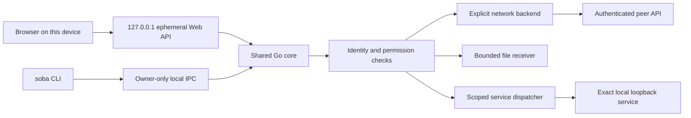
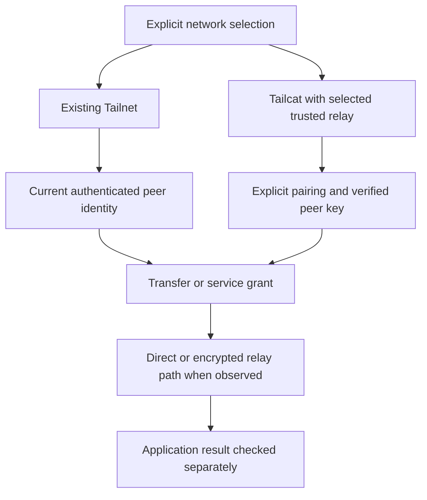
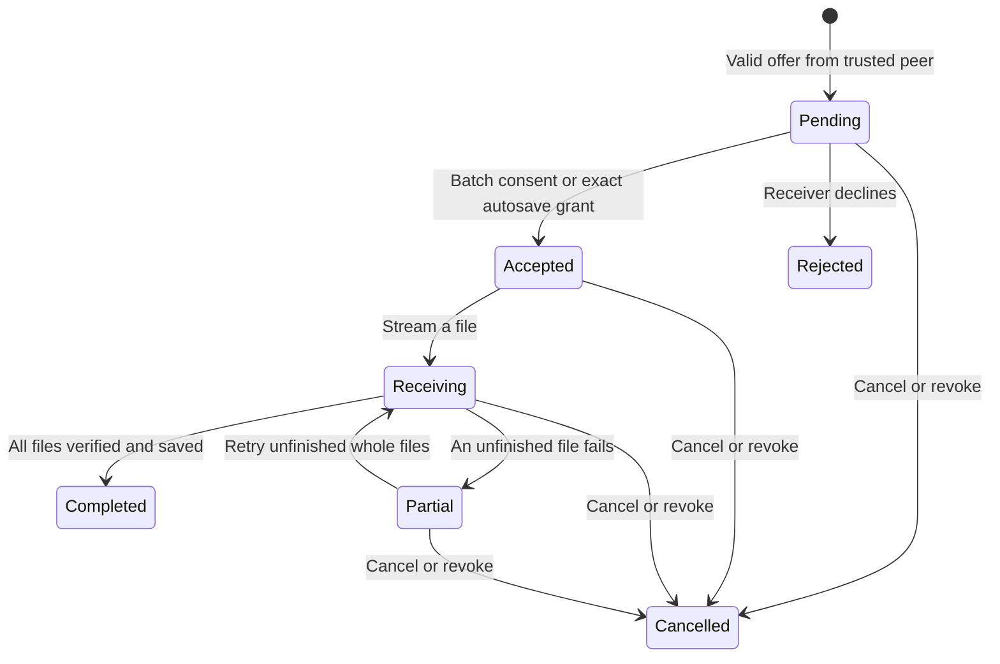

# sobalink architecture

[日本語ガイド](GENERIC.ja.md) · [English guide](GENERIC.en.md) · [Security](../SECURITY.md) · [Development principles](DEVELOPMENT_PRINCIPLES.en.md)

The development draft combines an embedded React UI and a Go agent. Human interaction and agent CLI requests share one application boundary. A peer can exchange authorized messages, batches and service metadata; it cannot operate the local administration API.

## Source map

| Source | Responsibility |
| --- | --- |
| `cmd/soba` | Locale selection, foreground lifecycle, local command interface |
| `web` | React source, pinned npm lockfile, generated assets embedded with Go |
| `internal/webui` | Exact loopback management listener, code/session/Origin/CSRF checks |
| `internal/control` | Owner-restricted Unix socket or Windows named pipe |
| `internal/core` | Shared commands, current state, profile, trust, peers, transfers and service grants |
| `internal/identity` | Embedded tsnet adapter and current Tailnet identity |
| `internal/lanlink`, `internal/core/lan.go` | Tailcat adapter, explicit relay setup, pairing, protected state and offline recovery; stock loopback-relay acceptance passed at the recorded commit; new Core integration awaits CI |
| `internal/transfer` | Manifest validation, receive policy, bounded streaming, storage and whole-file retry |
| `internal/ranges` | Compact range/exclusion sets, immutable plans and TCP fallback admission |
| `internal/policy`, `internal/transport` | Current-identity authorization, forwarding and bounded TCP/UDP lifetimes |
| `internal/distribution` | Deterministic package layout, source/dependency metadata, frontend assets and notices |

The legacy `cmd/tsnet-bridge` implementation may remain in the tree. It does not define the new UI, CLI or profile compatibility contract. The repository and module are now `github.com/webkaz-labs/sobalink`; earlier release signatures retain their historical identities.

## Network boundaries

The application selects one backend explicitly. A new profile selects none. A saved selected backend may reconnect when the agent starts; that does not restart service grants or transfer progress. Runtime switching cannot silently exchange backend identities or continue an existing TCP session.

Existing Tailnet mode uses a separate embedded tsnet node. Enrollment uses the official interactive login flow. Current peer identity, Tailnet grants/ACLs and the application grant are checked independently. Service dialing uses the embedded stack instead of an OS-network fallback. OS routes and DNS remain outside this product's management surface.

The Tailcat adapter and Core/CLI commands are implemented. Dedicated LAN UI and the connection graph are integrated locally. Stock loopback-relay acceptance passed on all four native targets at `14ee61f8`; newer UI/Core browser and integration checks await the next exact CI. The stock adapter uses an explicit numeric relay endpoint with a TLS certificate SHA-256 pin and matching peer capabilities. It has no default public relay map or DNS bootstrap. Build tags `ts_omit_portmapper,ts_omit_captiveportal,ts_omit_useproxy` exclude port mapping, captive-portal probes and system-proxy fallback; proxy/unsupported backend environment overrides are rejected.

The selected relay may be self-hosted or another endpoint explicitly trusted by the user. Its permitted traffic includes encrypted relayed payloads and HTTPS/ICMP diagnostics to that same endpoint, plus peer direct traffic. This boundary is not strict LAN isolation or zero external traffic. Independent static review and local logic/race tests cover pairing key ownership, durable acknowledgement and UDP multiplexing. The stock Tailcat loopback-relay continuity test passed for the recorded four-platform CI scenario; direct LAN/WAN, actual devices and sleep/wake are separate unverified cases. [Current gate](VERIFICATION.en.md#tailcat-gate)

Direct and Relay are path observations; Reconnecting is a lifecycle state. Unknown means the backend has not supplied reliable path evidence. A route can change inside a backend, but the product makes no established-TCP preservation promise. An unavailable backend does not trigger automatic exchange to another mode.

## Management and peer surfaces

The management listener is always `127.0.0.1:0` at allocation and then the exact resulting host/port. It serves embedded assets and `/api` only. A separately delivered one-time terminal code creates a session; mutating requests require the matching Origin and session CSRF token. URL-based secrets, wildcard listening and remote administration are excluded.

Network failures carry a stable `self.errorCode`; the UI localizes recovery guidance while preserving technical details. The current UI contract is [web/API.md](../web/API.md), backed by TypeScript in `web/src/api.ts`. The UI cannot make its own trust decision authoritative: Go validates identity, expiry, range, receive policy and path safety on every relevant operation. Request IDs deduplicate repeated commands within bounded process-local history; they do not claim durable transaction recovery.

The peer API has separate routes for hello, explicit messages, transfer offers/status/content and minimal service discovery. Transport-derived identity is rechecked against current peer state. Peer routes do not accept local management commands, filesystem destinations or arbitrary URLs. Reserved endpoints are discovery `54543`, peer API `54544` and pairing `54545`; local management/control and backend-internal endpoints are also excluded from generic service sharing.

## Trust, batches and storage

Trust, pairing, autosave and service sharing are distinct scopes. LAN invitations last 1–600 seconds and are bound to one recipient key. Sealed bootstrap authorizes only the verified transport role; server and client role keys stay distinct. Atomic private-state persistence precedes pairing success. See the [LAN command and recovery guide](LAN.en.md). A display name never supplies identity. A receive policy binds a backend, exact peer and trust generation to an absolute local destination. Revocation closes work and invalidates the previous generation. Persisted receive policy becomes effective only after its atomic configuration write succeeds.

A manifest includes relative paths, kinds, sizes and SHA-256 values. Directories explicitly represent empty folders. The receiver bounds metadata, path depth, reservations, outstanding batches and concurrent file streams, rejects unsafe paths/links and creates files without overwrite. Final acknowledgement follows size/hash verification and save completion. Completed-file acknowledgements are idempotent while their batch exists.

The current core limits each batch to 256 entries and 1 GiB. Browser uploads stage into private local storage before offering a batch to the peer. Local upload progress, remote acceptance, file saving, partial completion and completed delivery remain separate states. No automatic file opening, execution or clipboard synchronization follows receipt.

Retry starts each unfinished file again from byte zero. There is no byte-offset resume, durable progress journal or restart resume. Saved data survives cancellation and process shutdown; active batch state does not. A new batch after restart may create unique-name duplicates, which the user must review.

The embedded relay forces a fresh admission check through a two-minute connection lease. Removed relay sessions may remain for that lease, and temporary bootstrap admission plus a lease can last about four minutes from initial bootstrap. Application revocation closes its own flows immediately. The native fixture passed its 130-second existing-TCP test across a real relay lease on all four targets at the recorded commit; this is a bounded scenario, not a general TCP continuity guarantee.

Peer Pause stops messages/files and cancels active sends; resuming requires reselecting those files. It does not revoke separate service grants. `soba start --offline` opens management without reconnecting a saved backend, so pairing state can be revoked or repaired after startup failure.

## Compact service plans

TCP sharing uses a compact inclusive range/exclusion plan with one userspace fallback dispatcher. Shared port N maps to the same exact loopback port N. A broad range is a real future grant: applications started later on effective ports are reachable to its permitted peers until expiry.

Plans require 1–32 current peer IDs, a current embedded-node address, a specific protocol, a valid range and an explicit lifetime of 1 second–24 hours. System reservations and active internal endpoints are removed from effective scope. Overlap, collision, stale identity and exhausted capacity fail before an unsafe plan becomes usable.

UDP shares and local connection listeners require per-port resources and share a total 64-listener budget. TCP shares do not consume one listener per covered port. Client connections may explicitly remap sorted effective remote ports to consecutive local ports, but shares retain same-port targets. Each accepted flow checks current identity, grant and deadline before loopback dialing.

Discovered services carry bounded metadata only for eligible peers and unexpired active shares. A selected observation is revalidated before connecting. Ordinary Tailnet services can be connected manually without a peer sobalink API. All service state labels application health `unverified`.

Expiry, stop and peer revocation close tracked flows. They do not cancel a remote application job, retrieve delivered content or extend a deadline. Saved definitions are inert after restart until explicitly started.

## Connection graph scope

The lightweight SVG connection view is integrated locally, with browser screenshot acceptance for this revision pending. It depicts this device and its known peers from actual state observations, with observed contact and trust kept separate from path type. It must not invent peer-to-peer full-mesh links, rates or direct/relay telemetry. A missing observation is Unknown, and saved pairing metadata is not proof that a peer is online.

## Evidence and release boundary

Unit tests and mock backends establish specific logic properties. A DOM test checks component behavior. A real local browser checks rendering and navigation. Native socket tests check OS behavior. Two real peers establish enrollment, delivery and path behavior. None substitutes for another.

Commit `14ee61f87b0bb339f69eb133021e15f624b90fcd` passed [all six jobs](https://github.com/webkaz-labs/sobalink/actions/runs/37042721076), including stock Tailcat loopback-relay acceptance on all four native targets, packages, the baseline Go-backed Chromium checks and manifest. The subsequent UI/Core snapshot has 117 frontend tests, strict TypeScript and two identical asset builds passing locally. New actual-font/graph browser checks and real Core text/file/share/revoke integration are prepared but not yet executed in CI. Cross-compilation is not native execution, and these results do not establish actual-device or direct LAN/WAN acceptance.

Production packages embed generated frontend assets and include the pinned dependency inventory, copied notices, build metadata and SBOM. Repeatability, signature/provenance verification and actual installed-binary checks remain publication gates. No new release is claimed from this local draft. [Distribution](DISTRIBUTION.md) · [Verification](VERIFICATION.en.md)
