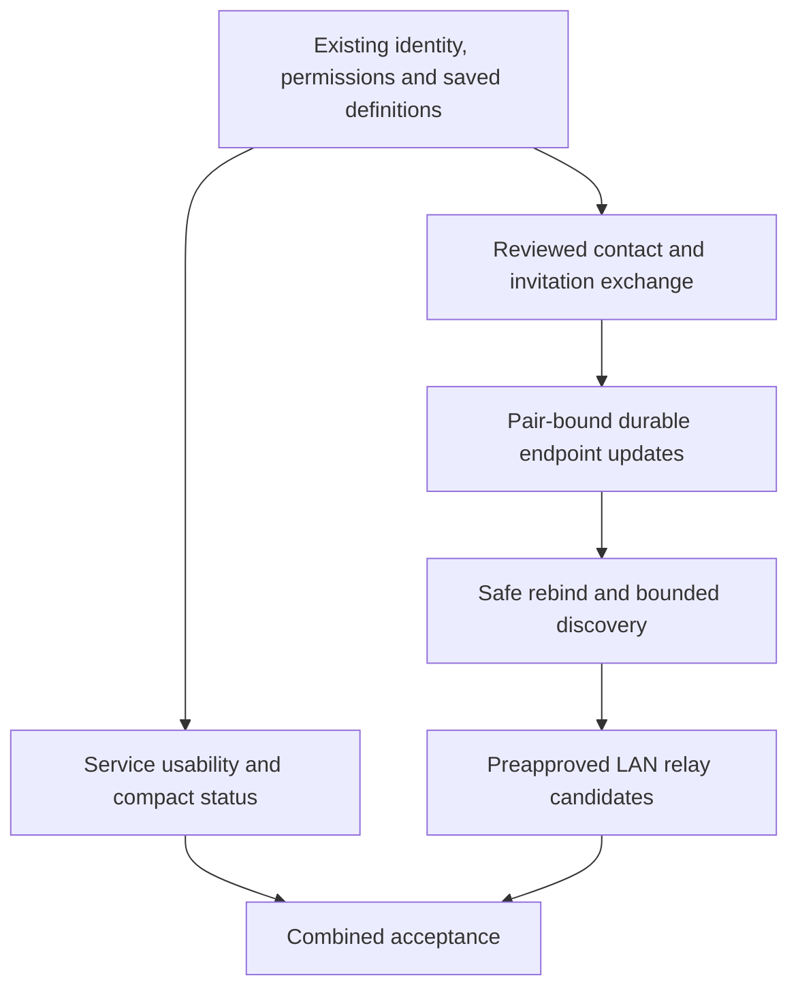

# alpha.6 convenience patch: scope and acceptance

[日本語](CONVENIENCE_PLAN.ja.md) · [Development principles](DEVELOPMENT_PRINCIPLES.en.md) · [Roadmap](ROADMAP.en.md)

**The planned alpha.6 targets all ten areas below plus the confirmed alpha.5 saved-screen correction; these improvements are not yet a released version.** Deliver and review small independent changes while keeping the complete target. Reuse working service, group, permission and recovery contracts rather than replacing them.

The reviewed foundation in [merged PR #13](https://github.com/webkaz-labs/sobalink/pull/13) includes the saved-screen correction, inert favorites and group navigation, passive diagnosis, read-only device-card API/CLI/Web controls, reusable saved-share templates, and explicit alternate-port checks in the Core, CLI and Web UI. LAN invitation review also precedes pairing on an already-configured relay. Participant-host setup includes manual private-address fallback and guarded startup of the exact saved host.

At the historical main `7d505315` snapshot, the tree also included [merged PR #17](https://github.com/webkaz-labs/sobalink/pull/17): bounded local device-card PNG import fills the text field before separate review and application. Its [final-source CI](https://github.com/webkaz-labs/sobalink/actions/runs/37585215258) and [canonical main `721662a1` CI](https://github.com/webkaz-labs/sobalink/actions/runs/37587774557) passed all eight jobs, including 121 real Chromium tests with eight PNG cases.

[Merged PR #18](https://github.com/webkaz-labs/sobalink/pull/18) adds the inert endpoint metadata codec and data models; its [final-source CI](https://github.com/webkaz-labs/sobalink/actions/runs/37588890808) passed all eight jobs after the Windows temporary-store test portability correction. At that PR snapshot the package had no production callers. Subsequent Core integration and [PR #25](https://github.com/webkaz-labs/sobalink/pull/25) add managed activation; [PR #26](https://github.com/webkaz-labs/sobalink/pull/26) adds signed endpoint following and Web/CLI controls. Final integrated acceptance and alpha.6 distribution remain pending; earlier source checks are not physical-device acceptance.

Normal operation remains a user process without administrator privileges, TUN, OS route/firewall changes or router configuration. Outside-LAN use normally uses Tailscale. Existing explicitly opted-in WAN functionality remains available on its existing terms; new public-relay deployment and a standalone relay daemon are outside this patch. Byte-level transfer resume, durable message outboxes, a TUI and native UI are also outside scope.

## What already works and what must improve

| Area | Existing foundation | Acceptance for this patch | Current evidence; release status |
| --- | --- | --- | --- |
| 1. Initial pairing and endpoint exchange | Exact recipient keys, one-use expiring invitations, authenticated pairing, inspection, direct-LAN invitation QR and bounded local device-card PNG import | Exchange a compact contact/invitation by QR or text/file without manually transcribing keys. Show backend, intended peer, endpoint and expiry before applying. Scanning/importing alone grants nothing. Keep usable non-camera and narrow-terminal paths; cancellation, expiry, replay and wrong-recipient input remain safe | Card/PNG review and fixed-host pairing: PR #13/#17/#19; regression passed at `43bdc817`; release-source recheck pending |
| 2. Address changes and approved routes | Durable device keys, exact direct-LAN endpoints, pair-bound sealed relay offers, approved-route failover and inert endpoint metadata contracts | Follow a moved peer only after an authenticated, replay-protected update within the reviewed scope. Keep device identity across local address changes. Reject stale, revoked, different-pair and outside-policy updates; retire affected transport generations. Show when both endpoints have moved and an explicit exchange is needed | Signed following and bounded native observations below; Web/CLI product 2/2 at `719d6bfa`; final release-source acceptance pending |
| 3. LAN relay setup and operation | Local address choices, reviewed user-process relay hosting, pin-preserving restart, certificate status and prepared candidates | Make choosing, starting, stopping and recovering a LAN relay understandable. Evaluate optional discovery and candidate selection explicitly. Discovering a host does not authorize it. Only an already-running, explicitly eligible host with reviewed admission and destination scope can become a candidate; do not claim automatic installation on another device | Saved-host review/start and native pairing in PR #19; regression passed at `43bdc817`; release-source recheck pending |
| 4. Actionable diagnosis | Stable command errors, per-service last failure, optional explicit TCP check | Present a short known problem and a concrete next action for configuration, availability, identity, pin, expiry, capacity and listener conflict. Keep unknown causes unknown. Passive diagnosis performs no probe; an explicit probe checks only its reviewed target and reports transport separately from application health | Passive guidance and explicit scoped TCP tests; regression passed at `43bdc817`; release-source recheck pending |
| 5. Browse and use shared services | Authorized discovery, freshness observations, reviewed advertised-service selection and client hints | Find the intended peer/service, review it and use its exact local endpoint in one coherent flow. Refresh stale metadata, distinguish no advertisements from no confirmed reply, and revalidate identity, scope and expiry at start. Do not auto-launch remote content or treat a listening endpoint as application success | Reviewed advertised-service start and changed-scope rejection in PR #17; regression passed at `43bdc817`; release-source recheck pending |
| 6. Favorites and service sets | Saved definitions, named groups, revision-bound multi-service start/stop and local client settings | Add a compact favorites/quick-set path without duplicating group membership or permission stores. Favorites are inert preferences. Show each set member and partial outcome; selection changes invalidate review. Saving, importing or favoriting does not start anything or create startup approval | Inert favorites/group review and observed partial outcomes in PR #13/#17; regression passed at `43bdc817`; release-source recheck pending |
| 7. Offline retention and reconnect | Offline definition editing, durable settings, stopped saved definitions and same-process service recovery | Keep definitions and explicitly selected intent visible through disconnect/reload. State whether work is saved, waiting, active, expired or needs review. Reconnect only under still-valid existing authority; do not renew deadlines, replay messages/jobs, restore revoked grants or silently start ordinary definitions after process restart | Offline saved definitions and unchanged-deadline recovery tests; regression passed at `43bdc817`; release-source recheck pending |
| 8. Port conflicts | Explicit ports/ranges, reserved-port exclusion and atomic listener rollback | Identify a listener conflict and offer a bounded set of checked high-port alternatives. The user explicitly chooses a proposal; an explicitly fixed port remains fixed. Preserve protocol, address family, range mapping and exclusions. Explain that a proposal is not a reservation and recheck at actual bind; distinguish capacity from conflict | Real bind/proposal checks and explicit stopped save in PR #13; regression passed at `43bdc817`; release-source recheck pending |
| 9. Guided sharing and permission presets | Guided CLI/Web sharing, purpose presets, exact audiences, port scope and lifetime | Reuse reviewed share settings as an inert permission template. Before each application show the exact current audience, protocol, target/scope and lifetime. Never add new peers, widen ports, lengthen permission or enable discovery/receiving silently. Existing copy/edit and saved definitions should carry as much of this as possible | Reviewed inert templates in PR #13; regression passed at `43bdc817`; release-source recheck pending |
| 10. Compact state and details | Peer presence, discovery outcomes, service lifecycle, graph and timestamped route observations | Show one short current state and useful next action, with technical details on demand. Separate saved configuration, listener readiness, current route evidence, explicit TCP observation and application result. Old, missing or contradictory route observations become unknown, never an inferred direct/relay success | Stale/mismatched observations become unknown in PR #17; endpoint-state regression passed at `43bdc817`; release-source recheck pending |

### Confirmed alpha.5 gap to fix first

The alpha.5 Saved Services Web reader accepts only `tailnet` and `lan` (plus a legacy empty backend), while Core and the saved editor also support `direct-lan` and `mixed`. A profile containing either new mode prevents the saved list and group-review controls from loading; the same reader also rejects those imported definitions. The merged correction aligns supported-mode validation and adds parser, rendered-group and import-review regression tests without changing backend selection or permissions. It does not change the published alpha.5 tag.

## Current alpha.6 evidence snapshot

[PR #25](https://github.com/webkaz-labs/sobalink/pull/25) is merged. The earlier [PR #26](https://github.com/webkaz-labs/sobalink/pull/26) candidate was head `43bdc817`, tree `e4172a15`. [Full CI 37752566702](https://github.com/webkaz-labs/sobalink/actions/runs/37752566702) passed all four native targets, the existing browser suite, all seven synthetic-owner Web/helper cases, manifest smoke and `ci-required`. The separate two-case product-activation job failed, so the workflow did not pass overall. These ordinary-gate passes apply to this exact source, not later corrections or a released package.

Historical failures remain failed: [CI 37734409976](https://github.com/webkaz-labs/sobalink/actions/runs/37734409976) on `d5412926` failed Web/helper runtime and a later native fixture; its sanitized Web result did not establish individual case outcomes or a cause. [CI 37732701867](https://github.com/webkaz-labs/sobalink/actions/runs/37732701867) failed dependency preparation and a persistence-test setup despite passing 1,296 Web tests and builds.

Recorded earlier candidate runs passed `TestIntegratedEndpointMoveDelivery`, `TestIntegratedEndpointStillValidReopen`, `TestIntegratedEndpointIPMoveRejectsStaleTCP`, `TestIntegratedFiniteFollowExpiryDeniesTraffic` and `TestIntegratedDisableFollowDeniesResumption`. An initial test-only composition passed IP/stale-TCP and finite-follow expiry but failed the disable-follow case during shared setup, before disabling follow: it required a confirmed reply from a one-attempt manual redelivery whose actual outcome was not logged. A reviewed fixture correction preserves the one-attempt contract, separately reports whether a replay reply was confirmed, and checks unchanged receiver authority. Three separately selected runs on that corrected fixture passed IP/stale-TCP, finite-follow expiry and disable-follow; each observed a confirmed replay reply. The original failure remains failed. These recorded runs do not establish CI for this later combined head. These establish bounded synthetic loopback observations on their recorded sources: Core close/Open in one OS process, post-publication stale-handle rejection, and local authority expiry/disable with bounded no-extra-byte observations. They do not establish OS-process restart, retroactive removal of already admitted OS bytes, or universal future non-resumption.

Both Web and CLI initial activation are covered by the separately selected real-Core product cases. At source `719d6bfa` / tree `b0f0fcc0`, [diagnostic run 37758251193](https://github.com/webkaz-labs/sobalink/actions/runs/37758251193) passed [both product cases](https://github.com/webkaz-labs/sobalink/actions/runs/37758251193/job/113248160792) and [all seven synthetic-owner Web/helper cases](https://github.com/webkaz-labs/sobalink/actions/runs/37758251193/job/113248160924). The product cases preserve the original review, reach ordinary readiness and bilateral native network-started confirmation, and establish descendant cleanup and profile removal. All nine cases report zero blocked requests. Product owners are real Core processes with synthetic loopback peers; OS browser launching is stubbed. These are exact-source bounded Linux results, not full final-source CI, installed-release or physical-device acceptance.

The earlier [product diagnostic run 37756358198](https://github.com/webkaz-labs/sobalink/actions/runs/37756358198), source `72f34faf` / tree `fc0b17fa`, remains failed: its Web case and CLI functional body passed, but CLI cleanup reported `origin-write` and did not establish profile removal. The corrected fixture's later success does not relabel that result.

The isolated diagnostic workflow's create-ref route provides bounded feedback: the observed [product diagnostic job](https://github.com/webkaz-labs/sobalink/actions/runs/37756358198/job/113241835410) took about 3–4 minutes. This is the job duration, not a full validation workflow or a promised future runtime. It is not release validation and does not replace exact-source full CI. Exact final-release-source acceptance, ten-area release reconciliation, generated release assets, signing/provenance and four-target installed-release checks remain pending. Physical devices, actual LAN/VPN, multiple NICs, sleep/wake and long-run operation remain post-release checks. See [Web/CLI activation](WEB_ACTIVATION_HANDOFF.en.md) and [verification](VERIFICATION.en.md).

## Dependency and implementation order

1. **Baseline regression and presentation contract.** Repair the saved-mode reader, establish the ten-area regression matrix, and inventory existing error/route fields. Preserve the post-release documentation checkpoint and the separate CI-efficiency work.
2. **Service convenience.** Improve compact state/diagnosis and advertised-service navigation. Then add favorites/quick sets, clearer retained offline state, explicit alternate-port proposals and reusable guided-share templates. Reuse current profile/group revisions, preview/apply and capacity policy.
3. **Pairing convenience.** Add a versioned, size-bounded contact exchange around existing authenticated invitation protocols. QR is only an encoding; a contact hint is not trust or a permission. Keep secrets out of URLs, logs, shell arguments and ordinary exports.
4. **Endpoint continuity: original design order.** Define and review pair-instance and sender/recipient binding, monotonic sequence, exact endpoint/scope, expiry, durable high-water marks and failure-closed persistence before changing sockets. The original direct-LAN path lacked pair-instance binding; the current candidate uses its own managed PairContext rather than adopting the relay protocol's route binding. Revocation followed by re-pairing must not revive old updates. Safe rebind and transport-generation retirement are implemented in the candidate; their final integrated acceptance remains separate from this design order.
5. **Optional LAN discovery and relay selection.** Feed bounded, explicitly enabled local discovery into authenticated endpoint review. Then evaluate preapproved relay eligibility, admission and preference/failover using the existing route coordinator. No self-appointed trusted host, unauthenticated election or remote software installation is implied.
6. **Combined acceptance.** Recheck all ten flows together, generated Web assets, package provenance and the exact final-source native/browser/distribution gates. Record physical-device results separately.

## Risks and boundaries

### Endpoint continuity: remaining product contract

These remain the design and acceptance conditions for the integrated endpoint-following candidate. Existing prepared-relay recovery alone does not update exact direct-LAN endpoints. Source implementation and bounded native observations do not establish final-source release acceptance.

- Bind each bounded, versioned update to the current pairing instance, issuer, intended recipient, tunnel key, prior and proposed canonical endpoint, monotonic sequence, and explicit validity interval. A device key alone cannot distinguish revocation followed by pairing again. Accept only endpoints inside the already-reviewed destination scope; a new scope still needs review.
- Save issued sequence before returning an exported update. Save authenticated received proof and its high-water mark before activating a new endpoint. Lost replies require state inspection; they do not establish that no write occurred. Retain replay evidence after expiry and withdrawal, and reject unsupported versions and counter regression.
- Serialize endpoint changes with revocation and current application authority. The reviewed initial plan permits temporarily interrupting all direct-LAN connections during a move; the candidate implements retirement and replacement under this boundary. Close affected old communication generations and join their workers before advertising the replacement as ready. Existing TCP may disconnect; bytes already handed to the OS cannot be recalled. Do not replay requests or revive stopped, expired or revoked services. Preserve an existing same-process local service entrance where its original permission remains valid.
- Define migration, restart and uncertain-save recovery before enabling updates. A process-local recovery latch does not prove durable revocation after restart, and a local sequence record does not detect restoration of an entire old profile. Keep these limits explicit and require reconciliation rather than claiming rollback resistance.
- Cover IPv4/IPv6, multiple interfaces, simultaneous updates, one/both endpoints moving, sleeping/lost hosts and capacity limits. If no old endpoint or approved rendezvous remains reachable, show a reviewed manual exchange path. Neither automatic discovery nor another retry can create a missing network path.

The [isolated metadata package](../internal/endpointmeta/README.md) now supplies strict bounded wire encodings, fixed synthetic vectors, codec validation tests, and candidate/persistence-result data models. Remaining product evidence covers current application authority, exclusive lifecycle ownership, real profile migration and durable storage outcomes, Core/transport integration, interrupted/repeated flows, and same-source native/browser acceptance. Synthetic storage tests do not establish runtime or crash-recovery guarantees. A loopback prototype with test-supplied authority or complete engine replacement does not establish those product contracts.

### LAN relay: smallest operational path and feasibility

Prefer an explicitly chosen, reachable participant as the host. Show its exact advertised private address, port, certificate state and current listener health; review before starting. Saved-host startup reuses the saved identity and reviewed settings. A host still needs to remain running and reachable from the other participant.

A separate host can be useful when both participants can reach it but cannot accept each other's inbound connection. If a participant can host and the other can reach it, a third host is unnecessary. If every permitted path is blocked or the only reachable host is asleep, automatic election cannot make a connection possible. Router changes and automatic remote installation are not a fallback.

Optional local discovery is feasible as a bounded hint source, but automatic discovery and host election are not implemented. A future candidate must already be running, explicitly permit hosting, prove its identity/admission role, and fit reviewed destination and resource policy. Candidate ordering may reuse prepared-route recovery only after those conditions hold; discovery itself grants nothing. This feasibility decision does not add a new public relay, separate daemon or unrestricted third-host admission protocol to the patch.

- **Discovery is a hint.** A name, private IP, network prefix or received multicast packet proves neither device identity nor membership in one physical LAN. Do not broaden allowed destinations, select a different NIC or bypass VPN boundaries from a hint.
- **Mobility needs rendezvous.** Both peers moving, AP isolation, blocked UDP/TCP or a sleeping only relay may leave no reachable exchange channel. Show a specific manual exchange/wake/connect-Tailscale path where appropriate; do not invent connectivity.
- **Relay identity needs continuity.** Current hosted certificates are pinned and IP-specific. A host address/certificate change must not silently replace an approved pin. A new candidate also needs the correct relay admission identity, not merely a reachable port.
- **Disk failure is consequential.** New authority waits for confirmed persistence. Reductions and invalid updates stop affected work; uncertain durable revocation must remain visible across recovery. Freshness and replay counters do not solve rollback of an entire private profile.
- **Resource controls stay separate from logical convenience.** New card/cache/discovery/probe state needs configurable finite byte, candidate, concurrency and retry budgets. Logical unlimited choices never disable memory/socket bounds or authorization checks.
- **Old peers and old state need explicit behavior.** Version exchange formats and private-state migrations; unknown versions fail closed. Feature absence should produce a concrete fallback, not repeated blind negotiation.

## Required evidence

Each slice needs focused negative tests, JA/EN parity, stable JSON, repeated-click/idempotence, cancellation/back/close and stale-review tests. Frontend changes require typecheck, build and rendered desktop/narrow-layout checks. Go changes require formatting, race tests and vet. Preserve native Linux x64/ARM64, macOS ARM64 and Windows x64 coverage and the existing distribution signing/provenance checks.

Protocol acceptance must include spoofed and replayed announcements, revoke/re-pair, clock/expiry boundaries, lost acknowledgements, interrupted persistence, concurrent updates, resource exhaustion, one/both endpoints moving, sleeping/lost relay and restart. Application and multi-device/NIC/suspend acceptance cannot be marked complete from mocks or loopback-only tests. An implementation slice passing its focused suite is not completion of all ten areas or a release.
