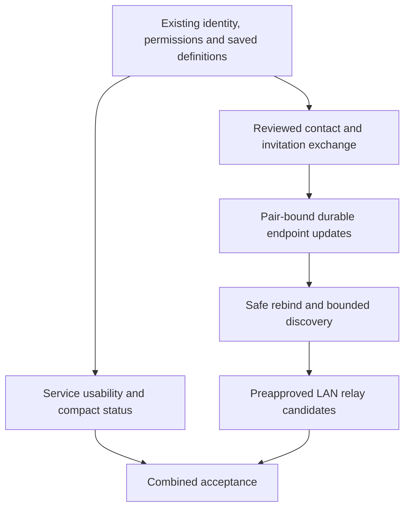

# alpha.6 convenience patch: scope and acceptance

[日本語](CONVENIENCE_PLAN.ja.md) · [Development principles](DEVELOPMENT_PRINCIPLES.en.md) · [Roadmap](ROADMAP.en.md)

**The planned alpha.6 targets all ten areas below plus the confirmed alpha.5 saved-screen correction; these improvements are not yet a released version.** Deliver and review small independent changes while keeping the complete target. Reuse working service, group, permission and recovery contracts rather than replacing them.

The partial source checkpoint in [draft PR #13](https://github.com/webkaz-labs/sobalink/pull/13) includes the saved-screen correction, inert favorites and group navigation, passive diagnosis, read-only device-card API/CLI/Web controls, reusable saved-share templates, and explicit alternate-port checks in the Core, CLI and Web UI. LAN invitation review now also precedes pairing on an already-configured relay. Read-only cards and invitation review are only part of pairing convenience. Endpoint continuity, relay convenience and the remaining combined acceptance are still open; the PR's current checks track automated verification, separately from release and physical-device acceptance.

Normal operation remains a user process without administrator privileges, TUN, OS route/firewall changes or router configuration. Outside-LAN use normally uses Tailscale. Existing explicitly opted-in WAN functionality remains available on its existing terms; new public-relay deployment and a standalone relay daemon are outside this patch. Byte-level transfer resume, durable message outboxes, a TUI and native UI are also outside scope.

## What already works and what must improve

| Area | Existing foundation | Acceptance for this patch |
| --- | --- | --- |
| 1. Initial pairing and endpoint exchange | Exact recipient keys, one-use expiring invitations, authenticated pairing, inspection and direct-LAN invitation QR | Exchange a compact contact/invitation by QR or text/file without manually transcribing keys. Show backend, intended peer, endpoint and expiry before applying. Scanning/importing alone grants nothing. Keep usable non-camera and narrow-terminal paths; cancellation, expiry, replay and wrong-recipient input remain safe |
| 2. Address changes and approved routes | Durable device keys, exact direct-LAN endpoints, pair-bound sealed relay offers and approved-route failover | Follow a moved peer only after an authenticated, replay-protected update within the reviewed scope. Keep device identity across local address changes. Reject stale, revoked, different-pair and outside-policy updates; retire affected transport generations. Show when both endpoints have moved and an explicit exchange is needed |
| 3. LAN relay setup and operation | Local address choices, reviewed user-process relay hosting, pin-preserving restart, certificate status and prepared candidates | Make choosing, starting, stopping and recovering a LAN relay understandable. Evaluate optional discovery and candidate selection explicitly. Discovering a host does not authorize it. Only an already-running, explicitly eligible host with reviewed admission and destination scope can become a candidate; do not claim automatic installation on another device |
| 4. Actionable diagnosis | Stable command errors, per-service last failure, optional explicit TCP check | Present a short known problem and a concrete next action for configuration, availability, identity, pin, expiry, capacity and listener conflict. Keep unknown causes unknown. Passive diagnosis performs no probe; an explicit probe checks only its reviewed target and reports transport separately from application health |
| 5. Browse and use shared services | Authorized discovery, freshness observations, reviewed advertised-service selection and client hints | Find the intended peer/service, review it and use its exact local endpoint in one coherent flow. Refresh stale metadata, distinguish no advertisements from no confirmed reply, and revalidate identity, scope and expiry at start. Do not auto-launch remote content or treat a listening endpoint as application success |
| 6. Favorites and service sets | Saved definitions, named groups, revision-bound multi-service start/stop and local client settings | Add a compact favorites/quick-set path without duplicating group membership or permission stores. Favorites are inert preferences. Show each set member and partial outcome; selection changes invalidate review. Saving, importing or favoriting does not start anything or create startup approval |
| 7. Offline retention and reconnect | Offline definition editing, durable settings, stopped saved definitions and same-process service recovery | Keep definitions and explicitly selected intent visible through disconnect/reload. State whether work is saved, waiting, active, expired or needs review. Reconnect only under still-valid existing authority; do not renew deadlines, replay messages/jobs, restore revoked grants or silently start ordinary definitions after process restart |
| 8. Port conflicts | Explicit ports/ranges, reserved-port exclusion and atomic listener rollback | Identify a listener conflict and offer a bounded set of checked high-port alternatives. The user explicitly chooses a proposal; an explicitly fixed port remains fixed. Preserve protocol, address family, range mapping and exclusions. Explain that a proposal is not a reservation and recheck at actual bind; distinguish capacity from conflict |
| 9. Guided sharing and permission presets | Guided CLI/Web sharing, purpose presets, exact audiences, port scope and lifetime | Reuse reviewed share settings as an inert permission template. Before each application show the exact current audience, protocol, target/scope and lifetime. Never add new peers, widen ports, lengthen permission or enable discovery/receiving silently. Existing copy/edit and saved definitions should carry as much of this as possible |
| 10. Compact state and details | Peer presence, discovery outcomes, service lifecycle, graph and timestamped route observations | Show one short current state and useful next action, with technical details on demand. Separate saved configuration, listener readiness, current route evidence, explicit TCP observation and application result. Old, missing or contradictory route observations become unknown, never an inferred direct/relay success |

### Confirmed alpha.5 gap to fix first

The alpha.5 Saved Services Web reader accepts only `tailnet` and `lan` (plus a legacy empty backend), while Core and the saved editor also support `direct-lan` and `mixed`. A profile containing either new mode prevents the saved list and group-review controls from loading; the same reader also rejects those imported definitions. The draft correction aligns supported-mode validation and adds parser, rendered-group and import-review regression tests without changing backend selection or permissions. It does not change the published alpha.5 tag.

## Dependency and implementation order

1. **Baseline regression and presentation contract.** Repair the saved-mode reader, establish the ten-area regression matrix, and inventory existing error/route fields. Preserve the post-release documentation checkpoint and the separate CI-efficiency work.
2. **Service convenience.** Improve compact state/diagnosis and advertised-service navigation. Then add favorites/quick sets, clearer retained offline state, explicit alternate-port proposals and reusable guided-share templates. Reuse current profile/group revisions, preview/apply and capacity policy.
3. **Pairing convenience.** Add a versioned, size-bounded contact exchange around existing authenticated invitation protocols. QR is only an encoding; a contact hint is not trust or a permission. Keep secrets out of URLs, logs, shell arguments and ordinary exports.
4. **Endpoint continuity.** Define and review the update protocol before changing sockets: pair-instance binding, sender/recipient binding, monotonic sequence, exact endpoint/scope, expiry, durable high-water marks and failure-closed persistence. Direct LAN does not currently have the relay protocol's per-pair route binding; revocation followed by re-pairing must not revive old updates. Add safe rebind and transport-generation retirement only after these tests pass.
5. **Optional LAN discovery and relay selection.** Feed bounded, explicitly enabled local discovery into authenticated endpoint review. Then evaluate preapproved relay eligibility, admission and preference/failover using the existing route coordinator. No self-appointed trusted host, unauthenticated election or remote software installation is implied.
6. **Combined acceptance.** Recheck all ten flows together, generated Web assets, package provenance and the exact final-source native/browser/distribution gates. Record physical-device results separately.

## Risks and boundaries

- **Discovery is a hint.** A name, private IP, network prefix or received multicast packet proves neither device identity nor membership in one physical LAN. Do not broaden allowed destinations, select a different NIC or bypass VPN boundaries from a hint.
- **Mobility needs rendezvous.** Both peers moving, AP isolation, blocked UDP/TCP or a sleeping only relay may leave no reachable exchange channel. Show a specific manual exchange/wake/connect-Tailscale path where appropriate; do not invent connectivity.
- **Relay identity needs continuity.** Current hosted certificates are pinned and IP-specific. A host address/certificate change must not silently replace an approved pin. A new candidate also needs the correct relay admission identity, not merely a reachable port.
- **Disk failure is consequential.** New authority waits for confirmed persistence. Reductions and invalid updates stop affected work; uncertain durable revocation must remain visible across recovery. Freshness and replay counters do not solve rollback of an entire private profile.
- **Resource controls stay separate from logical convenience.** New card/cache/discovery/probe state needs configurable finite byte, candidate, concurrency and retry budgets. Logical unlimited choices never disable memory/socket bounds or authorization checks.
- **Old peers and old state need explicit behavior.** Version exchange formats and private-state migrations; unknown versions fail closed. Feature absence should produce a concrete fallback, not repeated blind negotiation.

## Required evidence

Each slice needs focused negative tests, JA/EN parity, stable JSON, repeated-click/idempotence, cancellation/back/close and stale-review tests. Frontend changes require typecheck, build and rendered desktop/narrow-layout checks. Go changes require formatting, race tests and vet. Preserve native Linux x64/ARM64, macOS ARM64 and Windows x64 coverage and the existing distribution signing/provenance checks.

Protocol acceptance must include spoofed and replayed announcements, revoke/re-pair, clock/expiry boundaries, lost acknowledgements, interrupted persistence, concurrent updates, resource exhaustion, one/both endpoints moving, sleeping/lost relay and restart. Application and multi-device/NIC/suspend acceptance cannot be marked complete from mocks or loopback-only tests. An implementation slice passing its focused suite is not completion of all ten areas or a release.
