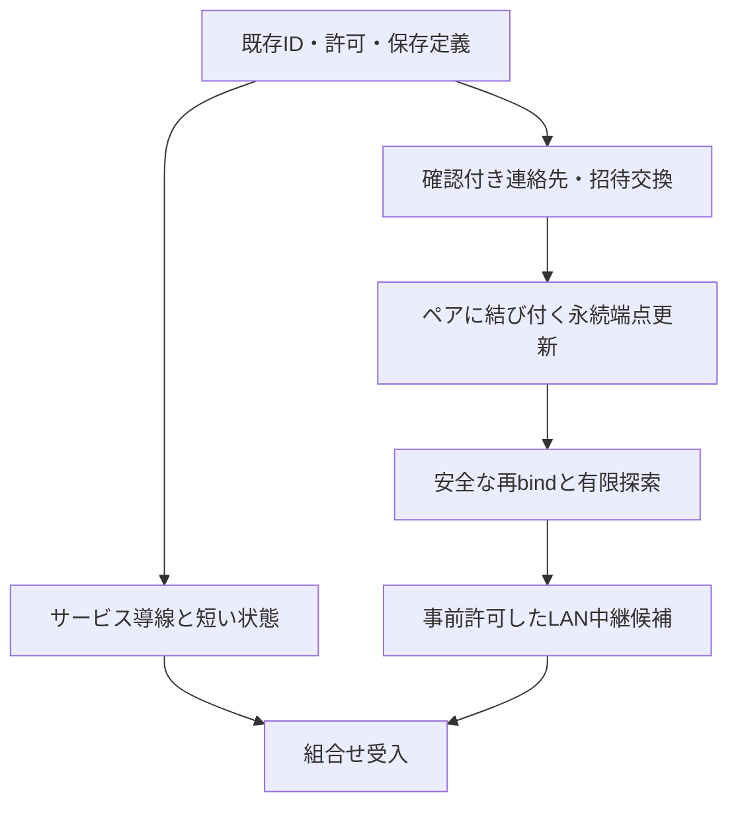

# 次の利便性パッチ：範囲と受入条件

[English](CONVENIENCE_PLAN.en.md) · [開発原則](DEVELOPMENT_PRINCIPLES.ja.md) · [ロードマップ](ROADMAP.ja.md)

**alpha.5の次に進める実装計画です。以下が公開済みという意味ではありません。** 10領域を目標として維持し、小さく独立した変更ごとに実装・レビューします。サービス・group・許可・復旧の既存契約を再利用します。

通常利用はユーザー権限のプロセスで動かし、管理者権限、TUN、OSの経路／FW変更、ルーター設定を前提にしません。LAN外は通常Tailscaleを使います。既存の明示opt-in WAN機能は従来の条件で保持し、公開relayの新規配置と単独daemonは今回の対象外です。転送の途中byteからの再開、永続outbox、TUI、ネイティブUIも含めません。

## 既存の土台と今回の受入条件

| 領域 | 既存の土台 | 今回の受入条件 |
| --- | --- | --- |
| 1 初回ペアリングと端点交換 | 正確な宛先鍵、一回限りの期限付き招待、認証付きペアリング、内容確認、direct LAN招待QR | 鍵を手で書き写さず、短い連絡先／招待をQRまたはテキスト／ファイルで交換できる。適用前に方式・相手・端点・期限を示す。読取りだけでは許可しない。カメラなし・狭い端末でも使え、取消・期限切れ・再利用・別宛先を安全に扱う |
| 2 アドレス変更と許可済み経路 | 永続端末鍵、固定direct LAN端点、ペアに結び付く暗号化relay情報と承認済み経路の復旧 | 認証と再利用防止を確認した更新だけで、承認範囲内の新しい端点を追跡する。ローカルIP変更でも端末IDを保つ。古い更新、取消済み、別ペア、範囲外を拒否し、影響する通信世代を終了する。両端が移動して明示交換が必要な場合を示す |
| 3 LAN中継の初期設定と運用 | ローカルアドレス一覧、確認付きのユーザープロセス中継、同じpinでの再起動、証明書状態、準備済み候補 | 中継の選択・開始・停止・復旧を分かりやすくする。任意の探索と候補選択の実現性を明示する。発見だけでは承認しない。既に動作し、中継になることを明示許可したホストで、admissionと送信先範囲を確認した候補だけを扱う。他端末への自動インストールを実装済みとしない |
| 4 次の操作につながる診断 | 固定エラーコード、サービスの直近失敗、明示TCP確認 | 設定不足・到達状態・認証・pin・期限・容量・待受競合を、分かっている原因と具体的な次の操作で短く示す。原因不明を断定しない。通常診断はprobeを送らず、明示probeも承認した対象だけを確認し、通信とアプリ正常動作を分ける |
| 5 共有サービスを見つけて使う | 許可された広告、鮮度・応答観測、内容確認付きの広告選択、接続先の案内 | 相手とサービスの発見から確認・正確なローカル接続先の利用までを一つの導線にする。古い情報を更新し、広告なしと応答未確認を分ける。開始時にID・範囲・期限を再確認する。遠隔コンテンツを自動起動せず、待受準備をアプリ成功としない |
| 6 お気に入りと複数サービスセット | 保存定義、名前付きgroup、版を確認した一括開始／停止、クライアント設定 | groupと許可台帳を重複実装せず、短いお気に入り／セット操作を加える。お気に入りは設定上の印だけで許可ではない。各メンバーと部分結果を示し、選択変更で確認を無効化する。保存・import・お気に入り登録で起動や起動時承認を作らない |
| 7 オフライン保持と再接続 | オフライン定義編集、永続設定、停止状態の保存定義、同一プロセスの復旧 | 切断・再読込後も定義と明示選択した意図が分かる。保存・待機・稼働・期限切れ・再確認を区別する。有効な既存許可だけで再接続し、期限更新、メッセージ／ジョブ再送、取消済み許可の復活、本体再起動時の通常定義の無断起動をしない |
| 8 port競合 | 明示port／範囲、予約port除外、失敗時の待受の巻戻し | 待受競合を示し、確認した高位portの候補を有限件提示する。選択は明示操作で行い、固定指定portは維持する。プロトコル・address family・範囲mapping・除外を保つ。候補は予約ではないことを示し、bind時に再確認する。容量不足と競合を分ける |
| 9 案内付き共有と許可preset | CLI／Web共有案内、用途preset、正確な相手・port範囲・期限 | 確認済みの共有設定を、未起動の許可templateとして再利用する。適用ごとに現在の相手・プロトコル・対象／範囲・期限を示す。相手追加・port拡張・期限延長・広告／受信有効化を無断で行わない。既存のcopy/edit・保存定義をできるだけ使う |
| 10 簡潔な状態と詳細 | 相手の存在情報、探索結果、サービス状態、graph、時刻付き経路観測 | 現在の短い状態と次の操作を示し、技術詳細は必要時に開く。保存設定・待受準備・現在の経路証拠・明示TCP確認・アプリ結果を分ける。古い／不足／矛盾する観測は不明とし、direct／relay成功を推測しない |

### 最初に直すalpha.5の確認済み不足

Saved ServicesのWeb側readerは `tailnet` と `lan`（および旧形式の空欄）だけを受理しますが、Coreと保存editorは `direct-lan` と `mixed` も対応しています。どちらかの新方式を含む保存profileでは一覧とgroup確認が読み込めず、同じreaderを使うimportも拒否されます。対応方式の検証だけを揃え、parser・実際に描画するgroup画面・import確認の回帰テストを加えます。方式の選択や許可は変更しません。

## 依存関係と実装順

1. **基準版の回帰修正と表示契約。** 保存方式readerを直し、10領域の回帰項目と既存エラー／経路情報を整理します。公開後文書のcheckpointと別作業のCI効率化を保ちます。
2. **サービスの使いやすさ。** 短い状態／診断と広告から使う導線を改善し、お気に入り／セット、保持したオフライン状態、明示的な代替port、再利用できる共有templateへ進みます。既存のprofile／groupの版、確認→適用、容量policyを再利用します。
3. **ペアリングの簡略化。** 既存認証付き招待の周囲に、版とサイズ制限のある連絡先交換を加えます。QRは表現方法であり、連絡先情報は信頼や許可ではありません。秘密はURL・ログ・shell引数・通常exportに含めません。
4. **端点の継続性。** socket変更前に、ペア世代、送受信者、単調増加sequence、正確な端点／範囲、期限、永続の最終sequence、保存失敗時の閉鎖を定義・レビューします。direct LANにはrelay側のペア単位のroute bindingがまだないため、取消後の再ペアで古い更新が復活しないことが必要です。そのテストの後に、安全なrebindと通信世代の終了を加えます。
5. **任意のLAN探索と中継選択。** 明示有効化した有限のローカル探索を、認証付きの端点確認に結び付けます。次に、事前許可した中継資格・admission・優先選択／復旧を既存route coordinatorで評価します。発見した端末の無断信頼、未認証の選挙、遠隔インストールを意味しません。
6. **組合せ受入。** 10領域の組合せ、生成Web、来歴、最終sourceのnative／browser／配布gateを再確認します。実端末の結果は別に記録します。

## リスクと境界

- **探索は手掛かりです。** 名前・private IP・prefix・multicast受信は、端末IDや同じ物理LANの証明ではありません。探索結果だけで送信先範囲を広げたり、別NICを選んだり、VPN境界を越えたりしません。
- **移動後に再会できる経路が必要です。** 両端の移動、AP隔離、UDP／TCP拒否、唯一の中継の休止では、更新経路がなくなる場合があります。適切な手動交換・起動・Tailscale利用を案内し、接続成功を保証しません。
- **中継IDの継続を守ります。** 現在のhost証明書はpinとIPに結び付きます。IP／証明書変更で承認pinを無断交換しません。新候補にはport到達だけでなく、適切な中継admission IDも必要です。
- **保存失敗を軽視しません。** 新しい許可は保存確定後に有効化します。縮小や不正な更新は該当通信を止め、永続取消が不確かな状態を復旧後も明示します。鮮度・sequenceだけでprivate profile全体の巻戻しを解決したことにはしません。
- **利便性と資源上限を分けます。** 連絡先・cache・探索・probeには、設定可能で有限のbyte・候補・同時処理・retry予算が必要です。論理上の無制限でもmemory／socketの上限と認可を外しません。
- **旧peerと旧状態の扱いを定義します。** 交換形式とprivate状態の移行に版を付け、未知の版は安全側に失敗させます。未対応時は明確な代替手順を示し、無制限に交渉を繰り返しません。

## 必要な証拠

各変更で負例、日英一致、安定JSON、連続クリック／冪等性、取消／戻る／閉じる、古い確認の扱いを確認します。Frontend変更には型検査・build・desktop／狭幅での描画確認、Go変更には整形・race・vetが必要です。Linux x64／ARM64・macOS ARM64・Windows x64のnative検査と、既存の署名・来歴検査を維持します。

Protocol受入には偽装・再利用、取消と再ペア、時計／期限境界、応答喪失、保存中断、同時更新、資源不足、片側／両側の移動、中継休止／喪失、再起動を含めます。アプリ・複数端末／NIC・休止復帰はmockやloopback試験だけで完了にしません。個別変更の対象テスト成功は、10領域全体やリリースの完了ではありません。
