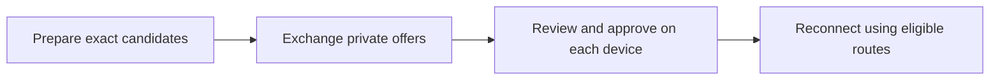

# Tailcat LAN setup and recovery

[日本語](LAN.ja.md) · [Main guide](GENERIC.en.md) · [Security](../SECURITY.md) · [Verification](VERIFICATION.en.md#tailcat-gate)

Published `0.3.0-alpha.2` provides explicit single-relay pairing. This checkout adds prepared-route recovery for the same pair; the new sections are **unreleased and under verification**. The published baseline, native prototype results and remaining two-process/native gates are separate in [verification](VERIFICATION.en.md#route-recovery-gate). Actual devices, direct LAN/WAN/NAT, sleep/wake and native IME remain unverified.

## Use the local UI

Open Network setup, choose LAN and create or display this device's public identity. Then choose the appropriate path:

1. To host, choose “Host a relay on this device”, select a private address/interface from the current list and an unused TCP port, review the listener, then start it. The default port is 48443 and can be changed. An empty list needs a private-network connection and refresh. Firewall settings are unchanged; a running listener does not prove another device can reach it
2. To join from a fresh profile, send this device's public ID to the inviter and paste its private invitation. Review the host identity, exact relay/pin and expiry, then choose “Connect and pair”. The UI configures that reviewed relay and pairs; an existing different network or relay requires explicit stop/offline recovery first
3. “Advanced: use an existing relay” remains available for a verified numeric endpoint and certificate pin. Once connected, invite the exact recipient key or join a received invitation. Pairing leaves application trust off until explicitly approved

“Stop sobalink” reviews active transfers and services before stopping the app, hosted relay and connections. The local control page disconnects. Reopen the app to continue. Ordinary definitions remain stopped; only separately reviewed [outbound startup approvals](STARTUP.en.md) can start fresh connections. Previous transfer progress never resumes.

Copying an invitation is explicit. Dismissing setup retains an outstanding invitation only in memory so it can still be canceled; consumed invitations lose their copy/cancel actions. Pause and revoke show their affected peer and scope before submission. For a running-backend change, stop and restart with `soba start --offline`, then return to setup.

The local SVG graph and accessible list show self-to-peer state only. Both remain available on narrow layouts, preserving the view explicitly selected. Click a device or edge to open its details and permission controls. Record actual font/metric and interaction acceptance for the latest source separately in [verification](VERIFICATION.en.md).

## Choose the relay explicitly

LAN mode uses Tailcat without account login. Choose either a relay hosted by this process on an exact private IP/high port, or an existing trusted relay identified by exact numeric IP/port and its TLS certificate SHA-256 pin. Both peers initially select the same bootstrap endpoint and pin. New prepared candidates are separate from this original pairing anchor. No public relay map, DNS bootstrap or arbitrary fallback is selected automatically.

The local relay binds only the chosen address; do not use a wildcard. A loopback address is useful only for same-host testing and is not reachable from another device. A hosted relay port must be at least 1024 and must not conflict with management, discovery, peer, pairing or backend-internal ports.

Stop an already running agent before changing backend or relay. Start management without reconnecting its saved backend:

```sh
soba start --offline
```

Leave that process running and use another terminal for commands. `--offline` is a startup option, not a promise that later explicit network commands are disabled.

On the hosting device, use `soba lan addresses` to list candidates and choose a private address. The IP below is fictional; replace it with an actual candidate. Listing a candidate does not prove reachability:

```sh
soba lan addresses
soba setup --network lan --host 192.168.50.10:54546
soba status
```

The host creates a private relay identity and certificate. State exposes only its public endpoint/pin and public node key. Verify those with the joining device through a trusted channel. Do not copy the private state file.

The other device selects the same relay. `RELAY_CERT_SHA256` is a placeholder for the verified 64-character lowercase certificate hash:

```sh
soba setup --network lan --relay 192.168.50.10:54546 --certificate RELAY_CERT_SHA256
```

`--relay` does not start a relay; its operator provides the listener and admission policy. Configuration validates and starts the selected backend, but listener readiness does not prove that the other device is reachable. `--host` and `--relay` are mutually exclusive. Use `soba setup --network lan` to reuse a saved selection; add `--name sample-node` only to change the node name.

## Pair the intended identity

With the agent running on each device, obtain its public identity. This also works with no selected network or under `start --offline`:

```sh
soba lan identity
```

This creates and saves a LAN identity if needed and returns only the public key in `publicKey`. Send the joining device's exact 64-character public key to the inviter through a trusted channel and compare it. Names are labels, not authentication.

On the inviter, after configuring the relay, issue a one-time invitation for that exact key. Replace `PUBLIC_ID` with the joining device's public key:

```sh
soba lan invite --to PUBLIC_ID
```

The default lifetime is five minutes. Override it with `--ttl`, in whole seconds from 1 second to 10 minutes, and set a display name with `--name sample-peer`. The result includes the secret `invitation` string, expiry and recipient public key. Save this output privately as `private-invitation.json` and share it only with the intended peer through an appropriate private channel. Keep secrets out of URLs, screenshots, shared logs, shell history and command arguments.

On the joining device, inspect the received file before joining:

```sh
soba lan inspect --json-file ./private-invitation.json
```

`inspect` checks the recipient against this device and validates the expiry, then returns the host public key/name and relay endpoint/pin without joining. Verify the intended host and configure that exact relay using `setup --network lan --relay ... --certificate ...` above before joining. `join` never changes the relay automatically:

```sh
soba lan join --json-file ./private-invitation.json
```

`inspect`, `join` and `cancel` accept either the full `lan invite` response or raw invitation JSON. No hand-written wrapper or manual JSON-string escaping is needed. A pipe or redirected input can replace the file option:

```sh
soba lan inspect --stdin < ./private-invitation.json
```

Input is limited to 48 KiB and interactive-terminal stdin is rejected. Protect the file and invitation-creation output, and remove unnecessary temporary copies. Reading a file does not change its permissions. `--dry-run` redacts invitation contents; use a real `inspect` call to validate the recipient, expiry and relay.

A successful join returns `paired: true` and `trusted: false`. Pairing commits private state before acknowledging success and establishes the transport relationship only. Each receiving device separately grants application trust to its sender:

```sh
soba peers
soba trust PEER_ID
```

Then use explicit messages, batch transfers and scoped services from the [main guide](GENERIC.en.md). Autosave remains a separate opt-in bound to backend, exact peer, trust generation and destination.

## Prepare another route (unreleased)

Prepare **both devices before moving networks**. Keep the original pairing; add only relay endpoints whose operator and certificate pin you have verified. An additional relay must already exist and admit the paired roles. `routes add` neither starts a relay nor changes its admission policy.



1. Stop the running agent and start `soba start --offline`. Keep it running; in another terminal use `soba lan routes list`, then add the exact endpoint/pin and `local` or `external` scope. The original relay plus at most three extra candidates are supported
2. Stop and restart normally on both devices so their saved relay sets take effect. This preserves the paired identity and keys. Ordinary saved services still require their existing explicit start/startup approval
3. Create an offer for the exact paired peer and exchange the result privately. On the receiving device, inspect it and compare the issuer, recipient, endpoint, certificate pin and expiry
4. Approve only candidate IDs from that inspection, with an explicitly chosen finite or until-revoked local lifetime. Do the same in the other direction. Authentication alone is not approval; an unapproved offer causes no route probe
5. Reconnect the application through its existing local service entrance. The coordinator can retire a transport generation confirmed failed, including hung flows, then try current approved routes for a new connection. Healthy active flows are not interrupted merely to prefer LAN. Check the actual application operation separately

These fictional values are placeholders, not reachable relay recommendations:

```sh
soba lan routes add --relay 192.168.50.20:54546 --certificate RELAY_CERT_SHA256 --scope local
soba lan routes list
soba lan routes offer PEER_ID --until-revoked
soba lan routes inspect PEER_ID --json-file ./private-route-update.json
soba lan routes approve PEER_ID --json-file ./private-route-update.json --candidates CANDIDATE_ID --until-revoked
soba lan routes list PEER_ID
```

Run add/list while offline; restart before using the new set. Run offer on the sender and inspect/approve on the receiver, substituting each side's exact paired `PEER_ID`. Save the complete offer result privately as the shown file. `--stdin` accepts piped input instead; do not paste the secret update into an argument, URL, screenshot or log. The CLI accepts its own offer envelope or the enclosed update. [Authoritative command help](../cmd/soba/lan_routes.go): `soba lan routes --help`.

Offer and local approval lifetimes are independent choices: `--until-revoked` means no scheduled expiry; `--ttl 168h` explicitly chooses a finite duration. The CLI requires exactly one of them for offer/withdraw and nonempty approval and has no default lifetime. Version 2 has no arbitrary 30-day ceiling. A finite approval is capped by a finite offer; until-revoked approval requires an until-revoked offer. Existing v1 finite records keep their exact deadlines. Receipt, reconnect and reload do not refresh permissions. An until-revoked approval survives reopening as the same saved grant; an expired finite grant stays expired. Applying a fresh offer replaces the locally approved selection, so review every route still wanted, including the original relay. Expiry or full revocation never silently restores the legacy singleton.

```sh
soba lan routes approve PEER_ID --current --candidates CANDIDATE_ID --ttl 168h
soba lan routes revoke PEER_ID --candidates CANDIDATE_ID
soba lan routes revoke PEER_ID
```

`--current` explicitly reapproves selected candidates from the still-valid saved offer. Omitting `--candidates` on revoke removes all local managed-route grants and stops affected outgoing work; it keeps the pair and application grants. To end the whole relationship, use pair revocation below. Removing an additional prepared candidate uses `soba lan routes remove CANDIDATE_ID` while offline, then restart. It does not retract an already exchanged peer offer; revoke approval on the relevant device as needed. The original anchor cannot be removed this way.

In the local UI, open LAN setup → “Advanced: prepared relay candidates” to review additions/removals. A paired device's details → “Route recovery” provides private offer creation, inspect/approve, expiry and revoke controls. New offers and eligible approval reviews start with Until revoked selected; finite/v1 offers allow only finite approval. The chosen lifetime and its impact still require confirmation. Select exact candidates explicitly; none is checked automatically. Saving reports configuration, not proven reachability.

`local` is a relay address classification. Direct peer traffic can leave the LAN; there is no strict LAN/no-external-egress mode in this scope. Saved-state cold start with external services unavailable, stable service entrances and route transitions require the [native integration gate](VERIFICATION.en.md#route-recovery-gate), not just configuration success. Existing TCP preservation, automatic application replay and byte-offset/restart file resume are not provided.

### Withdraw an advertised offer

Withdrawal creates an authenticated empty offer for the paired recipient. Save/exchange it privately and inspect it on the receiving side before explicitly applying:

```sh
soba lan routes withdraw PEER_ID --until-revoked
soba lan routes inspect PEER_ID --json-file ./private-route-withdrawal.json
soba lan routes approve PEER_ID --json-file ./private-route-withdrawal.json --withdrawal
```

Run withdraw on the issuer; inspect/approve run on the recipient with that side's peer ID. Creating the offer alone changes neither this device's configured candidates/local approvals nor the recipient's state. Applying the verified empty offer records its sequence and removes that recipient's local route approvals; it grants no route or application access. Normal nonempty approval still requires `--candidates` plus an explicit lifetime. `--withdrawal` removes authority and accepts neither candidate IDs nor lifetime flags. This differs from `revoke`, which directly removes local approval without creating a peer offer.

### Upgrade and recovery

Alpha.2 private LAN state version 1 preserves its original identity, keys, anchor and singleton behavior. Earlier prepared-route version-2 files retain their v1 finite deadlines. Explicit-lifetime protocol/state version 2 uses private LAN file version 3; these are different version numbers. Older binaries reject unsupported state. Do not lower versions or restore old backups to bypass that check. Keep backups private and inspect state with a compatible binary under `--offline`. Until-revoked approval does not bypass certificate validity: generated local relay certificates last 365 days, and expiry or a changed pin requires separate reviewed recovery.

`lan_routes_invalid` means obtain and inspect a fresh valid update; `lan_routes_unavailable` means no current local route permission. `lan_routes_recovery` means saved-state durability is uncertain: stop the agent and inspect/repair private storage before restarting. Refresh state before retrying an uncertain action. No successful offer import proves remote approval or connectivity.

## Cancel or recover an invitation

The inviter can cancel its own outstanding invitation using the private file it issued:

```sh
soba lan cancel --json-file ./private-invitation.json
```

| Result | Next action |
| --- | --- |
| `lan_environment_proxy` | Remove unsupported proxy variables for this process, then restart LAN |
| `lan_environment_override` | Remove unsupported Tailscale overrides for this process, then restart LAN |
| `lan_relay_mismatch` | Compare the selected numeric endpoint and exact certificate pin with the invitation |
| `lan_certificate_expired` | Check the clock; otherwise use offline management to revoke old pairs and reconfigure the relay |
| `network_restart_required` | Stop the agent, run `soba start --offline`, then change the network, name or relay |
| `lan_cancel_invite_first` | Cancel the invitation you issued to this peer before joining the peer's invitation |
| `lan_pair_reply_uncertain` | Do not retry blindly. The other side may have committed; inspect and revoke its completed pair before creating a fresh invitation |
| `lan_remote_paired_local_save` | The other side saved the pair but this side did not. Revoke the remote approval before retrying |
| `lan_revoke_not_persisted` | LAN has stopped because durable revocation could not be confirmed. Repair private-state storage before restarting |
| Expired, canceled or invalid invitation | Verify the intended identity and selected relay, then issue a fresh invitation if still wanted |

Add `--json-errors` before the CLI command to receive failures as `{code,error}` on stderr. Network failures also expose the stable `self.errorCode` in state. The UI localizes known recovery codes and keeps the unchanged technical explanation separate.

An uncertain reply is not success or proof that neither side changed. Reissuing the same command is not a safe substitute for inspecting both sides.

## Revoke, recover and stop

Application trust and transport pairing are separate:

```sh
soba revoke PEER_ID
soba lan revoke PEER_ID
soba stop
```

The first command removes application trust. `soba lan revoke` also removes the LAN transport pair, its application trust/autosave and affected services, and persists that removal. Run it on each side when ending the relationship completely. A storage failure causes the LAN backend to stop instead of claiming durable success.

If the saved network will not start, stop the agent and restart with `soba start --offline`. Saved peers remain visible as unverified/offline so you can explicitly revoke them. Replacing the original bootstrap relay requires all current LAN pairs to be revoked and no active backend. Adding/removing prepared extra candidates instead follows the offline/restart workflow above and keeps pairs. The same recovery path is available after a saved local certificate expires; do not bypass certificate checks or silently reuse old pair permissions.

Peer Pause blocks messages/files and cancels active sends. After unpausing, select those files again; canceled sends do not automatically restart. Disabling autosave instead returns to batch-by-batch consent. Neither operation stops a separately granted service; stop that service or revoke the pair explicitly.

## Traffic and remaining limits

The mode permits direct peer traffic, encrypted payload through the selected relay and HTTPS/ICMP diagnostics to that relay endpoint. It is not strict LAN isolation or zero external traffic. Required build tags omit port mapping, captive-portal probes and system-proxy support; unsupported proxy/backend override environments are rejected.

The embedded relay authenticates a sealed HTTPS bootstrap before admitting the invited transport role. Unknown keys have no blanket exception. Its two-minute relay connection lease rechecks admission; a previously admitted relay session can persist for up to two minutes after removal, or about four minutes from initial bootstrap when temporary admission overlaps a lease. Application authorization and tracked application flows are revoked immediately.

Path state remains Unknown until measured. A saved pairing is not evidence of contact. The graph shows this device and observed peers only; it must not invent a full mesh, bandwidth or direct/relay paths. Direct/relay changes, sleep/wake and reconnection do not guarantee existing TCP continuity. The successful native fixture establishes one loopback relay scenario across a lease boundary, not real LAN/WAN/NAT migration or a production zero-egress policy.
