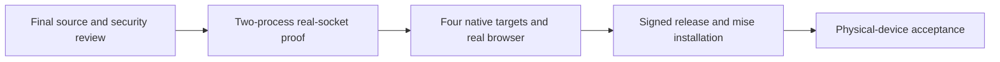

# Implementation and remaining acceptance

[日本語](ROADMAP.ja.md) · [Overview](../README.en.md) · [Verification](VERIFICATION.en.md) · [Development principles](DEVELOPMENT_PRINCIPLES.en.md)

The published baseline is [0.3.0-alpha.4](https://github.com/webkaz-labs/sobalink/releases/tag/v0.3.0-alpha.4), including prepared-route recovery and failed-reduction safeguards, with signed public retrieval and installation verified on four targets. [PR #11](https://github.com/webkaz-labs/sobalink/pull/11) adds LAN destination admission, easier chosen-host relay operation, relayless LAN, explicit WAN discovery and mixed connections. It is unreleased; implementation, exact-source automated acceptance and physical-device acceptance remain distinct. Mixed availability handling and configurable relay resource budgets are integrated locally; the corrected final source still needs full release acceptance.

## Current work

| Area | Implemented scope | Remaining evidence |
| --- | --- | --- |
| Devices and services | Tailnet, explicitly paired Tailcat, scoped TCP/UDP, stable local service listeners, presets | Physical enrollment, app authentication/TLS/host keys and actual LAN/WAN/NAT behavior |
| Prepared routes and relay operations | Alpha.4 recovery, encrypted pair-bound offers, explicit lifetimes, chosen-host setup and certificate operations | Recheck exact-source recovery and adjustable relay budgets; candidate metadata has no fixed four-item permission ceiling |
| LAN destination admission | Explicit private prefixes, exact pinned relay TCP, UDP guard and auxiliary-diagnostic restrictions | Exact-source native denial/revocation checks; never label this physical NIC/VPN or host-wide isolation |
| Relayless LAN | Mutually authenticated pairing/control plus userspace WireGuard TCP/UDP | Fixed same-family numeric endpoints must be reachable over TCP and UDP; no discovery or automatic endpoint rebinding; physical networks remain unverified |
| WAN candidates | Explicit numeric STUN and/or IPv6 discovery through the trusted-relay backend | Pinned relay still required for bootstrap; no universal NAT or relayless WAN promise; final native and expanded-form browser coverage |
| Mixed connections | Separate selected engines, signed same-peer binding and separately approved application access | Verify integrated positively-unavailable startup/dial fallback, unknown-state refusal and lifecycle races on the final source; no byte replay or existing-stream migration |
| Files and stored state | Explicit send, batch consent, optional exact-peer autosave, no overwrite, bounded staging/accounting, uncertain-save recovery | Active-transfer interruption, real filesystems, ordinary-user Windows process behavior and physical power-loss durability |
| Human interfaces | Japanese/English guided CLI, local UI, services, graph, route review, private sign-in | Final Go-backed route browser flows and screenshots; physical phone QR, actual native IME/fonts and terminal input |
| Lifecycle | Explicit startup approvals, offline suppression, saved settings and per-user OS startup | Actual OS sign-in and suspend/wake, real proxy/application reconnect |
| Distribution | Existing reproducible packages, signing/provenance, public retrieval and four-target mise checks | Repeat all exact-source gates for a separately selected next release |

[PR #8](https://github.com/webkaz-labs/sobalink/pull/8) was integrated before alpha.4, including independent Core-process restart/recovery evidence. That evidence does not automatically cover new connection modes. The [verification record](VERIFICATION.en.md#route-recovery-gate) preserves historical failures and exact-source outcomes.

## Acceptance order

A clearly labeled prerelease can be published for physical-device testing after its automated hard gates pass. Prepared-LAN cold start with the external relay unavailable, authentication/permission/privacy and stable entrance proof are required before that publication. An unperformed physical test stays unperformed; simulated or loopback success never turns it into a pass.

## Fixed boundaries and later work

Initial backend selection and cross-transport peer binding stay explicit. Automatic choice is limited to already configured, authenticated and approved routes for new flows, with positively classified unavailability; authorization, pin, unknown-state and unclassified failures stay terminal. Outward application traffic remains in the selected userspace stack. Route recovery cannot renew service lifetimes, widen peers/ports, restore revoked trust or restart canceled files. Files retain in-process whole-item retry only; no byte-offset or restart resume is added. Existing TCP preservation, arbitrary transaction replay and remote-job completion are not promised.

The normal direct-enabled single executable remains. `local` classifies a relay, and direct peer paths may be public. The implemented optional LAN policy admits specified destinations; it does not promise physical-NIC/VPN binding or whole-process/host zero egress. Administrator privileges, OS route/firewall or LAN-router changes are not prerequisites. Additional resource administration, remote management APIs, remote filesystem browsing, broadcast, synchronization and a durable offline outbox remain separate work.

### Agreed convenience work after this release

The supported outside-LAN recommendation is Tailscale. Building or deploying an external relay, including a separate public relay daemon, is out of scope for now. Existing opt-in WAN candidate controls remain an advanced capability requiring an already reachable compatible pinned relay; they are not a supplied public-relay deployment workflow. The next relay setup improvements focus on LAN hosts.

The following ten areas are adopted for the patch after the current integration release. Each needs CLI/Web, Japanese/English and permission/failure acceptance:

1. Easier authenticated first pairing and endpoint exchange. Existing recipient-bound invitation QR display is a starting point, not automatic discovery.
2. Stable-key LAN endpoint tracking and automatic selection among approved routes. Current fixed endpoints and new-flow routing do not yet provide endpoint migration.
3. Easier LAN relay placement and operation. Chosen-host setup exists; safe host election remains feasibility work and is not fulfilled by manual setup.
4. Actionable diagnosis and recovery guidance for connection failures.
5. Browse advertised services and launch them. Build on existing service listings and explicit access approval.
6. Favorites and multi-service start/stop sets, building on current presets without widening permissions.
7. Retain offline configuration and reconnect when an approved peer returns; distinguish this from a durable file-transfer outbox.
8. Suggest alternate ports when a local port conflicts, while preserving explicit fixed-port choices.
9. Guided local service sharing and reusable permission presets with a review of the resulting scope.
10. Compact actionable state with details on demand, including the actual route and why switching is unavailable.

Automatic LAN relay-host selection remains an unresolved desired capability. No remote deployment, new host authority or permission expansion is implied by these usability goals.

Keep all examples and published evidence generic. See [capacity](CAPACITY.en.md), [security](../SECURITY.md) and the [route contract](ROUTE_RECOVERY_DESIGN.en.md) for the authoritative boundaries rather than duplicating detailed checklists here.

## CI latency and conditional real-time tests

Keep short safety/logic checks, four native targets and browser acceptance on every change; select only natural key/lease timing checks by change impact. Transport/auth/timer/Core/config/dependency/helper/workflow or unknown changes require full coverage. Only cumulative docs/CSS changes from an exact verified full baseline are eligible to omit those waits. Release retains every test. See the [selection, provenance, required-check and measurement contract](CI_EFFICIENCY.en.md). Acceptance requires native CI for both selected and full paths and protection requiring the coverage aggregate.
