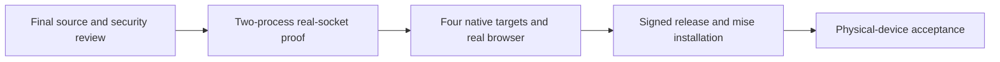

# Implementation and remaining acceptance

[日本語](ROADMAP.ja.md) · [Overview](../README.en.md) · [Verification](VERIFICATION.en.md) · [Development principles](DEVELOPMENT_PRINCIPLES.en.md)

The published baseline is [0.3.0-alpha.2](https://github.com/webkaz-labs/sobalink/releases/tag/v0.3.0-alpha.2), with signed public retrieval and installation verified on four native targets. The next source adds prepared-route recovery for the same paired device. It remains unreleased, with no version assigned here. Implementation, automated integration and physical-device acceptance are separate milestones.

## Current work

| Area | Implemented scope | Remaining evidence |
| --- | --- | --- |
| Devices and services | Tailnet, explicitly paired Tailcat, scoped TCP/UDP, stable local service listeners, presets | Physical enrollment, app authentication/TLS/host keys and actual LAN/WAN/NAT behavior |
| Prepared routes | Attributed transport adaptation, bounded local-first candidates, encrypted pair-bound offers, explicit finite/until-revoked local review, durable sequence state, CLI/UI | Final-source two-process/socket cold start and route recovery, unchanged entrance for new connections, migration/revoke/expiry and four native targets |
| Files and stored state | Explicit send, batch consent, optional exact-peer autosave, no overwrite, bounded staging/accounting, uncertain-save recovery | Active-transfer interruption, real filesystems, ordinary-user Windows process behavior and physical power-loss durability |
| Human interfaces | Japanese/English guided CLI, local UI, services, graph, route review, private sign-in | Final Go-backed route browser flows and screenshots; physical phone QR, actual native IME/fonts and terminal input |
| Lifecycle | Explicit startup approvals, offline suppression, saved settings and per-user OS startup | Actual OS sign-in and suspend/wake, real proxy/application reconnect |
| Distribution | Existing reproducible packages, signing/provenance, public retrieval and four-target mise checks | Repeat all exact-source gates for a separately selected next release |

[PR #8](https://github.com/webkaz-labs/sobalink/pull/8) has a successful corrected native transport prototype after an earlier cross-relay timeout. Later application integration cannot inherit that result. The [verification record](VERIFICATION.en.md#route-recovery-gate) holds exact sources and run outcomes.

## Acceptance order

A clearly labeled prerelease can be published for physical-device testing after its automated hard gates pass. Prepared-LAN cold start with the external relay unavailable, authentication/permission/privacy and stable entrance proof are required before that publication. An unperformed physical test stays unperformed; simulated or loopback success never turns it into a pass.

## Fixed boundaries and later work

Backend changes stay explicit. Outward application traffic remains in the selected userspace stack. Route recovery cannot renew service lifetimes, widen peers/ports, restore revoked trust or restart canceled files. Files retain in-process whole-item retry only; no byte-offset or restart resume is added. Existing TCP preservation, arbitrary transaction replay and remote-job completion are not promised.

The normal direct-enabled single executable remains. `local` classifies a relay, and direct peer paths may be public. Strict LAN/no-external-egress mode remains unimplemented and is not resolved by this source. Additional resource administration, remote management APIs, remote filesystem browsing, broadcast, synchronization and a durable offline outbox remain separate work.

Keep all examples and published evidence generic. See [capacity](CAPACITY.en.md), [security](../SECURITY.md) and the [route contract](ROUTE_RECOVERY_DESIGN.en.md) for the authoritative boundaries rather than duplicating detailed checklists here.
