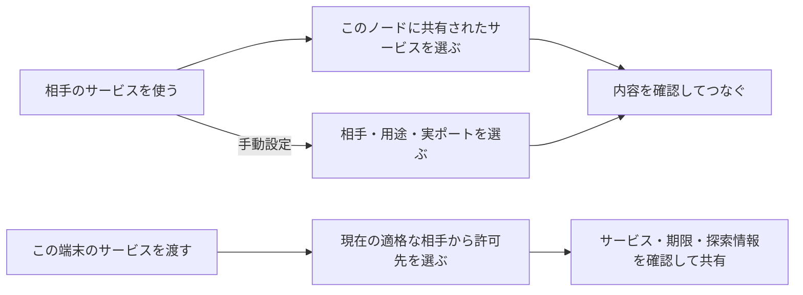

# tsnet-bridge 次期機能計画

更新日: 2026-10-02

**現在のソースでは「共有されたサービスを選ぶ → 確認してつなぐ」が基本です。** `0.2.0-alpha.2` に探索・矢印キー編集・用途候補と提供側条件の案内を含めています。導入は署名付き配布物の公開確認後です。公開済み `0.2.0-alpha.1` は相手・用途から選ぶ従来の操作です。通常の Tailscale・旧 bridge・既知の接続先へ進む手動経路も残します。探索結果はアプリの正常動作を保証しません。

| 実装したもの（`0.2.0-alpha.2` 対象ソース） | 引き続き確認するもの |
| --- | --- |
| サービス探索、矢印キー選択・文字編集、用途・提供側の案内、ブラウザー／QR／リンク認証、名前付き TCP/UDP、グループ、限定共有、期限、相手 ID 固定、JSON・待機・タスクリース、希望制のユーザー自動起動 | 対象版の Actions による公開・公開物検証・実導入の結果、実 tailnet 認証、実際の IME・フォント、Windows Console／ConPTY・標準ユーザー、実アプリ・モバイル、OS ログイン／スリープ・回線変更、性能比較 |

**実装済みと実機合格は別です。** 操作は CLI として実装しました。GUI・専用の「開く／クリップボードへコピー」ボタンはなく、`settings` の接続先を手動でコピーします。旧 `0.1.0-alpha.2` は固定の RustDesk／SOCKS 版で、名前付き接続の機能は含みません。利用手順は [名前付き接続ガイド](GENERIC.ja.md)、公開・自動試験の証拠は [検証報告](VERIFICATION.en.md) で確認してください。

- 新機能を試す: [名前付き接続ガイド](GENERIC.ja.md)／従来の [RustDesk 手順](VERIFICATION.md)
- 何に使うか選ぶ: [活用案と Tailscale との比較](USE_CASES.ja.md)
- 開発時に確認する: [実施順](#実施順)／[詳しい仕様と試験](#詳しい仕様と試験)

## 基本の操作

最初に、何をしたいかを二つから選びます。初回の tailnet 参加や追加のアクセス許可が必要なら、その手続きは省略せず案内します。

| 操作の名前 | 何が起こるか |
| --- | --- |
| **相手のサービスを使う** | この端末のアプリから、選んだ相手の Web・SSH・DB などへ接続する |
| **この端末のサービスを渡す** | 選んだ相手だけが、この端末で動く Web・API などへ接続できるようにする。技術上は「逆向き転送」 |

### 相手のサービスを使う

1. このノードに許可された有効な共有サービスを、新しい認証済み応答から選ぶ
2. 相手・用途・通信方式・共有ポートは自動入力し、接続名とローカル側の入口を確認する
3. 保存・開始前に選択を再確認して開始する。以後は接続先の確認・コピー・個別停止が基本操作

探索できない既知の接続先は `connect --manual` を使い、相手・用途・実ポートを選びます。探索の確認不能を、相手やアプリの停止と決めつけません。

### この端末のサービスを渡す

1. 接続を許可する相手を選ぶ
2. 渡すサービスを選ぶ。未登録なら、そのローカルサービスだけを指定する
3. **何を・誰に・いつまで渡すか**を確認して開始する。共有中の一覧からいつでも停止できる

保存しただけでは接続・共有を始めません。用途の既定値は候補として示し、サービスの存在や許可を推測で確定しません。端末内のサービスを一括で自動公開する操作は作りません。

## 設定を増やさないためのルール

- **通常は共有サービスを選ぶ。** 相手・用途・通信方式・共有ポートをまとめて引き継ぐ。手動設定や共有の作成では用途別ひな形を候補にし、推測を確認済みサービスとして扱わない
- **必要な項目だけ開始する。** 「開発環境」なら Web・API・テスト DB を一組にできるが、DB まで自動で有効にしない。項目別とまとめての停止を用意する
- **同じポートを最初に提案する。** 使われている、または権限が足りないときは代替案を見せて確認する。無言で番号を変えたり管理者権限を求めたりしない
- **現在の相手を見失わせない。** 名前・用途・実際の接続先を表示する。環境を切り替えても、既存の接続を別の相手へ付け替えない
- **コピーした内容で次へ進める。** 接続先とプロキシ欄を混同しない表示にする。TLS の証明書確認や SSH のホスト鍵確認は省略しない
- **共有の終了を簡単にする。** 共有先・サービス・残り時間を表示し、個別停止と全共有停止を用意する。停止・期限切れを再接続だけで復活させない
- **自動起動は希望した場合だけ。** 既定は無効。登録と解除を案内し、自動起動の許可からサービス共有の許可まで広げない

RustDesk の relay など相手にも伝わるポートは、既存の固定条件を維持します。汎用の自動提案をそのまま適用しません。[入力するアドレスの違い](USE_CASES.ja.md#アプリに指定するアドレス)

## 状態は次の行動がわかる言葉で伝える

| 表示の案 | 一緒に伝えること |
| --- | --- |
| サインインが必要です | 正規の認証手順へ進む方法 |
| 参加の承認待ちです | tailnet 側の承認が必要なこと |
| 接続の準備ができました | 「開く／コピー」。通信の準備とアプリの動作確認は別 |
| 一部だけ使えます | 使える項目と使えない項目。全体を成功扱いにしない |
| 相手に届きません | 確認できた範囲と再確認の操作。ACL 拒否・相手停止・経路障害を断定しない |
| このポートは使用中です | 競合した項目と、確認して選べる代替案 |
| 期限が切れました／停止しました | 通信を閉じたこと。再開するには明示操作が必要 |

スリープや回線変更後は、同じ相手・許可・期限を確認してから復旧します。確認できないときは通信を閉じ、通常のインターネット経路へ切り替えません。詳細が必要な人には理由コードや JSON を開けるようにします。

## 使う人から見た合格条件

以下を満たしてから、予定の操作を「使える」と案内します。

| 確認する場面 | 合格する振る舞い |
| --- | --- |
| 初めて標準的な用途を登録する | 相手・用途・確認の流れで進み、JSON やネットワーク用語を理解しなくても設定できる |
| 接続先を間違えそうになる | 開始前と利用中に対象がわかる。同名端末への置換や環境切替で勝手につながらない |
| ポートが競合する | 理由と代替案が出る。確認前には変更せず、既存アプリの設定も書き換えない |
| サービスを渡す | 対象・相手・期限が確認でき、未選択のサービスや相手には広がらない |
| 停止・期限切れ（スリープ中を含む） | 対象の待受と既存通信が閉じ、期限切れは復帰・再起動で再開しない |
| 一組の開始に途中で失敗する | 今回新しく開始した分を戻す。他の作業の接続を止めず、結果を項目別に示す |
| URL や SSH 接続情報をコピーする | 正しい入力先がわかり、証明書・origin・ホスト鍵の確認を弱める設定を含まない |
| 複数の自動処理が並行する | 各処理が自分の接続だけを待機・停止でき、失敗や二重停止でも他の処理へ影響しない |
| ヘルプを読む | 現行機能と予定が冒頭で区別でき、基本操作から必要な詳細だけに進める |

## 実施順

下表の 1〜6 の接続機能はソースへ実装しました。ローカル／模擬試験で、入出力・個別停止・部分失敗・相手変更・期限・所有関係を確認しています。ただし表の実機・実アプリ・OS 別確認まで完了した意味ではありません。自動起動は希望制の登録と解除を実装し、実ログイン時の挙動は未確認です。

安全性と基本診断は各段階に含め、最後にまとめて追加する形にはしません。

| 順序 | 作るもの | 確認すること |
| --- | --- | --- |
| 1 | 名前付きルール、用途のひな形、保存形式 | 既存設定の移行は事前確認。保存だけで接続を始めない |
| 2 | 相手のサービスを使う、複数 TCP/UDP、まとめ操作 | 競合、部分失敗、個別停止、項目別 JSON。SSH/SFTP と単純 HTTP から実機確認 |
| 3 | この端末のサービスを渡す TCP | 接続元制限、共有一覧、停止・期限をセットで検証 |
| 4 | 同じ操作での UDP 提供 | 相手別の応答、期限・失効・上限を UDP 専用に検証 |
| 5 | 復帰・診断・コピー、エージェント用の待機と後片付け | OS 別の障害復旧、認証・名前、並行処理。iPhone/iPad も利用側として確認 |
| 6 | 希望制のユーザー単位自動起動 | 登録・解除、二重起動、停止保持、期限切れが復活しないこと |

実装するアプリ機能は増やしすぎず、[用途の選び方](USE_CASES.ja.md)に沿って検証します。通常の Tailscale／Serve で足りる構成と、操作の手間・追加ノード管理・CPU・メモリー・電池・転送速度を比較します。direct／DERP の条件も分け、未測定の軽量性や高速性を約束しません。

## 詳しい仕様と試験

接続・保存形式・安全性の条件

### 旧 0.1.0-alpha.2 からの変更

旧 `0.1.0-alpha.2` の [設定](https://github.com/webkaz-labs/tsnet-bridge/blob/0069e38732227c8913ee6ceb0ec21784ae03d862/internal/config/config.go) は RustDesk 公開鍵と ID・ID−1・relay ポートが必須で、転送先にも 1024 以上の制約があります。SSH `22`、HTTP `80`、HTTPS `443` は現設定では指定できません。v2 では RustDesk 固有の条件を専用プロフィールに残し、ローカル待受 1024〜65535 とリモート宛先 1〜65535 を分離しました。

各ルールは名前・方向・TCP/UDP・待受・転送先・個別の有効状態を持ち、共有ルールは接続元と期限も持ちます。新規・取り込んだ設定は無効から開始。設定変更と移行は事前表示し、無断で上書き・有効化しません。

### 二つの経路

- 相手を使う: ローカルアプリ → 数値 loopback 待受 → 許可した現在の tailnet ピア。OS DNS・通常経路へフォールバックしない
- この端末から渡す: 許可した tailnet ピア → `tsnet.Server.Listen` → 明示した数値 loopback のサービス。LAN・公開 IP・任意ホスト名への中継に流用しない

相手から**新しい接続**を受けることと、既存接続の返信は別です。TCP の受信基盤は [固定依存版の Listen](https://pkg.go.dev/tailscale.com@v1.102.5/tsnet#Server.Listen) を参照します。OS の経路・DNS・ファイアウォールは自動変更しません。

### 制限と停止

- tailnet の ACL/grants に加えて、共有ごとに接続元ピアを検証する。同じ tailnet 全員を自動許可せず、識別不能なら拒否する
- 接続先をピアの識別情報で確認し、同名置換や IP 再割当で付け替えない。失効・識別変更を観測したら既存通信も閉じる。制御情報の伝播前まで含む瞬時の失効は保証しない
- loopback のアプリからは bridge の接続に見える。「localhost なら認証不要」が遠隔にも適用される危険を確認し、必要なアプリ認証・認証付き gateway を別途備える
- 接続数、待ち行列、UDP 対応表とアイドル時間に上限を設ける。固定転送は他のローカルプロセスからも到達でき、完全なアプリ隔離ではない
- 共有は期限付きが基本。期限・停止で新規待受、既存 TCP、UDP 対応表を閉じる。スリープ中の期限切れ、時計変更、再起動も確認する
- 一項目の障害は項目別に示す。共通の認証・ピア情報が確認できない場合は、影響する通信を全て閉じる
- 自動起動と継続共有の許可は分ける。停止・期限切れを復活させず、継続共有も対象・相手・条件を別指定する

既に渡ったデータは停止で回収できません。秘密情報を設定共有・ログ・JSON に含めず、書き出す内容を確認できるようにします。[既存の安全性](../SECURITY.md)、[tailnet のアクセス制御](https://tailscale.com/docs/features/access-control/grants)

### UDP 専用の条件

逆向き UDP は TCP の合格を流用しません。[ListenPacket](https://pkg.go.dev/tailscale.com@v1.102.5/tsnet#Server.ListenPacket) は IP の明示が必要です。ピアと送信元ポートごとにローカル側の対応を維持し、遅延・順不同の応答を正しい相手へ返します。受信・送信双方の許可を確認し、期限・失効・アイドル後の応答を別の相手へ送らないようにします。

エージェント連携とアプリ互換性の条件

### エージェント向けの契約

alpha.2 の `status --json` はサービス全体のみでした。v2 は以下を実装しました。CLI の正確な引数は [利用ガイド](GENERIC.ja.md) を参照してください。

- ルールごとの JSON: 方向、観測状態、理由コード、確認時刻、実際の待受、期限を返す。未知の原因とアプリ未確認を区別し、秘密情報を出さない
- 準備待機: 指定ルールをタイムアウト付きで待ち、取消・一部失敗を返す。準備完了を遠隔ジョブ完了としない
- タスク単位の所有関係: 自分が開始した転送だけを片付け、例外・呼出元終了・二重停止でも他の作業へ影響しない。名前分けは OS の隔離ではない

bridge は接続管理までを担当します。割当・並列数・実行権限・成果物・再試行・重複防止はオーケストレーターと実行側 API の担当です。**TTL や回線切断は遠隔ジョブの取消を保証しません。** ジョブ ID、取消・結果照会の API を用意し、bridge はアプリ要求を勝手に再送しません。

認証付き HTTP MCP/API は候補ですが、stdio MCP のプロセスは TCP 転送だけでは HTTP 化できません。接続許可と、ツールの操作・引数・対象資源の認可を分けます。権限・トークン・CLI 承認を自動追加せず、SaaS エージェントにも承認済みの tailnet 接続環境が必要です。通常の OS 通信・ファイル権限のサンドボックスは別設計です。[MCP トランスポート](https://modelcontextprotocol.io/specification/2026-07-28/basic/transports)、[認可](https://modelcontextprotocol.io/specification/2026-07-28/basic/authorization)、[利用者確認](https://modelcontextprotocol.io/specification/2026-07-28/server/tools)

### 名前とブラウザー

HTTPS の証明書名・SNI、Web の origin・Cookie・CORS・リダイレクト・WebSocket、SSH のホスト鍵を検証します。URL を localhost に変えるだけでは解決しません。`HostKeyAlias` や curl `--connect-to` は用途別の候補で、検証無効化の自動生成はしません。[OpenSSH](https://man.openbsd.org/ssh_config#HostKeyAlias)、[curl](https://curl.se/docs/manpage.html#--connect-to)

iPhone/iPad は通常の Tailscale と既存アプリを使う側として試験します。MagicDNS、ログイン、HTTPS の secure context、画面ロック・バックグラウンド・回線切替後の復帰を確認します。端末側の localhost と提供側を混同せず、証明書発行や DNS 設定変更が必要なら別途確認します。[モバイル利用の条件](USE_CASES.ja.md#iphone-と-ipad-から使う)

試験チェックリストと今回作らないもの

### 試験

- 保存・再読込・移行、重複名、ポート範囲、方向とプロトコルの不整合、無効項目が起動しないこと
- 同一／複数ピア、TCP/UDP 同一番号、部分開始の巻き戻し、個別停止、環境切替の誤接続防止
- 未許可・識別不能・同名置換・失効・ACL 拒否、通常経路や指定外 loopback・LAN・公開宛先への転送防止
- TCP 半閉じ・切断、UDP の送信元分離・順不同・遅延・アイドル・上限、停止後の残存通信
- スリープ中の期限切れ、時計変更、再起動、回線変更・長時間切断後に共有が意図せず再開しないこと
- JSON の互換性、秘密情報の非出力、待機タイムアウト・取消、並行所有関係、二重停止、呼出元終了
- HTTP MCP/API の認証拒否・権限不足・応答中断と、その後も続くジョブの照会。復旧時に要求を自動再送しないこと
- HTTPS・SSH と実アプリ、iPhone/iPad の画面表示・入力・権限・復帰
- 対象 Linux・macOS・Windows の実機。Windows の管理者権限 CI と、標準ユーザーの起動・認証を分けて記録

自動試験は実際の tailnet 認証なしを基本とし、実機参加・共有・ポリシー変更は対象と範囲を承認した試験で行います。CI 成功だけで実機互換性を合格にしません。[既存の検証報告](VERIFICATION.en.md)

### 今回作らないもの

独自のファイル・クリップボード同期、チャット、バックアップ実行エンジン、エージェントのスケジューラー・特権付き任意コマンド実行、stdio MCP アダプター、ブラウザー用 HTTP プロキシ、無人環境の認証方式、iOS 版 bridge は別機能です。

公開インターネットへの提供、Funnel、サブネット転送、Exit Node、mDNS・ブロードキャスト中継、任意宛先への転送も含めません。tailnet 内のコールバック、限定デバッグ、MQTT、読み取り専用の障害診断は既存アプリをつなぐ候補です。公開 SaaS の webhook や非 tailnet 機器へは別経路が必要で、高権限のデバッグ入口を無条件で再共有しません。

