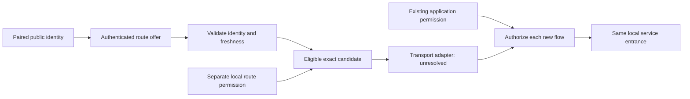
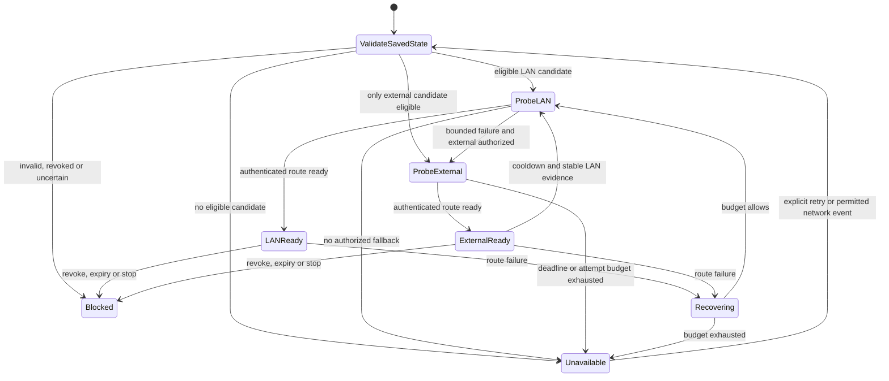

# Authenticated route recovery design

[日本語](ROUTE_RECOVERY_DESIGN.ja.md) · [Current LAN behavior](LAN.en.md) · [Architecture](ARCHITECTURE.md) · [Security](../SECURITY.md) · [Development principles](DEVELOPMENT_PRINCIPLES.en.md)

**Status: design and investigation only; not implemented or accepted for release.** This document proposes recovery between LAN-local and external relay candidates for the **same Tailcat peer and pairing**. It does not change current commands, state formats or guarantees. Current code selects one exact numeric relay endpoint and certificate pin; changing it requires stopping the backend and revoking existing LAN pairs. Stock Tailcat integration does not yet establish a safe multi-route implementation.

## 1. Intended result and limits

After one explicit pairing and local review of exact route candidates, a peer should be reachable through an eligible LAN-local or external relay without repeating pairing. A previously prepared LAN must support cold start with Internet access absent. An already running, authorized local application entrance should retain its exact loopback address and port while the route is recovering, so the application can reconnect there.

These are acceptance targets, not current functionality:

- Prefer a healthy, eligible LAN-local relay, with hysteresis rather than reacting to every probe
- Fall back only to a previously authorized, authenticated external candidate; never to a public/default relay map
- Preserve the paired identity, application target and existing permission expiry across route changes
- Keep recovery attempts, probes, concurrency, stored candidates and update messages bounded
- Explain whether the listener, transport, application connection or remote job is ready; do not infer one from another

The stable application entrance is an existing explicitly selected **service listener**, not the management UI's ephemeral port. A route change must not silently choose another local port. A process restart follows existing startup approval rules; it does not revive stopped services.

No seamless TCP guarantee is made. A connection may fail and the application may need to reconnect. sobalink must not replay arbitrary TCP bytes, HTTP requests, shell commands, remote jobs or application transactions. UDP datagrams may be lost; stale datagrams must not be replayed. File transfer retains only its existing in-process retry of unfinished **whole items from byte zero**, with the existing batch acknowledgement behavior. There is no byte-offset resume, durable restart resume or offline outbox.

Switching Tailnet/tsnet and Tailcat, MCP, fleet administration, synchronization and an outbox are outside this design.

## 2. What the current source actually does

| Source | Current boundary | Consequence for this proposal |
| --- | --- | --- |
| [`trusted.go`](../internal/lanlink/trusted.go), `TrustedRelay.region`, `validateRemote` | One numeric endpoint/pin; a peer capability must contain exactly the expected one-node region | A list of endpoints cannot simply be appended to the existing capability |
| [`node.go`](../internal/lanlink/node.go), `NodeConfig`, `NewNode`, `Address` | One relay in configuration and server construction; saved per-peer clients use their original capabilities | A selection policy alone does not update live transport |
| [`pairing.go`](../internal/lanlink/pairing.go) | Authenticated, recipient-bound pairing transcript binds relay, role keys, capability hashes and fresh request/reply data | A new route update needs its own domain, freshness and authority rules; it cannot weaken pairing validation |
| [`peers.go`](../internal/lanlink/peers.go) | Exact public peer key, distinct role mapping and revocation epochs authorize tracked flows | An endpoint, name or relay membership must never become peer identity |
| [`core/lan.go`](../internal/core/lan.go) | Private state version 1 contains one selection; changing relay with saved pairs is refused | Migration and local review must precede any broader runtime behavior |
| [`backend.go`](../internal/lanlink/backend.go) | Application outbound traffic uses the userspace stack, with no OS route/DNS fallback | Recovery must retain this boundary |

The pinned dependency is `github.com/tailscale/tailcat v0.7.1-0.20260929145319-b4dc28e8aa89` in [`go.mod`](../go.mod). API investigation finds a single `Server.Region`, a maximum of one region in `ConnInfo`, and no supported runtime region-update API. Underlying map-first region selection is not deterministic route preference. Multiple DERP nodes or a reordered Go map are not proof of LAN-first failover, peer rendezvous or offline cold start. These observations must be rechecked against any dependency change.

Existing pairing/atomic-persistence and loopback integration tests establish useful regression boundaries. They do **not** verify the proposed route-update protocol, offline-LAN startup, LAN/WAN migration or real-device application continuity. See [verification](VERIFICATION.en.md).

Preparatory work in [`routes.go`](../internal/lanlink/routes.go) defines recipient-sealed route-update helpers, a pair binding derived from existing device-to-outgoing-role associations, canonical authenticated-payload validation, a sequence check, exact candidate IDs and an intersection with separately supplied local approvals. Its current draft bounds are four candidates and a 30-day maximum offer lifetime. These are helper-level bounds, not measured recovery-policy defaults. The helpers perform no network I/O or persistence and are not a delivered route-recovery feature. Durable high-water marks, pair-scoped local approval ownership/expiry, acknowledgement reconciliation, delivery and runtime activation remain caller/integration obligations. Pure helper tests cannot clear those gates.

## 3. Separate identity, route offers and local permission

The proposed model separates four records. Names below are conceptual, not a wire schema or public JSON contract.

| Record | Required binding |
| --- | --- |
| Pair identity | Existing public peer key, local identity, protected role keys/capability and a durable pair incarnation or equivalent anti-replay boundary |
| Route offer | Issuer's paired public identity, intended recipient, pair incarnation, protocol version, monotonically increasing revision, validity interval and bounded candidate set |
| Exact candidate | Stable candidate identifier, numeric unicast IP and port, exact TLS certificate SHA-256 pin, relay kind, candidate validity and its offer issuer/revision |
| Local route permission | Exact pair/incarnation and candidate tuple, authorized purpose, lifetime, enabled/revoked state and local revision; held separately from remote offers |

The offer issuer is the authenticated paired peer, not a display name, relay operator or transport source address. A peer may advertise routes for its own paired endpoint only. It cannot introduce a third peer, replace a server identity/PSK or change transport role keys through a route-only update. Any permitted capability refresh must bind the same identity, existing role relationship and exact candidate; its format remains a transport gate.

Eligibility is the intersection of current pair approval, authenticated unexpired offer, exact local permission, valid pin/certificate and route policy. Authentication answers who sent the offer; it does not authorize local network access, relay hosting or application access. A newly offered endpoint, changed port/pin, new external destination or longer permission lifetime requires explicit local review. An already reviewed exact candidate may be selected repeatedly without repeated pairing or prompts. A fresh offer cannot extend local permission. Removing or disabling a local permission cannot be undone remotely.

Review shows peer, issuer, numeric endpoint, pin, LAN-local/external kind, validity and intended change. It does not expose PSKs, private keys or capabilities. Route offers, DNS, discovery and advertisements are never instructions to bind a new local listener. Hosting a relay retains explicit exact-interface/address/port permission and admission policy. No wildcard binding, automatic firewall changes or arbitrary numeric-address scanning is introduced.

Transport pairing, application trust, file consent/autosave, share/connect scopes, proxy grants and startup approvals remain separate. Route recovery cannot add peers/ports, change receive destinations, renew grants, clear pause, re-enable receiving or activate stopped definitions. Recovery preserves original finite expiries and revocation generations.

## 4. Authenticated updates and failure handling

The future protocol must meet these requirements before its encoding is selected:

1. Use a dedicated versioned domain, authenticated confidentiality under the existing paired identities, and strict bounded decoding. Reject unsupported versions, unknown fields, malformed/duplicate fields, extra trailing data and ambiguous representations. Define canonical authenticated bytes and hashes; reuse reviewed cryptographic primitives, not a new ad hoc signature scheme.
2. Bind sender, recipient, pair incarnation, revision, full candidate content and validity interval. If transport bootstrap/capability data is needed, bind its digest and keep the data protected. Bind acknowledgements to the exact update hash and revision.
3. Reject tampering, cross-peer/cross-profile reflection, revoked identities, expired/not-yet-valid offers and stale revisions. An identical retransmission may receive the existing durable acknowledgement; equal revision with different content is a conflict and cannot overwrite state. Higher revision alone cannot grant authority.
4. Persist the highest accepted revision/content hash, local permissions and revocation barriers coherently. The current in-memory trust epoch is not a durable replay counter. Specify counter overflow, concurrent senders, crash recovery and pair re-creation so old updates cannot resurrect an earlier relationship.
5. Distinguish offer receipt, durable acceptance, local authorization and actual activation. A transport acknowledgement must not claim the other device approved a route or established an application connection. A lost acknowledgement is uncertain; query/retransmit the same bounded update identity, never invent success or blindly start a new authorization transaction.
6. Serialize update activation against peer/route revocation, expiry and shutdown. Capture an authorization generation before dialing and recheck before exposing a new flow. Late probes and delayed callbacks must not reactivate an old candidate.

Proposed persistence behavior follows the existing private atomic writer contract:

| Outcome | Required behavior |
| --- | --- |
| Rejected/malformed update | No permission or route change; bounded diagnostic without secret payload |
| Save fails before publication | Do not activate or acknowledge durable acceptance; preserve the last durable valid state |
| Replacement published, durability uncertain (`ErrAtomicCommitted`) | Do not claim rollback or activate uncertain new authorization; reconcile the recorded state and freeze affected mutations pending explicit recovery |
| Revocation cannot be durably confirmed | Disable affected admission/flows immediately; stop the affected transport when safe isolation cannot be proven; report recovery required |
| Crash/restart or corrupt state | Load and validate a complete supported state before dialing; never silently fall back to older, broader permissions |
| Clock invalid or moved backward | Fail closed on uncertain validity; show a clock/review action rather than extending expiry |

This is not a distributed atomic commit promise. Either side can be offline or fail after saving. The recovery protocol must represent asymmetric state without discarding pair identity or granting speculative permission. A locally denied route stays denied even if the peer reports successful activation.

Candidate revocation removes eligibility and closes affected route resources; remaining routes are usable only if independently authorized. Pair revocation invalidates all candidates, update authority and related application approvals, and cancels outstanding recovery work. Relay connection lease lag is distinct from application admission; existing residual relay-session limits must not be described as continued application permission.

Durable anti-replay state does not by itself detect a whole-profile rollback to an old backup. Define a fail-closed restore/review procedure and the limits of local rollback detection before release. Do not claim rollback resistance from a revision field alone.

## 5. Recovery policy and offline-LAN cold start

This is an application recovery policy sketch, **not** a claim that Tailcat exposes these state transitions today.

- Determine eligible candidates before network I/O. An unapproved candidate is not even probed. Restrict relay probes to exact authorized tuples; retain permitted direct-peer traffic and existing selected-relay diagnostics rather than claiming LAN-only egress isolation
- Prefer LAN on startup when valid cached LAN bootstrap is available. Use explicit time budgets so an unavailable LAN does not block an authorized external candidate indefinitely
- Use consecutive success/failure evidence, a minimum dwell time, a failback cooldown and bounded jittered backoff. Exact defaults and observation signals require the transport spike and real-device measurements; no unmeasured latency or reconnection SLA is promised
- Keep a usable current route while probing a preferred candidate wherever the adapter can do so safely; a successful probe is not itself a switch. Require authenticated readiness before selection. If preparing a candidate requires tearing down the old engine, record that interruption explicitly
- Cap simultaneous candidate work, per-attempt deadline, attempts per recovery cycle and overall cycle duration. Exhaustion produces a visible unavailable state. Further work needs an explicit retry or a defined, rate-limited network-change trigger while permission remains valid; no unbounded busy retry
- Coalesce concurrent dials behind one peer recovery operation. Do not queue arbitrary application bytes for later replay. Any waiting new connection is bounded, cancelable and reauthorized before use
- Expiry, revoke, stop and permission changes preempt probe/backoff timers. A network event is a retry trigger, never a permission renewal

Offline-LAN cold start means both devices and any required local relay start from saved state while the external relay and Internet are unavailable. All required identity, candidate, pin, validity and local permission must already be usable locally. No public DNS/map, online login, external relay contact, new pairing or remote-only configuration lookup may be necessary. A local relay host must start with its reviewed listener and valid saved identity. A changed interface/address or expired certificate requires explicit recovery, not a wildcard bind or bypass.

The peers must rendezvous on a common authorized route even when they start at different times or initially prefer different candidates. A control message available only over the failed old route cannot solve this cold-start problem. If no shared valid candidate exists, report that fact and the exact local review/recovery needed. Do not silently exchange new endpoints or pins through unauthenticated discovery.

## 6. Transport design remains an open gate

The following options require experiments; none is selected or implemented here:

| Investigation | Evidence required before selection |
| --- | --- |
| Supported upstream extension or reviewed minimal dependency change | Deterministic candidate control, authenticated capability/bootstrap updates, cancellation, listener lifecycle and stable identity behavior |
| Serialized transport recreation behind stable service listeners | Proven close/reopen safety with the same protected keys, loss/duplication boundaries, inbound reattachment, peer rendezvous and bounded asymmetric recovery |
| Multiple prepared transport paths | Proof that simultaneous server/client roles, key reuse, relay admission and resource accounting do not conflict; never assume two engines with one identity are safe |

For every option, demonstrate how both peers obtain compatible relay bootstrap, how the sender and receiver select a common path, and how current `validateRemote` protections survive. Do not replace the exact-relay check with “any advertised relay.” Show that changing a route does not replace the peer endpoint identity or accidentally change all unrelated peers. Record whether the capability or disco material changes and how it is authenticated.

The stable local listener may outlive a failed transport connection, but new connections can fail while recovery is unavailable. If the adapter cannot retain that listener, the implementation must document the narrower result and must not pass the stable-entrance gate. Application success and remote-job completion need separate evidence. Direct-versus-relayed path labels stay unknown until measured.

## 7. Old peers and alpha.2 migration

This migration target is the sobalink `0.3.0-alpha.2` single-relay state model, not the unrelated legacy `tsnet-bridge` release. Release publication/installation evidence is separate; see [distribution](DISTRIBUTION.md).

- Treat a valid version-1 selection as a **singleton** exact candidate with its existing scope. Preserve private identity, PSK, paired role keys and public peer identity. Do not infer permission for any second relay, changed pin, route hosting or recovery mode
- Keep old-peer operation single-relay. Authenticated capability negotiation is required before sending a new route-update protocol; unknown/missing capability means unsupported, not permission to weaken checks. A mixed-version pair remains usable only on its existing compatible route
- Enabling additional candidates requires local review on each affected device. A verified offer can be retained as pending information without being activated; pending data is bounded and must not trigger probes
- Design a versioned private-state migration with validation, atomic persistence, interruption recovery and explicit behavior for older binaries. Do not silently rewrite a newer state to version 1, strip revocation barriers or restore an older backup merely to make downgrade work
- Preserve legacy service, receive, trust, pause and startup semantics. Missing/invalid legacy state stays blocked under existing recovery rules. An upgrade cannot invent receive approval or consider an offline peer currently verified
- Do not run a speculative migration in this documentation-only change. Until the migration and transport gates pass, current stop/revoke/reconfigure recovery remains authoritative

No new CLI command, API endpoint, JSON field or wire version is committed by this document. Final schema and bilingual command/UI wording require implementation review together.

## 8. Acceptance matrix and release gates

All integrated route-recovery scenarios below remain **unimplemented and unverified**; preparatory helper tests are narrower evidence. A passing mock or loopback test is not real-device acceptance. Record exact source/dependency revision, build tags, OS/architecture, scenario, observations and remaining limits for each future result.

| Area | Required scenarios | Pass criterion |
| --- | --- | --- |
| Identity and permission | Same pair across approved LAN/external candidates; offer without local permission; changed endpoint/pin; third-party offer | Identity unchanged; no redundant pairing; unapproved destinations receive no probes or traffic |
| Protocol security | Tamper, replay, equal-revision conflict, stale incarnation, reflection, malformed/oversize input, unsupported version | Rejection without state widening; bounded work and redacted errors |
| Durability | Pre-publication failure, published uncertainty, crash at each transition, lost ACK, restart replay, rollback recovery | No speculative activation or false success; no resurrected revoked permission |
| Revocation and expiry | During dial, probe, backoff, activation and active traffic; route-only and pair-wide removal | No late authorization; tracked work stops; remaining routes require independent permission |
| Offline cold start | Both fresh processes, no Internet, saved LAN relay; staggered startup; external endpoint blackholed | Common LAN route established within the agreed budget without external bootstrap or re-pairing |
| Route transitions | LAN loss, WAN loss/return, interface change, intermittent failure, asymmetric candidate preference | Bounded recovery and LAN failback; no flapping, arbitrary fallback or key/role collision |
| Application entrance | Existing local TCP/UDP listener, port conflict, concurrent connects, route switch | Exact entrance retained during same-process recovery; conflict visible; no silent port change or replay |
| Applications and files | Real application reconnect; interrupted request/job; unfinished file retry; stop/restart | No TCP/job guarantee; existing whole-item retry only; no byte/restart resume or duplicate-success claim |
| Migration and old peers | Valid alpha.2 state, corrupt/missing state, mixed versions, interrupted migration, attempted downgrade | Singleton scope preserved; explicit additional approval; safe incompatibility/recovery message |
| Resource and observability | Many peers/candidates, repeated updates, cancellation, sleep/wake, clock changes | Finite storage/work bounds; truthful path state, distinct readiness and actionable errors |
| Platform/distribution | Native Linux x64/ARM64, macOS ARM64, Windows x64; installed signed binary | Native race/vet/regression evidence and packaged-binary checks; actual LAN/WAN/NAT and sleep/wake recorded separately |
| Human interfaces | Japanese/English automatic locale, override/fallback, narrow UI, keyboard navigation, cancel/retry | Equivalent review and recovery meaning; stable language-independent machine JSON; no leaked private data |

For a **clearly labeled prerelease**, hard gates are: (1) functional rendezvous, offline cold start and reconnect demonstrated by two separate processes using real sockets with controlled topology failure and recovery; (2) reviewed identity, update authentication, durable anti-replay/revocation and failure handling; (3) exact local permission, privacy and backward-state migration; (4) bounded retry/resource behavior and tested policy defaults; and (5) native Linux x64/ARM64, macOS ARM64 and Windows x64 regressions plus signed installed-binary verification for the exact candidate. Mocks, a single successful loopback connection or documentation review cannot replace these gates. Authentication, permission and privacy failures cannot be deferred as prerelease limitations.

**Physical-device acceptance is a separate later tier.** Actual LAN/WAN/NAT movement, physical-device offline cold start, target-application compatibility and OS suspend/wake must remain explicitly unverified until measured. A prerelease that passes the automated hard gates may be published for those tests, including installation through mise, without claiming physical acceptance. Publication does not establish seamless TCP or strict no-external-egress behavior; neither may be advertised without supporting evidence. Record automated topology results and physical results separately in the matrix above.

All examples and diagrams here are generic. Do not add real endpoints, private state, pairing material, personal usage history or environment-identifying details to implementation fixtures, screenshots or release evidence.
