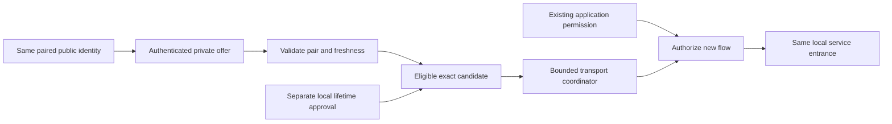

# Authenticated route recovery

[日本語](ROUTE_RECOVERY_DESIGN.ja.md) · [LAN steps](LAN.en.md#prepare-another-route-unreleased) · [Architecture](ARCHITECTURE.md) · [Security](../SECURITY.md) · [Verification](VERIFICATION.en.md#route-recovery-gate)

**Status: implemented in the unreleased source, integration verification in progress.** This is recovery between prepared relay candidates for the **same Tailcat device and pairing**. Published `0.3.0-alpha.2` remains the single-relay baseline. The new implementation has not completed the two-process, four-native-target and distribution gates; no new release version or physical-device acceptance is claimed.

## Result and boundaries

Prepare the exact candidates on both devices, exchange recipient-authenticated offers privately, then approve the selected routes locally. A new application connection can try an eligible LAN-local or external relay without pairing again. The intended same-process service entrance retains its exact loopback address and port while the underlying path recovers. This is an existing authorized service listener, not the management UI's ephemeral port.

- An existing TCP connection can fail; the application must reconnect. Healthy active flows are not interrupted for optional preferred-route probes; a failed transport generation is retired, including hung flows, so new connections can recover
- No arbitrary TCP bytes, HTTP requests, commands, jobs or transactions are replayed. UDP can lose datagrams; there is no stale-datagram replay
- File retry remains in-process retry of unfinished **whole items from byte zero**. No partial-byte resume, restart resume or durable offline outbox is added
- Route recovery never switches Tailcat to Tailnet, renews application permissions, changes a receive directory or starts a stopped definition
- `local` classifies a relay address. The normal single executable retains direct UDP and can use public peer paths. Strict LAN/no-external-egress mode remains unimplemented; no helper binary or traffic-isolation promise is included

The two-Core-process CI fixture proves a prepared LAN-local cold start from saved identity, pins, offers and approvals while its external-labelled loopback alternative is unavailable. No fresh login or pairing occurs. This bounded synthetic topology does not prove physical Internet-disconnected devices, WAN/NAT movement, staggered startup or every asymmetric preference; those checks remain open.

## Implementation map

| Source | Responsibility |
| --- | --- |
| [`routes.go`](../internal/lanlink/routes.go) | Dedicated versioned, recipient-sealed update; directional pair binding; canonical payload and sequence/expiry validation; exact candidate IDs and local-first ordering |
| [`route_state.go`](../internal/lanlink/route_state.go) | Durable issued/received high-water marks, retained authenticated proof, separate explicit-lifetime local approvals, exact review digest, expiry/revoke and uncertain-save handling |
| [`transport_routes.go`](../internal/lanlink/transport_routes.go) | Serialized per-peer candidate attempts, cancellation, finite deadlines/hold-down, outgoing generations and current authorization checks |
| [`core/lan_routes.go`](../internal/core/lan_routes.go) | Local management API; offline configuration edits, private state validation and secret-free route snapshots |
| [`cmd/soba/lan_routes.go`](../cmd/soba/lan_routes.go) | Bilingual `soba lan routes` help and typed commands, private file/stdin input and reviewed candidate selection |
| [`LanRoutes.tsx`](../web/src/components/LanRoutes.tsx) | Local reviewed setup, private offer exchange, explicit candidate selection, expiry and revoke controls |
| [`internal/routecat`](../internal/routecat/UPSTREAM.md) | Attributed, bounded adaptation of pinned Tailcat transport; prepared server regions and single-candidate clients |

The upstream pin is Tailcat `v0.7.1-0.20260929145319-b4dc28e8aa89`, with Tailscale `v1.104.0`. Upstream's single-region capability and lack of live region-update API cannot supply the required behavior by reordering a map. The internal adaptation keeps prepared server regions in one engine, uses the relay carrying authenticated role discovery for rendezvous, and retains WireGuard plus outer pair/trust authorization. Discovery alone is not application authentication. Packaging records the adaptation and retained licenses separately; see [UPSTREAM](../internal/routecat/UPSTREAM.md).

## Identity, offers and local approval

The original bootstrap anchor, public device identity, PSK and server/client role keys do not change during candidate recovery. Original pairing still requires the exact bootstrap relay. Route updates cannot replace identity, introduce a third peer or grant application access.

A candidate binds numeric unicast IP/port, exact TLS certificate SHA-256 pin and `local`/`external` scope. Its ID changes if any of those change. `local` accepts private/loopback literals only. There are at most four candidates including the original anchor; additional configuration is limited to three and duplicate endpoints are rejected.

An offer binds the issuer and intended recipient to the existing directional role-key relationship, its protocol domain/version, sequence, issue time, lifetime/expiry and full candidate set. It is encrypted for that recipient and authenticated by the paired identity. Tampered, stale, expired, reflected, cross-pair, malformed and oversized input must fail without broadening authority. Re-pairing changes the role binding even when device keys survive.

Local authorization is a separate exact-candidate record. Eligibility is the intersection of the current pair, an active authenticated offer and an active local approval. Version 2 gives both records an explicit `finite` or `until-revoked` lifetime. Finite lifetime has no arbitrary 30-day ceiling; positive, representable dates/durations remain required. Finite approval cannot exceed a finite offer. Until-revoked approval requires an until-revoked offer; a shorter finite approval is also possible. The CLI requires exactly one of `--ttl` or `--until-revoked` for offer/withdraw and nonempty approval. The Web defaults new offers and eligible approvals to until-revoked with a clearly labeled confirmation, but all exact candidates remain unchecked. A finite/v1 offer restricts approval to finite. Higher sequences, reconnects and reloads never refresh permission automatically. Until-revoked approval reopens as the same saved authority, without creating a new grant or expiry timer; finite deadlines never restart on reopen. Applying a fresh offer replaces the local selection rather than inheriting grants. Explicit `--current` review can reapprove a still-active saved offer after local withdrawal.

The command/UI review shows the peer, recipient, endpoint, pin, scope, sequence and expiry, without exposing private keys or capabilities. No candidate is approved just because it was received. An unapproved peer offer is not probed. Explicitly configuring this device's own server candidate set separately permits that exact server transport configuration. Relay hosting still requires explicit exact-address/port setup; an offer or `routes add` does not start a relay, alter its admission policy, bind a wildcard or change the firewall.

Offer export/import is a local API operation and manual private exchange, not an automatic peer protocol delivery service. It neither sends an external message nor runs a command. The result confirms local storage, not remote receipt, remote approval or connectivity. Both devices must support the new workflow; no automatic negotiation with an old binary is assumed. `routes withdraw` (local API export with `withdraw: true`) creates a recipient-authenticated empty offer without changing local candidates or approvals. The recipient must inspect and explicitly apply it using `approve --withdrawal`; that records the sequence and removes local route approvals. Normal nonempty approval still requires exact candidate IDs.

Until-revoked describes authorization lifetime, not perpetual availability. Locally generated relay certificates currently last 365 days. Certificate expiry or a changed pin can make a route unavailable while its permission still exists; renewal/pin changes need explicit reviewed configuration and never silently renew a permission or replace the original pairing anchor. Original-anchor replacement retains its existing recovery requirements.

## Persistence, revocation and failure

Reducing route permission (removing/replacing candidates or shortening a deadline) stops the old outgoing generation before saving. Mixed changes grant nothing new until the complete desired state is durably confirmed. If stopping or saving fails, current-process route changes and reconnects remain blocked, including stop/start and disposable offline Nodes. Pure additions/extensions still require confirmed saving before activation.

**A failed write is not a durable revocation.** Stop soba after a recovery error. Older permissions may remain on disk when replacement never occurred; a new process can read those old permissions. Inspect and reconcile the saved approvals before restarting. An uncertain committed write may instead contain the desired state and requires the same inspection. Do not treat a process-local recovery latch as proof across a process restart.

Authenticated route updates and pair-scoped route records now use version 2 with an explicit lifetime. Their containing private LAN file uses version 3; prepared candidates without new route records can still use version 2. Migration preserves original identity material and exact existing finite deadlines. Issued protocol version and sequence are saved before export returns. Apply revalidates the exact reviewed envelope under the save lock, rejects received-version regression and stale sequences, and retains authenticated proof/high-water marks before activating approved authority. Expiry, withdrawal and restart do not erase anti-replay evidence. Re-pairing changes the role binding. Missing lifetime/zero expiry cannot manufacture permanent authority; legacy v1 is decoded as finite under its original rules.

| Outcome | Current boundary / required verification |
| --- | --- |
| Invalid offer or review mismatch | Reject without widening permission; keep errors bounded and redacted |
| Save fails before publication | No new route activation or durable-success claim |
| Replacement published but durability uncertain | Freeze subsequent route-state writers/outgoing reconnects; reconcile private storage before restart; do not claim rollback |
| Route approval revoked | Stop the affected outgoing generation before persistence; preserve pair and unrelated application grants; failed persistence latches recovery in Core, including offline management, before another node can reactivate saved authority |
| Pair revoked | Invalidate route authority and affected application work; preserve existing fail-closed pair-revocation behavior |
| Expired/fully withdrawn managed offer | No silent return to legacy singleton permission; obtain/review a fresh valid offer or explicitly reapprove a still-valid one |

Removing a prepared extra candidate edits future server configuration/offers after restart. It does not retract a peer's already received offer. Remove approval on the relevant peer when that authority should end. Relay admission lease lag is separate from current application authorization.

This is not distributed atomic commit. A timeout or lost local response requires inspecting saved state; it is not proof neither side changed. Sequence records do not detect every whole-profile rollback to an older backup. Never strip route fields, lower the state version or restore old authorization merely to make downgrade work. Corrupt/unsupported state stays blocked; use compatible offline management and preserve backups privately.

## Recovery policy and service entrance

Current implementation bounds are five-second route checks and connection attempts within a per-dial budget of five seconds times the candidate count, at most four candidates per dial and a 30-second failure/preference hold-down. Local candidates precede external candidates deterministically. Dials serialize per peer, are bounded by caller and permission deadlines, and cancel with the runtime generation. These are code defaults, not a measured latency or reconnection SLA.

The coordinator preserves healthy active flows during optional LAN-preference probes. When fresh transport checks establish that a generation has failed, it retires that generation, including hung flows, and can try another approved candidate for a new connection. A refused application port alone is insufficient: a successful follow-up health check preserves the healthy transport. With no active flows, a later dial can reconsider the preferred local candidate after hold-down. There is no arbitrary-byte queue or application/job replay. Route evidence can become stale; Unknown remains Unknown without reliable evidence.

The Core service listener is separate from the selected outgoing engine. Recovery must retain its exact address/port and existing grant expiry; new connections can still fail when no route is usable. Conflicts must remain visible instead of causing silent port changes. A process restart follows existing startup approval rules and never resumes transfer progress. Verify the entrance with a real application/socket connection, not only a route snapshot or pure coordinator test.

## Migration and release gates

A valid alpha.2 private LAN version-1 state remains a legacy singleton. Earlier private LAN version-2 route data contains v1 finite proofs/approvals; loading or migrating it keeps the original exact deadlines and v1 validation limits. Explicit v2 lifetime records require LAN file version 3. A pair without an applied incoming offer stays legacy even after export. Additional candidates still require explicit offline edits/restart, and outgoing grants require local review on each side. Old binaries reject unsupported versions rather than stripping records. Never lower stored versions or restore old authority to bypass the checks. Exact-source acceptance must cover migration, interruption, legacy peers, version/counter regression, re-pair replay and attempted downgrade.

[Verification](VERIFICATION.en.md#route-recovery-gate) separates pure tests, transport prototypes and integrated Core/UI evidence. The earlier `10e836ca` had two browser selector failures. Integrated `15d878ea` passed [CI 37252690553](https://github.com/webkaz-labs/sobalink/actions/runs/37252690553): four native targets, 69/69 browser cases and manifest, including the independent Core-process fixture in both transport builds. Later strengthened saved-authority/service-identity assertions still need their own exact-source run. Physical acceptance and signed publication remain separate.

For a clearly labeled prerelease, require:

1. Two independent processes with actual sockets demonstrating same-pair rendezvous, externally unavailable prepared-LAN cold start, controlled route loss/recovery and a stable service entrance for new connections
2. Reviewed authentication, explicit finite/until-revoked exact approval, durable anti-replay, revoke/expiry/cancellation, uncertain persistence, migration and privacy tests
3. Final-source native Linux x64/ARM64, macOS ARM64 and Windows x64 regressions, real Go-backed bilingual browser flows and reproducible packages
4. A separately selected version/source and successful signing, provenance, public retrieval and four-target installed-binary verification

Physical LAN/WAN/NAT movement, physical-device offline cold start, real application compatibility and OS suspend/wake are a separate tier. A prerelease that passes the automated hard gates can support those later tests through mise without claiming physical acceptance. Authentication/permission failures cannot be deferred as limitations. All examples, diagrams, fixtures and published evidence must remain generic and free of private endpoints, keys or personal context.
