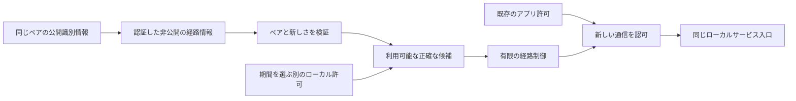

# 認証済み経路の復旧

[English](ROUTE_RECOVERY_DESIGN.en.md) · [LAN 手順](LAN.ja.md#別の経路を準備する未公開) · [設計](ARCHITECTURE.md) · [安全性](SECURITY.ja.md) · [確認範囲](VERIFICATION.md#経路復旧の条件)

**状態: 未公開ソースに実装し、統合検証中です。** 準備した中継候補を使い、**同じ Tailcat 端末とペアリング**を保って復旧します。公開済み `0.3.0-alpha.2` は単一中継の基準です。新実装は2プロセス・4ネイティブ対象・配布の条件を完了しておらず、新しい公開番号や実機受入を主張しません。

## 目的と境界

両端で正確な候補を準備し、受信者を認証した情報を非公開で交換して、それぞれの端末で使う経路を許可します。新しいアプリ接続は、再ペアリングせずに有効な LAN 内・外部中継を試せます。同じ起動中は、経路復旧の間もサービス入口の正確な loopback アドレス・ポートを維持することを目標とします。既に許可したサービスの入口であり、管理画面の一時ポートではありません。

- 既存 TCP は切れる場合があり、アプリの再接続が必要です。健全な通信は任意の優先経路検査だけでは切断せず、通信不能を確認した世代は停止中の通信を含めて閉じ、新しい接続の復旧を可能にします
- 任意の TCP データ、HTTP 要求、コマンド、ジョブ、取引を自動再実行しません。UDP は欠落する場合があり、古い datagram を再送しません
- ファイル再試行は同じ起動中の未完了**項目全体を先頭から**扱います。途中バイト・再起動後の再開、永続的オフライン送信箱は追加しません
- 復旧は Tailcat を Tailnet へ交換せず、アプリ許可の延長・受信先変更・停止定義の起動をしません
- `local` は中継アドレスの区分です。通常の単一実行ファイルは直接 UDP と公開された相手経路を使う場合があります。厳密な LAN 限定・外部通信ゼロは未実装で、補助バイナリや通信隔離の保証を含めません

Internet・外部中継が不通の状態から、準備済み LAN で起動することは必須の統合条件であり、まだ確認済みではありません。保存済みの有効な識別情報・ピン・経路情報・許可だけを使い、新しい認証、ペアリング、外部設定取得を必要としないことを検証します。時差起動や両端の候補優先順位が異なる場合も対象です。

## 実装の構成

| ソース | 担当 |
| --- | --- |
| [`routes.go`](../internal/lanlink/routes.go) | 専用の版付き受信者限定更新、方向別ペア対応、正規形・順序番号・期限、正確な候補 ID と local 優先順 |
| [`route_state.go`](../internal/lanlink/route_state.go) | 発行・受信番号の永続記録、認証の証拠、独立した明示期間の許可、確認 digest、期限・取消・不確かな保存 |
| [`transport_routes.go`](../internal/lanlink/transport_routes.go) | 相手ごとに直列化した候補試行、取消、有限の期限・再試行待機、外向き世代と現在の許可検査 |
| [`core/lan_routes.go`](../internal/core/lan_routes.go) | ローカル管理 API、オフライン候補編集、非公開状態の検証、秘密を出さない一覧 |
| [`cmd/soba/lan_routes.go`](../cmd/soba/lan_routes.go) | 日英の `soba lan routes` と型付き操作、非公開ファイル/stdin 入力、確認した候補選択 |
| [`LanRoutes.tsx`](../web/src/components/LanRoutes.tsx) | ローカル確認付き設定、非公開の情報交換、明示候補選択、期限・取消 |
| [`internal/routecat`](../internal/routecat/UPSTREAM.md) | 出所を明示した最小範囲の Tailcat 改変、準備した server regions と単一候補 client |

元の固定版は Tailcat `v0.7.1-0.20260929145319-b4dc28e8aa89`、Tailscale は `v1.104.0` です。upstream の単一 region capability と live region-update API の不在は、map の並替えでは解決しません。内部改変は準備した server regions を一つの engine に置き、認証した role の探索を運んだ中継で相互到達を行い、WireGuard と外側のペア・信頼検査を維持します。探索だけではアプリ認証になりません。配布は改変とライセンスを別に記録します。[UPSTREAM](../internal/routecat/UPSTREAM.md)

## 識別情報・経路情報・ローカル許可

候補間の復旧で、元の bootstrap 中継、公開端末 ID、PSK、server/client のロール鍵を変更しません。最初のペアリングは正確な bootstrap 中継を引き続き要求します。経路更新で識別情報を置換したり、第三の相手を導入したり、アプリ権限を与えたりできません。

候補は数値 unicast IP・ポート、正確な TLS 証明書 SHA-256 ピン、`local`/`external` 区分に結び付け、どれかが変わると ID も変わります。`local` は private/loopback の数値だけです。元の中継を含め最大4件、追加設定は3件までで、接続先の重複を拒否します。

経路情報は、発行者と受信者を既存の方向別ロール鍵の関係、専用 domain/version、順序番号、発行時刻・有効期間と期限、全候補へ結び付けます。受信者向けに暗号化し、ペアの識別情報で認証します。改ざん、古い情報、期限切れ、反射、別ペア、不正形式・過大入力では権限を広げず拒否する必要があります。端末鍵を保持しても、再ペアリングでロール対応は変わります。

ローカル許可は正確な候補ごとの別記録です。現在のペア、有効な認証済み情報、有効なローカル許可の共通部分だけを使います。version 2 は両方に `finite`（有限）または `until-revoked`（取り消すまで）を明示します。有限期間に30日という任意の上限は設けませんが、正の表現可能な日時・期間が必要です。有限許可は有限の提供情報の期限を超えられず、取り消すまでの許可には提供情報も取り消すまでであることが必要です。それより短い有限許可も選べます。CLI の offer/withdraw と候補ありの approve は、`--ttl` と `--until-revoked` のどちらか一つを必須にします。Web の新規提供と対応する許可は取り消すまでを初期表示し、明確な確定操作で確認しますが、正確な候補はすべて未選択です。有限・旧v1の情報では有限許可だけを扱います。大きい順序番号、再接続、再読込でも自動更新しません。取り消すまでの許可は新しい許可や期限タイマーを作らず同じ保存済み権限として復元し、有限期限を再起動時から数え直しません。新しい情報の適用は選択を置き換え、許可を引き継ぎません。取消後も保存済み情報が有効なら `--current` で明示して再確認・許可できます。

CLI・画面は、秘密鍵や capability を表示せず、相手・受信者・接続先・ピン・区分・順序・期限を示します。受信だけで許可せず、未許可の相手情報へ探索しません。この端末自身の server 候補を明示して設定する操作は、別にその正確な server 通信設定を許可します。中継の提供は正確なアドレス・ポートの明示設定が必要です。経路情報や `routes add` だけで中継を起動し、入場制限・wildcard 待受・firewall を変更することはありません。

書出し・取込みはローカル API と手動の非公開交換であり、自動のピア間配信ではありません。外部メッセージ送信やコマンド実行をしません。結果はローカル保存の確認であり、相手の受信・許可・到達性ではありません。両端で新しい操作への対応が必要で、旧バイナリとの自動交渉は想定しません。`routes withdraw`（ローカル API の export で `withdraw: true`）は、手元の候補・許可を変えず、受信者認証済みの空の情報を作ります。受信側が検査して `approve --withdrawal` で明示適用すると、順序番号を記録しローカル経路許可を削除します。通常の候補ありの許可には正確な候補 ID が必要です。

取り消すまでは権限の有効期間であり、永久の到達性ではありません。現在のローカル中継証明書は発行から365日です。証明書の期限切れやピン変更で、許可が残っていても経路は使えなくなります。更新・ピン変更は明示して設定を確認し、許可の自動延長や元のペアリング中継の無言交換をしません。元の中継の交換には既存の復旧条件が適用されます。

## 保存・取消・失敗

認証済み経路情報とペアごとの保存記録は、期間を明示する version 2 を使います。これを含む非公開 LAN ファイルは version 3 で、新しい経路記録を含まない準備済み候補は version 2 のまま扱えます。移行は元の識別情報と既存の正確な有限期限を保ちます。書出し結果を返す前に発行プロトコル版と順序番号を保存します。適用は保存lock内で確認した正確な情報を再検査し、受信版の後戻り・古い順序を拒否し、認証の証拠と最高番号を保持してから許可を有効化します。期限切れ・撤回・再起動で再送攻撃対策の記録を消しません。再ペアリングではロール対応が変わります。期間の欠落やゼロの期限から無期限の権限を作らず、旧v1は元の規則で有限として読みます。

| 結果 | 現在の境界・必要な検証 |
| --- | --- |
| 無効な情報・確認内容の不一致 | 権限を広げず拒否し、秘密を出さず有限のエラーにする |
| ファイル置換前の保存失敗 | 新しい経路を有効化せず、永続的成功を主張しない |
| 置換したが耐久性不確か | 後続の経路保存・外向き再接続を止め、保存状態を点検してから再起動。巻戻ったとは扱わない |
| 経路許可を取消 | 保存前に対象の外向き世代を止め、ペアと無関係なアプリ許可は保持。保存失敗ではオフライン管理も Core の復旧待ちに固定し、別の node が保存済み権限を復活させる前に止める |
| ペアを解除 | 経路権限と関連アプリ通信を無効化し、既存の安全側に閉じる解除処理を維持 |
| 管理中の情報が期限切れ・全取消 | 旧単一中継へ黙って戻さず、新しい情報の確認または有効な保存済み情報の明示再許可が必要 |

準備した追加候補の削除は、再起動後の server 設定と以後の提供情報を変更します。相手が既に受け取った情報は取り消しません。権限を終了するときは該当する相手の許可も削除します。中継入場リースの残存と現在のアプリ権限は別です。

分散 atomic commit ではありません。時間切れや応答消失では保存状態を確認し、両側が未変更と推測しません。順序番号だけでは古いバックアップへのプロフィール全体の巻戻しをすべて検知できません。旧版へ戻すために経路項目を削除し、状態版を下げ、古い許可を復活させてはいけません。不正・未対応状態は停止したまま、対応版のオフライン管理を使い、バックアップを非公開に保管します。

## 復旧方針とサービス入口

現在の実装は経路検査と接続試行に各5秒を設け、1回の接続全体は候補数×5秒で制限します。1回の接続で最大4候補、失敗・優先経路再試行の待機は30秒です。local を external より先に固定順で扱います。相手ごとに接続処理を直列化し、呼出し元と許可の期限で制限し、実行世代の終了で取り消します。コード上の既定であり、計測済みの遅延・復旧時間保証ではありません。

任意の LAN 優先検査では健全な稼働中通信を維持します。新しい通信検査でその世代の失敗を確認した場合は、停止したままの通信も含めて世代を閉じ、新しい接続で別の許可済み候補を試せます。アプリのポート拒否だけでは経路障害とせず、追加の正常性検査が成功すれば健全な transport を保持します。通信がないときは待機期間後の次の接続で優先 local を再検討できます。任意データのキューやアプリ・ジョブの自動再実行はありません。経路の証拠は古くなる場合があり、信頼できる証拠がなければ Unknown のままです。

Core のサービス待受は外向き engine と別です。復旧は正確なアドレス・ポートと既存の許可期限を維持する必要があり、有効な経路がなければ新規接続も失敗します。競合は表示し、黙って番号を変えません。プロセス再起動は既存の起動許可に従い、転送進捗を再開しません。経路一覧や純粋な制御試験だけでなく、実アプリ・ソケット接続で入口を確認します。

## 移行と公開条件

有効な alpha.2 の非公開 LAN version 1 は旧単一中継を維持します。以前の LAN version 2 の経路データはv1の有限な情報・許可を含み、読込・移行で元の正確な期限とv1の検証制限を保ちます。明示期間のv2記録には LAN ファイル version 3 が必要です。受信情報を適用していないペアは書出し後も旧動作のままです。追加候補には明示的なオフライン編集・再起動、外向き許可には各端末の確認が必要です。旧バイナリは未対応版を拒否し、記録を削りません。検査回避のために保存版を下げたり古い権限を復元したりしないでください。移行、中断、旧ピア、版・順序の後戻り、再ペア前の情報の再送、旧版起動を正確なソースで検証します。

[検証記録](VERIFICATION.md#経路復旧の条件)は純粋試験、実ネイティブ transport 試作、最終 Core/UI 統合を区別します。初回試作は中継間で時間切れになり、修正版の試作は成功しました。後続統合 `10e836ca` は4ネイティブが合格しましたが、ブラウザーselectorの2件が失敗しました。selector修正、明示期間v2、作成した2Coreプロセスfixtureには新しい証拠が必要で、新fixtureは未実行です。過去の成功では代用できません。

明示したプレリリースには、次を必要とします:

1. 独立した2プロセスと実ソケットで、同じペアの相互到達、外部不通時の準備済み LAN 起動、制御した経路断・復旧、新規接続用のサービス入口維持を実証する
2. 認証、明示した有限／取消までの正確な許可、永続的な再送攻撃対策、取消・期限・中断、不確かな保存、移行、非公開情報の扱いを確認する
3. 最終ソースの Linux x64/ARM64・macOS ARM64・Windows x64 のネイティブ回帰、実 Go 本体を使う日英ブラウザー、反復パッケージを通す
4. 別途選んだ版とソースで、署名・provenance・公開取得・4対象の実導入を完了する

物理 LAN/WAN/NAT 移動、実端末のオフライン起動、実アプリ互換性、OS スリープ復帰は別段階です。自動試験の必須条件を満たしたプレリリースは、実機受入を主張せず、後続の実機試験へ mise で提供できます。認証・許可の欠陥を制限事項として先送りできません。例・図・fixture・公開証拠は、非公開接続先・鍵・個人の事情を含まない汎用的な内容にします。
