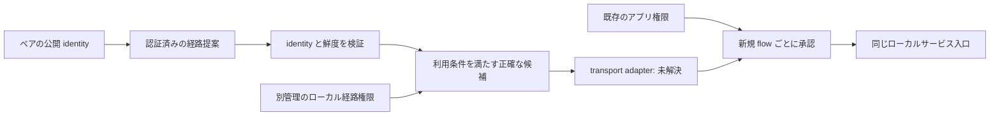
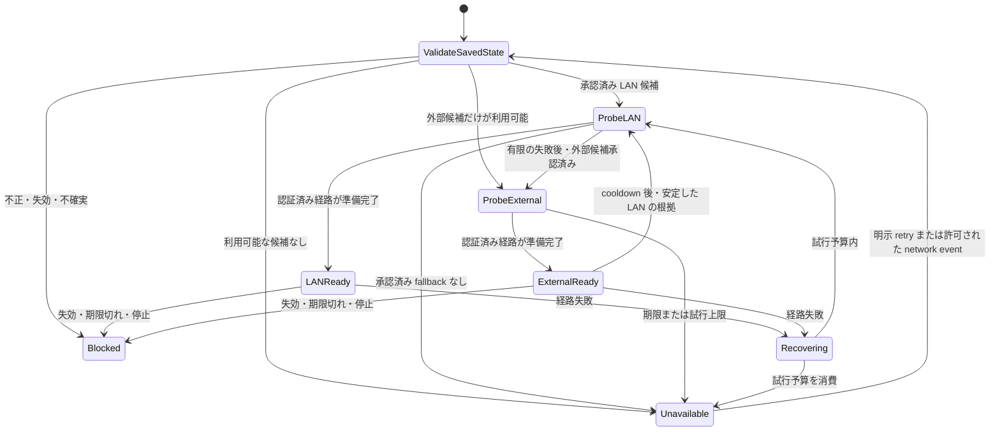

# 認証済み経路の復旧設計

[English](ROUTE_RECOVERY_DESIGN.en.md) · [現在の LAN の動作](LAN.ja.md) · [アーキテクチャ](ARCHITECTURE.md) · [セキュリティ](SECURITY.ja.md) · [開発原則](DEVELOPMENT_PRINCIPLES.ja.md)

**状態: 設計・調査段階。未実装で、リリース受け入れ未完了です。** 本書は、**同じ Tailcat ピアとペアリング**を維持しながら、LAN 内と外部のリレー候補の間で復旧する構想です。現在のコマンド、状態形式、保証は変更しません。現在のコードは正確な数値リレー endpoint と証明書 pin を 1 組選び、変更には backend の停止と既存 LAN ペアの失効が必要です。stock Tailcat の統合だけで安全な複数経路を実現できることは、まだ確認できていません。

## 1. 目標と限界

一度の明示的なペアリングと、正確な経路候補に対するローカル承認の後は、利用可能な LAN 内または外部リレーを使い、ペアリングをやり直さずに同じピアへ到達できることを目指します。事前準備した LAN では、インターネットがない状態から起動できる必要があります。承認済みで既に動作中のアプリ用ローカル入口は、経路復旧中も正確な loopback アドレスとポートを維持し、アプリが同じ入口へ再接続できることを目指します。

以下は受け入れ目標であり、現在の機能ではありません。

- 利用条件を満たす健全な LAN 内リレーを優先し、個々の probe に過敏に反応しないヒステリシスを設ける
- 事前に承認され認証済みの外部候補だけへ切り替える。公開・既定リレーマップにはフォールバックしない
- 経路が変わっても、ペアの identity、アプリの接続先、既存権限の有効期限を維持する
- 復旧試行、probe、同時実行、保存候補数、更新メッセージを有限に抑える
- listener、transport、アプリ接続、リモートジョブのどれが準備できたかを区別し、相互に成功を推測しない

安定したアプリ入口とは、既存の明示的に選択された**サービス listener**です。管理 UI の一時ポートではありません。経路変更で別のローカルポートを黙って選び直してはいけません。プロセス再起動には既存の起動承認規則を適用し、停止中のサービスを復活させません。

TCP が無停止で継続する保証はありません。接続が失敗し、アプリ側の再接続が必要になる場合があります。任意の TCP バイト列、HTTP リクエスト、shell コマンド、リモートジョブ、アプリのトランザクションを sobalink が再送してはいけません。UDP datagram は失われ得ます。古い datagram を再送しません。ファイル転送は、既存の同一プロセス内での未完了**項目全体を byte zero から再試行**する動作と、既存 batch の保存 ACK の扱いだけを維持します。byte offset からの再開、永続的な再起動後の再開、offline outbox は対象外です。

Tailnet/tsnet と Tailcat の切り替え、MCP、fleet 管理、同期、outbox は本設計の範囲外です。

## 2. 現在のソースで確認できること

| ソース | 現在の境界 | 本構想への影響 |
| --- | --- | --- |
| [`trusted.go`](../internal/lanlink/trusted.go) の `TrustedRelay.region`、`validateRemote` | 数値 endpoint/pin は 1 組。ピア capability は期待する 1 node の region と完全一致する必要がある | 既存 capability に endpoint リストを足すだけでは実現できない |
| [`node.go`](../internal/lanlink/node.go) の `NodeConfig`、`NewNode`、`Address` | 設定と server 構築のリレーは 1 つ。保存したピア client は元の capability を使う | 選択方針だけでは実行中 transport を更新できない |
| [`pairing.go`](../internal/lanlink/pairing.go) | 認証済み・受信者限定の transcript が、リレー、role key、capability hash、新しい request/reply 情報を結び付ける | 経路更新には独自の domain、鮮度、権限規則が必要。ペアリング検証を緩めてはいけない |
| [`peers.go`](../internal/lanlink/peers.go) | 正確な公開 peer key、個別 role の対応、失効 epoch が追跡中 flow を承認する | endpoint、名前、リレーへの参加をピア identity として扱ってはいけない |
| [`core/lan.go`](../internal/core/lan.go) | private state version 1 は selection を 1 つ持つ。保存ペアがあるリレー変更を拒否する | 実行時動作を広げる前に移行とローカル承認が必要 |
| [`backend.go`](../internal/lanlink/backend.go) | アプリの外向き通信は userspace stack を使い、OS 経路/DNS にフォールバックしない | 復旧でもこの境界を維持する |

[`go.mod`](../go.mod) の固定依存は `github.com/tailscale/tailcat v0.7.1-0.20260929145319-b4dc28e8aa89` です。API 調査では `Server.Region` は単一、`ConnInfo` の region は最大 1 つで、対応する実行時 region 更新 API はありません。内部で map の最初の region を取る動作は決定的な経路優先順位ではありません。複数 DERP node や Go map の並び替えだけで、LAN 優先の切り替え、両ピアの合流、offline cold start が成立するとはいえません。依存を変更する場合は、この確認をやり直します。

既存の pairing、atomic persistence、loopback 統合テストは回帰防止の根拠になります。しかし、提案する経路更新 protocol、offline LAN 起動、LAN/WAN 間の移行、実機アプリの接続継続は検証していません。[検証記録](VERIFICATION.md)を参照してください。

準備段階の [`routes.go`](../internal/lanlink/routes.go) には、受信者限定の sealed route-update helper、既存 device とその outgoing-role の対応から求めるペア binding、認証済み payload の正規形検証、sequence 検証、正確な候補 ID、別に渡すローカル承認との積集合があります。現 draft の上限は 4 候補、提案の有効期間は最大 30 日です。helper の制限であり、計測済みの復旧方針既定値ではありません。helper は network I/O も永続保存も行わず、利用可能な経路復旧機能ではありません。永続 high-water mark、ペアに結び付くローカル承認の所有/期限、ACK の整合、配送、実行時の有効化は、呼び出し元/統合側に残る要件です。純粋な helper test だけではこれらの条件を合格にできません。

## 3. identity、経路の提案、ローカル権限を分離する

構想では 4 種類の記録を分けます。以下の名称は概念であり、wire schema や公開 JSON 契約ではありません。

| 記録 | 必須の結び付け |
| --- | --- |
| ペア identity | 既存の公開 peer key、ローカル identity、保護された role key/capability、永続的なペア世代または同等の replay 防止境界 |
| 経路提案 | 発行元のペア公開 identity、正確な受信者、ペア世代、protocol version、単調増加 revision、有効期間、有限の候補集合 |
| 正確な候補 | 安定した候補識別子、数値 unicast IP とポート、正確な TLS 証明書 SHA-256 pin、リレー種別、候補の有効期間、提案の発行元/revision |
| ローカル経路権限 | 正確なペア/世代と候補 tuple、承認した目的、期間、有効/失効状態、ローカル revision。リモートからの提案とは別に保持する |

提案の発行元は認証済みのペア identity です。表示名、リレー運営者、transport の送信元アドレスではありません。ピアは自分自身のペア endpoint の経路だけを提案できます。経路だけの更新で第三のピアを追加したり、server identity/PSK や transport role key を変更したりしてはいけません。必要となる capability 更新は同じ identity、既存 role 関係、正確な候補を結び付ける必要があり、その形式は transport の未解決事項です。

候補を利用できるのは、現在のペア承認、認証済みで未失効の提案、正確なローカル権限、有効な pin/証明書、経路方針のすべてを満たす場合です。認証が示すのは発行元であり、ローカルのネットワークアクセス、リレーのホスト、アプリ利用の許可ではありません。新しい endpoint、ポート/pin の変更、新しい外部宛先、権限期間の延長には明示的なローカル確認が必要です。既に確認した正確な候補への再選択では、ペアリングや承認を繰り返しません。新しい提案でローカル権限を延長できず、削除・無効化した権限をリモートから復活させることもできません。

確認画面にはピア、発行元、数値 endpoint、pin、LAN 内/外部の種別、有効期間、変更内容を表示します。PSK、private key、capability は表示しません。経路提案、DNS、discovery、advertisement は新しいローカル listener を作る指示ではありません。リレーのホストには、従来どおり正確な interface/address/port と admission policy の承認が必要です。wildcard bind、firewall の自動変更、任意の数値アドレスの探索は追加しません。

transport pairing、アプリ trust、ファイル受信同意/autosave、share/connect scope、proxy grant、起動承認は独立のままです。復旧でピア/ポートを追加したり、受信先を変えたり、権限を更新したり、pause を解除したり、受信を再有効化したり、停止中の定義を起動したりしてはいけません。元の有限期限と失効世代を維持します。

## 4. 認証済み更新と失敗時の扱い

将来の protocol は、encoding を選ぶ前に次の要件を満たす必要があります。

1. 専用の version 付き domain、既存ペア identity による認証と機密性、厳密で有限の decode を使う。未対応 version、未知 field、不正・重複 field、後続の余分なデータ、曖昧な表現を拒否する。認証対象 byte 列と hash の正規形を定義し、独自の署名方式を作らず、検討済みの暗号 primitive を使う
2. 送信者、受信者、ペア世代、revision、候補の全内容、有効期間を結び付ける。transport bootstrap/capability が必要なら、その digest も結び付けて内容を保護する。ACK は正確な更新 hash と revision に結び付ける
3. 改ざん、別ピア/別 profile への reflection、失効した identity、期限切れ・有効開始前の提案、古い revision を拒否する。同一再送には既存の永続 ACK を返せるが、同じ revision で異なる内容は競合として上書きしない。大きな revision だけでは権限は増えない
4. 受理済み最高 revision/内容 hash、ローカル権限、失効境界を整合した状態で保存する。現在のメモリ内 trust epoch は永続 replay counter ではない。counter overflow、同時更新、crash recovery、ペアの作り直しを規定し、旧更新が以前の関係を復活させないようにする
5. 提案の受信、永続的な受理、ローカル承認、実際の有効化を分ける。transport ACK を相手の経路承認やアプリ接続成功として表示しない。ACK の喪失は不確実な結果であり、同じ有限の更新 identity を照会/再送する。成功を推測したり、新しい承認処理を無条件に始めたりしない
6. 更新の有効化をピア/経路の失効、期限切れ、shutdown と直列化する。dial 前の権限世代を記録し、新しい flow を渡す直前に再確認する。遅れて完了した probe/callback が旧候補を再有効化してはいけない

保存時の構想は、既存 private atomic writer の契約に従います。

| 結果 | 必要な動作 |
| --- | --- |
| 不正・拒否した更新 | 権限も経路も変更しない。秘密 payload を含まない有限の診断を返す |
| 公開前の保存失敗 | 有効化も永続受理 ACK も行わず、最後に永続化できた有効な状態を維持する |
| ファイル置換済みだが durability 不明 (`ErrAtomicCommitted`) | rollback したと表示せず、不確実な新規権限を有効化しない。記録済み状態との整合を取り、明示的な復旧まで影響する変更を止める |
| 失効の永続化を確認できない | 対象 admission/flow を直ちに無効化する。安全な分離を示せなければ該当 transport を停止し、復旧が必要と伝える |
| crash/restart または破損状態 | dial 前に完全で対応済みの状態を読み検証する。古い、より広い権限へ黙って戻さない |
| 不正な時計・時計の巻き戻り | 有効期間が不確かなら閉じる。期限を延長せず、時計確認/再確認の操作を示す |

分散 atomic commit を保証する設計ではありません。片方が offline だったり、保存後に失敗したりします。復旧 protocol は、ペア identity を捨てたり権限を仮に与えたりせず、左右の非対称状態を表現する必要があります。相手が有効化成功を報告しても、ローカルで拒否した経路は拒否のままです。

候補の失効では利用資格を取り消し、その経路のリソースを閉じます。残りの経路にも独立した承認が必要です。ペアの失効では全候補、更新権限、関連アプリ承認を無効化し、実行中の復旧を中止します。リレー接続 lease の残存とアプリ admission は別です。既存のリレー session 残存時間を、アプリ権限が続く時間として説明してはいけません。

永続 replay 防止状態だけでは、profile 全体を古い backup に戻したことは検出できません。リリース前に、安全側に閉じる restore/review 手順とローカル rollback 検出の限界を定義します。revision field だけで rollback 耐性があるとは主張しません。

## 5. 復旧方針と offline LAN cold start

これはアプリの復旧方針の概略であり、**現在の Tailcat にこの状態遷移を操作する API があるという意味ではありません**。

- network I/O 前に候補の利用資格を決める。未承認候補には probe も行わない。リレー probe は正確な承認済み tuple に限る。許可された direct peer 通信と従来の選択リレーへの診断は維持し、LAN 外への通信を完全隔離すると主張しない
- 有効な保存済み LAN bootstrap があれば、起動時は LAN を優先する。明確な時間予算を設け、到達不能な LAN が承認済み外部候補を無期限に妨げないようにする
- 連続成功/失敗の根拠、最小維持時間、LAN へ戻る cooldown、有限の jitter 付き backoff を使う。既定値と観測指標は transport 実験と実機計測で決める。未計測の遅延や復旧 SLA は約束しない
- adapter が安全にできる範囲で、優先候補の probe 中も現在の利用可能な経路を維持する。probe の成功だけで切り替えず、認証済みの準備完了を選択条件にする。候補の準備に旧 engine の停止が必要なら、その中断を明記する
- 候補の同時処理数、1 試行の期限、1 復旧周期の試行数、周期全体の時間を制限する。上限に達したら unavailable を表示する。次の処理には明示 retry、または権限が有効な間の定義済み・頻度制限付き network-change trigger が必要。無限の busy retry はしない
- 同時 dial はピア単位の復旧処理にまとめる。後から任意のアプリ byte 列を再送する queue は作らない。待機する新規接続にも上限、取消、利用直前の再承認が必要
- 期限切れ、失効、停止、権限変更は probe/backoff timer より優先する。network event は再試行の契機であり、権限更新ではない

offline LAN cold start とは、外部リレーもインターネットも利用不能な状態で、両デバイスと必要なローカルリレーを保存状態から起動することです。identity、候補、pin、有効期間、ローカル権限がすべて手元で利用可能でなければなりません。公開 DNS/map、online login、外部リレーへの接触、新しい pairing、リモートにしかない設定取得を必要としてはいけません。ローカルリレーホストは、確認済み listener と有効な保存 identity で起動する必要があります。interface/address の変更や証明書の失効は明示的な復旧を必要とし、wildcard bind や検証回避で解決しません。

起動時刻が違う場合や、最初に別の候補を優先した場合も、両ピアは共通の承認済み経路で合流する必要があります。失敗した旧経路でしか届かない制御メッセージでは、この cold start は解決しません。共通の有効候補がなければ、その事実と必要なローカル確認/復旧を示します。未認証 discovery で新しい endpoint/pin を黙って交換しません。

## 6. transport 設計は未解決の受け入れ条件

次の案には実験が必要です。本書ではいずれも採用・実装していません。

| 調査案 | 採用前に必要な根拠 |
| --- | --- |
| upstream が支援する拡張、またはレビューした最小の依存変更 | 決定的な候補制御、認証済み capability/bootstrap 更新、取消、listener lifecycle、安定した identity |
| 安定したサービス listener の内側で transport を順に再作成 | 同じ保護 key で安全に close/reopen できること、喪失/重複の境界、inbound 再接続、ピアの合流、有限の非対称復旧 |
| 複数 transport 経路の事前準備 | 同時 server/client role、key 再利用、relay admission、リソース計上が競合しないこと。同じ identity の engine を 2 つ動かせば安全とは仮定しない |

どの案でも、両ピアが互換な relay bootstrap を得る方法、送受信者が共通経路を選ぶ方法、現在の `validateRemote` の保護を維持する方法を示します。正確なリレー検証を「広告された任意のリレー」に置き換えてはいけません。経路変更でピア endpoint identity を差し替えたり、無関係な全ピアを意図せず変更したりしないことも示します。capability や disco 情報が変わるか、変わる場合はどう認証するかを記録します。

ローカル listener は失敗した transport 接続より長く存続できても、復旧不能な間は新規接続が失敗し得ます。adapter が listener を維持できないなら、より限定された結果を記録し、安定した入口の条件を合格にしてはいけません。アプリ成功とリモートジョブ完了には別の根拠が必要です。direct/relay の表示は計測できるまで unknown のままにします。

## 7. 旧ピアと alpha.2 からの移行

移行元は sobalink `0.3.0-alpha.2` の単一リレー状態モデルです。別製品の legacy `tsnet-bridge` release ではありません。リリース公開/インストールの根拠は別に扱います。[配布](DISTRIBUTION.md)を参照してください。

- 有効な version 1 selection は、既存 scope の**単一**の正確な候補として扱う。private identity、PSK、ペア role key、公開 peer identity を保持する。第二のリレー、変更された pin、リレーのホスト、復旧モードの権限を推測しない
- 旧ピアとの動作は単一リレーのままにする。新しい経路更新 protocol を送る前に、認証済みの capability negotiation が必要。capability が不明/欠落なら未対応であり、検証を緩める許可ではない。混在 version のペアは既存の互換経路だけを利用する
- 候補追加には影響する各デバイスでローカル確認が必要。検証済み提案は保留情報として保存できるが、勝手に有効化しない。保留データも有限にし、probe を開始しない
- 検証、atomic 保存、中断時の復旧、旧 binary の動作を含む version 付き private state 移行を設計する。新状態を黙って version 1 に書き戻したり、失効境界を削ったり、downgrade のためだけに古い backup へ戻したりしない
- legacy の service、receive、trust、pause、起動承認の意味を保持する。欠落/不正な legacy state は既存の復旧規則で遮断したままにする。upgrade は受信承認を作り出さず、offline peer を現在確認済みと扱わない
- この文書だけの変更では仮の移行を実行しない。移行と transport の条件が合格するまで、現在の停止/失効/再設定による復旧が正式な手順

新しい CLI command、API endpoint、JSON field、wire version は本書で確定しません。最終 schema と日英の command/UI 表現は、実装と合わせてレビューします。

## 8. 受け入れ表とリリース条件

以下の統合された経路復旧 scenario はすべて**未実装・未検証**で、準備段階の helper test はより狭い根拠です。mock や loopback の成功を実機受け入れの代わりにしません。将来の各結果には、正確な source/dependency revision、build tag、OS/architecture、scenario、観測、残る限界を記録します。

| 領域 | 必要な scenario | 合格条件 |
| --- | --- | --- |
| identity と権限 | 同じペアで承認済み LAN/外部候補を使用。ローカル権限なしの提案、endpoint/pin 変更、第三者の提案 | identity が不変で再 pairing 不要。未承認宛先に probe/通信がない |
| protocol security | 改ざん、replay、同 revision の競合、旧世代、reflection、不正/過大入力、未対応 version | 状態を広げず拒否。有限の処理と秘密を除いた error |
| durability | 公開前失敗、公開後不確実、各遷移で crash、ACK 喪失、再起動後 replay、rollback 復旧 | 仮の有効化/成功表示がなく、失効権限が復活しない |
| 失効と期限 | dial、probe、backoff、有効化、通信中。経路だけ/ペア全体の削除 | 遅延した承認なし。追跡処理停止。残る経路も独立に承認されている |
| offline cold start | 両方が新規プロセス、Internet なし、保存 LAN リレー。時差起動、外部 endpoint blackhole | 合意した予算内で、外部 bootstrap/再 pairing なしに共通 LAN 経路が成立 |
| 経路遷移 | LAN 喪失、WAN 喪失/復帰、interface 変更、断続失敗、左右で異なる候補優先 | 有限の復旧と LAN 復帰。flapping、任意 fallback、key/role 競合がない |
| アプリ入口 | 既存 local TCP/UDP listener、port conflict、同時接続、経路切り替え | 同一プロセスの復旧中に正確な入口を維持。競合を表示。黙った port 変更や replay なし |
| アプリとファイル | 実アプリ再接続、中断 request/job、未完了ファイル retry、停止/再起動 | TCP/job 保証をしない。既存の項目全体 retry のみ。byte/restart resume や重複成功表示なし |
| 移行と旧ピア | 有効な alpha.2 state、破損/欠落、version 混在、移行中断、downgrade 試行 | 単一候補の scope を保持。追加承認は明示。不互換/復旧を安全に説明 |
| リソースと観測 | 多数ピア/候補、反復更新、取消、sleep/wake、時計変更 | 有限の保存/処理。正直な path 表示、準備状態の分離、操作可能な error |
| platform/配布 | native Linux x64/ARM64、macOS ARM64、Windows x64。署名済み installed binary | native race/vet/回帰と配布 binary の確認。実 LAN/WAN/NAT、sleep/wake は別記録 |
| 人の操作 | 日英の自動 locale、override/fallback、狭い UI、keyboard 操作、cancel/retry | 同等の確認/復旧内容。言語不変の machine JSON。private 情報の漏えいなし |

**prerelease と明記して公開する場合**の必須条件は、(1) 独立した 2 プロセスと実 socket を使い、制御した topology の故障/復旧でピア合流、offline cold start、再接続が動くこと、(2) identity、更新認証、永続 replay 防止/失効、失敗処理のレビュー、(3) 正確なローカル権限、privacy、旧状態からの移行、(4) 有限の retry/リソース動作と検証済み方針既定値、(5) 正確な候補に対する native Linux x64/ARM64、macOS ARM64、Windows x64 の回帰と署名済み installed-binary 検証です。mock、1 回の loopback 接続成功、文書レビューだけで代用できません。認証、権限、privacy の不具合を prerelease の制限として先送りしてはいけません。

**物理デバイスの受け入れは、別の後続段階です。** 実 LAN/WAN/NAT 間の移動、実機の offline cold start、対象アプリの互換性、OS の suspend/wake は、計測するまで未検証と明記します。自動化した必須条件を満たす prerelease は、mise 経由のインストールを含む実機検証のために公開できますが、実機受け入れ完了とはしません。公開によって無停止の TCP 継続や厳密な外向き通信ゼロが立証されることはなく、根拠なしに宣伝してはいけません。上表には自動 topology の結果と実機の結果を分けて記録します。

本書の例と図はすべて汎用的です。実 endpoint、private state、pairing 情報、個人の利用履歴、環境を特定できる情報を、実装 fixture、screenshot、release evidence に追加してはいけません。
