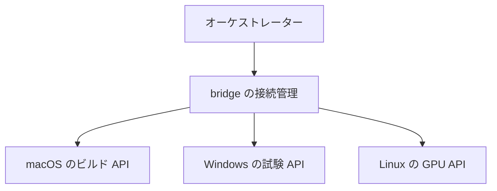
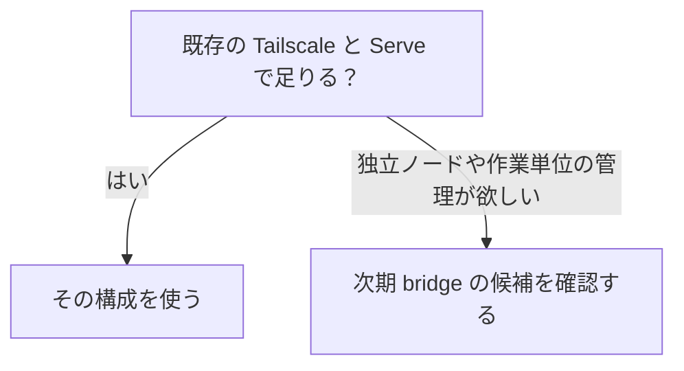

# tsnet-bridge の活用案

更新日: 2026-10-01

**使いたい相手と用途を選び、必要な間だけつなぐ。** 名前付き接続では、Web・SSH・AI などの用途を選び、通常は細かな設定を増やさず使うことを目指します。

**管理者権限なしで導入・利用できることを目指すのも利点です。** OS の VPN・経路・DNS を変更せず、普通のユーザー権限で動くアプリから必要な接続だけを使う設計です。接続先や tailnet の許可は別途必要です。Linux の非 root オフライン導入は旧 alpha.2 で確認済み、Windows 標準ユーザーの実認証は未確認です。

| `0.1.0-alpha.2` | `0.2.0-alpha.1` のソース |
| --- | --- |
| RustDesk 向け固定転送・認証付き SOCKS、起動・停止・診断 | 名前付き複数 TCP/UDP、限定共有、期限・グループ・タスク管理を追加 |

**接続機能の実装と、各活用例の実アプリ合格は別です。** 新機能の操作は [名前付き接続ガイド](GENERIC.ja.md)、従来の設定は [RustDesk 手順](VERIFICATION.md)、未確認の試験は [計画と実装状況](ROADMAP.ja.md)を参照してください。以下のアプリ互換性は未検証です。

## まず何をしたいか選ぶ

| やりたいこと | 読むところ |
| --- | --- |
| Web、SSH、DB、遠隔画面を使いたい | [相手のサービスを使う](#相手のサービスを使う) |
| この端末の画面や API を一時的に見せたい | [この端末のサービスを渡す](#この端末のサービスを渡す) |
| AI や複数端末のエージェントをつなぎたい | [エージェントをつなぐ](#エージェントをつなぐ) |
| iPhone/iPad で開きたい | [モバイルから使う](#iphone-と-ipad-から使う) |
| 通常の Tailscale で足りるか知りたい | [Tailscale との使い分け](#通常の-tailscale-との使い分け) |

基本操作は **「相手を選ぶ → 用途を選ぶ → 内容を確認してつなぐ」**。ポートやプロトコルは用途のひな形から提案し、変更が必要な場合だけ詳細を指定します。

## 相手のサービスを使う

普段使うアプリはそのままに、接続先のコピーや起動をまとめる用途です。最初の検証は SSH/SFTP と単純な HTTP 画面から進めます。

| 用途 | 想定する使い方 | 一つ覚えておくこと |
| --- | --- | --- |
| SSH・SFTP・Git over SSH | 相手を選び、接続情報をコピーして操作・ファイル転送 | SSH の認証とホスト鍵確認は残す |
| 開発 Web・API・テスト DB | 一組で保存し、必要な項目だけ開始 | DB を自動で共有しない。URL・CORS・認証も確認 |
| AI API・GPU 推論 | 登録した推論サービスの接続先を対応アプリへ渡す | API の認証・データ送信先・利用上限は別に管理 |
| DB・管理画面・監視画面 | 接続先を選んでクライアントやブラウザーを開く | 確認用なら読み取り専用権限を優先 |
| RDP・VNC | 必要な接続を開始して対応クライアントを開く | 画面・入力・UDP・再接続・性能は実機で確認 |

例えば「開発環境」に `web`、`api`、`test-db` を保存し、「Web と API だけ開始」「DB だけ停止」と扱う案です。複数ポートを開くだけで、サービス間の設定まで自動で整うわけではありません。

## この端末のサービスを渡す

今まで localhost からだけ使っていたサービスへ、選んだ相手から接続できるようにする案です。技術上は**逆向き転送**と呼びます。

**相手を選ぶ → 渡すサービスを選ぶ → 対象・相手・期限を確認して開始**。共有中は一覧から個別にもまとめても停止できます。ローカル用の認証省略が遠隔にも適用されないよう、サービス側の認証を確認します。

| 用途 | 想定する使い方 | 範囲 |
| --- | --- | --- |
| 一時プレビュー・共同確認 | Web/API だけを期限付きで見せる | 期限で接続は閉じるが、渡ったデータは回収されない |
| ローカル AI・テスト API | loopback の対象サービスを相手へ渡す | 提供側の逆向き機能とアプリ認証が必要 |
| 双方向 API・コールバック | 両側が必要な API をそれぞれ提供 | 両側の許可が必要。公開 SaaS の webhook 用入口にはならない |
| 既存のファイル・テキスト受渡しサービス | SFTP や Web サービスをつなぐ | 保存先・上書き・容量・宛先確認はそのアプリが担当 |
| 障害診断・遠隔デバッグ | 状態 API や必要なデバッグ接続を短時間だけ使う | 診断は読み取り専用を優先。デバッグは強い認証・相手制限・期限を必須とし、自動再共有しない |

相手のサービスを使う方向と、この端末から渡す方向は別の許可です。ファイル同期、クリップボード同期、チャットが転送機能だけで追加されるわけではありません。テキストも明示して送る方式を基本とします。

## エージェントをつなぐ

複数端末に置いた**認証付きのサービス API**へ、作業に必要な間だけ接続する構成です。次の図は役割の例で、bridge がジョブを実行する設計ではありません。

| bridge の担当 | オーケストレーターと各サービスの担当 |
| --- | --- |
| 接続の開始、準備待機、状態・診断、期限、停止・後片付け | 操作の認可、ジョブ割当、並列数、実行、成果物、重複防止、再試行、取消・結果照会 |

v2 ではルールごとの JSON、`wait-ready`、`task` による作業ごとの所有関係と期限付きリースを実装しました。遠隔ジョブ本体の管理は含みません。alpha.2 の状態表示はサービス全体のみです。

使い方は「自分の接続を開始 → 準備を待つ → API へ依頼 → 結果を確認 → 自分の接続だけ停止」。**回線を切ったり期限が来たりしても、遠隔ジョブが止まるとは限りません。** 実行側のジョブ ID と取消・結果照会を使い、安全に再試行します。

MCP・AI・自動処理で確認すること

- **HTTP MCP/API:** 認証付きの HTTP エンドポイントを接続する候補。stdio MCP は子プロセスの標準入出力を使うため、TCP 転送だけでは HTTP 化できず、別アダプターが必要。[MCP トランスポート](https://modelcontextprotocol.io/specification/2026-07-28/basic/transports)
- **許可を分ける:** tailnet への接続許可と、ファイル・ツール・コマンド・引数の操作認可は別。CLI 権限や承認を自動で追加しない。[MCP 認可](https://modelcontextprotocol.io/specification/2026-07-28/basic/authorization)、[利用者確認](https://modelcontextprotocol.io/specification/2026-07-28/server/tools)
- **実行環境:** 各エージェントに承認済みの tailnet 接続とサービス利用権限が必要。SaaS エージェントが URL だけで接続できるわけではない。特権付き任意実行 API や、OS 通信・ファイル権限を隔離するサンドボックスは作らない
- **開発・推論:** Web/API/テスト DB や GPU API を必要な項目だけ開始。DB は読み取り専用を優先し、データの送信先と利用上限を各サービスで管理
- **バックアップ・定型処理:** 送受信サービスを接続する基盤として利用。ファイル選別・同期・暗号化・重複防止・結果管理は各アプリが担当。無人環境への自動登録は別の認証設計が必要
- **MQTT・IoT:** tailnet ピアの broker/API が候補。非 tailnet 機器には別途承認された gateway が必要で、任意 LAN 中継や自動発見を提供する案ではない
- **環境切替:** アプリのローカル接続先を固定する案でも、現在の相手を表示して確認後に切り替える。既存通信を別環境へ付け替えず、TLS とホスト鍵も環境別に確認

## iPhone と iPad から使う

通常の Tailscale に接続済みなら、次期の PC 側 bridge が提供するサービスを Safari や対応アプリから使う構成が候補です。**利用側に iOS 版 bridge を追加する計画ではありません。** [Tailscale の iOS 対応](https://tailscale.com/docs/install/ios)

1. PC 側で、相手とサービス・期限を確認して提供する
2. iPhone/iPad で、提供側 **bridge ノード**の tailnet 名とポートを開く
3. サービス自身にもログインし、終了後に共有を停止する

最初は **開発 Web の実機確認・プレビュー**、次に **AI Web UI・ダッシュボード**、その後に **既存ファイルサービス・SSH 対応クライアント**を試す順が候補です。いずれも提供側の新機能と実機確認が前提です。

モバイルの名前解決・HTTPS・バックグラウンド

- MagicDNS と Tailscale DNS の設定を確認する。端末本体と bridge の独立ノード名を混同せず、iPhone/iPad の localhost を相手 PC として扱わない。bridge は OS の経路や DNS を自動修正しない。[MagicDNS](https://tailscale.com/docs/features/magicdns)
- tailnet の暗号化と、ブラウザーの HTTPS secure context は別。遠隔 HTTP は localhost 扱いにならず、カメラ・マイク等には適切な HTTPS と利用者の許可が必要。TCP 転送だけで証明書は用意されない。[getUserMedia](https://developer.mozilla.org/en-US/docs/Web/API/MediaDevices/getUserMedia)
- タッチ・画面幅・ログイン・WebSocket、タブ切替・画面ロック・回線変更後の復帰を試験する。iOS にはバックグラウンド実行の制限があり、常駐ジョブや長時間接続を保証しない。[Apple の説明](https://developer.apple.com/documentation/uikit/extending-your-app-s-background-execution-time)

## 通常の Tailscale との使い分け

**通常の Tailscale と Serve で目的を満たせるなら、まずその構成を使うのが簡潔です。** 接続制限やローカルサービスの提供は bridge だけの機能ではありません。

| 比較点 | 通常の Tailscale／Serve | alpha.2 | v2 の接続機能 |
| --- | --- | --- | --- |
| 管理者権限・OS への導入 | 一般的な導入では OS サービス等の設定権限が関わる。既設クライアントの利用条件は環境による | 通常ユーザーの単体アプリを目指す。Windows 実認証は未確認 | 同じ設計。ユーザー単位の自動起動は希望制、OS 経路・DNS は変更しない |
| 接続する | アプリから tailnet IP・MagicDNS 名へ直接接続 | loopback 転送・認証付き SOCKS | 相手と用途から設定し、接続情報をコピー |
| ローカルを提供する | Serve の HTTP(S)・複数 TCP 等 | tailnet 側の受信待受なし | 独立 tsnet ノードでサービスを限定提供 |
| まとめて管理する | CLI・既存設定・スクリプト等 | RustDesk 固有プロフィール | 名前付き複数ルール、個別・一括操作、期限 |
| 自動処理につなぐ | JSON 状態等を組み合わせる | 全体の JSON 状態 | 準備待機、作業ごとの所有関係と後片付け |
| アクセスを絞る | ACL/grants とアプリ認証 | それらに加え bridge の宛先制限 | 提供する側の接続元制限も追加。操作認可は別 |

通常の構成では、到達可能なサービスごとにローカル転送を作る必要がありません。Serve には既に HTTP(S)・TCP 転送、複数 TCP ポートの設定、JSON 状態表示があります。HTTPS 設定や証明書発行の同意は別に確認します。[MagicDNS](https://tailscale.com/docs/features/magicdns)、[ACL/grants](https://tailscale.com/docs/features/access-control/grants)、[Serve](https://tailscale.com/docs/features/tailscale-serve)、[CLI](https://tailscale.com/docs/reference/tailscale-cli/serve)、[複数ポートの設定](https://github.com/tailscale/tailscale/blob/v1.102.5/ipn/serve.go)

bridge が目指す利点は、**独立したノードで、必要な接続を作業単位にまとめ、開始から終了までの操作を揃えること**です。bridge 自身は OS 全体の経路・DNS を変更しません。通常の Tailscale でもスクリプト等で組める用途はあり、独占的な機能とは扱いません。[tsnet](https://tailscale.com/docs/features/tsnet)

導入の負担もあります。

- 別ノードの認証・保存状態・ポリシーと、プロフィールを管理する必要がある
- ポート競合、アプリの設定、TLS 名を扱う手間が増える場合がある
- 自動的に安全性が上がるわけではなく、他の OS 通信・ファイル権限を隔離する機能ではない
- Windows 標準ユーザーでの実機認証は未確認。管理者権限 CI の成功とは別
- CPU・メモリー・電池・速度、direct／DERP の影響は要測定。軽量・高速とは未評価

多くのアプリから常時使う場合や、Serve で localhost の共有が足りる場合は、通常の構成が向いています。追加管理に見合う操作上の利点がある場合に bridge を検討します。

## アプリに指定するアドレス

`settings` に表示された接続先をコピーして使います。専用のクリップボード操作やアプリの設定変更は行いません。以下は入力先の違いです。

固定転送・SOCKS・逆向きで入力先が違う

| 方式 | アプリの接続先 | bridge／プロキシ側の設定 |
| --- | --- | --- |
| 相手を使う固定転送 | 自分の `127.0.0.1` とローカルポート | bridge に相手の tailnet ピアとサービスのポート |
| SOCKS 対応アプリ | 相手の tailnet 名／IP とサービスのポート | プロキシ欄に自分の loopback SOCKS 待受と認証情報 |
| この端末から渡す逆向き転送 | 提供側 bridge ノードの tailnet 名／IP と受信ポート | 提供側に明示した loopback サービス、許可する相手、期限 |
| 通常の Tailscale | 相手の tailnet IP／MagicDNS 名とポート | 必要な tailnet 接続・ポリシーとサービス認証 |

同じポート番号でも IP は同じになりません。固定転送で相手の tailnet IP をアプリに入れても、bridge へ自動で流れるわけではありません。bridge のピア名の照合は現在のピア情報を使い、OS DNS に名前を追加しません。

現行 SOCKS は RustDesk 向けの宛先制限が残り、Chrome の認証制約もあります。表は機能追加ではなく、入力先の違いの説明です。

## 用途を決めた後に確認すること

現行版の制約とアプリごとの注意

### alpha.2 と v2 の違い

[設定](https://github.com/webkaz-labs/tsnet-bridge/blob/0069e38732227c8913ee6ceb0ec21784ae03d862/internal/config/config.go) と [起動処理](https://github.com/webkaz-labs/tsnet-bridge/blob/0069e38732227c8913ee6ceb0ec21784ae03d862/internal/app/service.go) は RustDesk 公開鍵と ID・ID−1・relay の組を要求し、全 TCP 転送先を確認してから待受を開始します。宛先も 1024 以上に限られ、SSH `22`／HTTP `80`／HTTPS `443` は指定不可です。これは alpha.2 の制約です。v2 は RustDesk 公開鍵不要の汎用プロフィールと、宛先 1〜65535 を実装しています。旧設定へ別用途の値を無理に当てはめる必要はありません。

### 名前と認証

- HTTPS の証明書名・SNI、origin・Cookie・CORS・リダイレクト・WebSocket を確認する。localhost への書換えや証明書確認の無効化で済ませない。CLI の curl `--connect-to` は元の名前を保つ候補。[証明書](https://curl.se/docs/sslcerts.html)、[接続先変更](https://curl.se/docs/manpage.html#--connect-to)
- SSH のホスト鍵を維持する。`HostKeyAlias` は候補だが、OpenBSD `nc` の認証は HTTP CONNECT のみで、一般的な `nc -X 5` の例を認証必須 SOCKS へそのまま使えない。[OpenSSH](https://man.openbsd.org/ssh_config#HostKeyAlias)、[nc](https://man.openbsd.org/nc#P)
- Chrome は SOCKS5 認証に非対応。選んだサイトだけをブラウザー経由で開く案には、HTTP プロキシ等の別機能が必要。対象への直接接続フォールバック、DNS、外部リソースも確認する。[Chromium](https://github.com/chromium/chromium/blob/main/net/docs/proxy.md#socksv5-proxy-scheme)
- Ollama は既定で loopback 待受かつローカル API の認証不要。逆向きでも認証付き gateway 等を検討し、無条件に公開しない。[待受](https://docs.ollama.com/faq#how-can-i-expose-ollama-on-my-network)、[認証](https://docs.ollama.com/api/authentication)
- DB の認証・TLS・用途別権限を維持する。トンネルを理由に認証を無効化しない。[PostgreSQL](https://www.postgresql.org/docs/current/auth-pg-hba-conf.html)

### 接続基盤の境界

固定転送は他のローカルプロセスからも利用でき、SOCKS 認証は付きません。相手アプリから見える接続元も変わるため、元の端末 IP や loopback の信頼をそのまま認可に使わないよう確認します。

外向きの相手は現在の tailnet ピアに限定し、相手の localhost には提供側の明示した逆向き経路が必要です。UDP の返信と新しい受信接続は別に検証します。SOCKS UDP、mDNS・ブロードキャスト、自動発見、任意の動的ポート、LAN 中継は提供しません。

接続成功とアプリの動作成功を分け、ログイン URL・資格情報・保存状態・実際の接続先を共有用設定やログへ含めないよう確認します。[安全性](../SECURITY.md)、[実装・試験報告](VERIFICATION.en.md)

詳細な合格条件と実施順は [次期機能計画](ROADMAP.ja.md) にまとめています。独自ファイル／クリップボード同期、ジョブ実行、無人登録などは接続基盤と分けて判断します。
